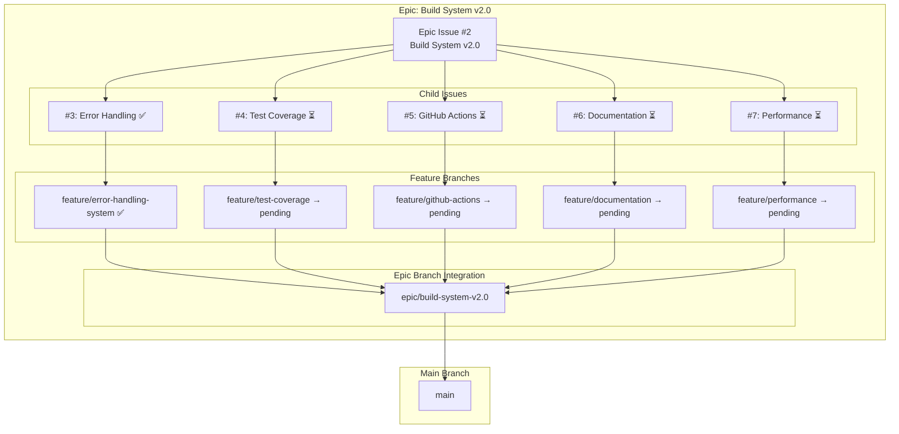
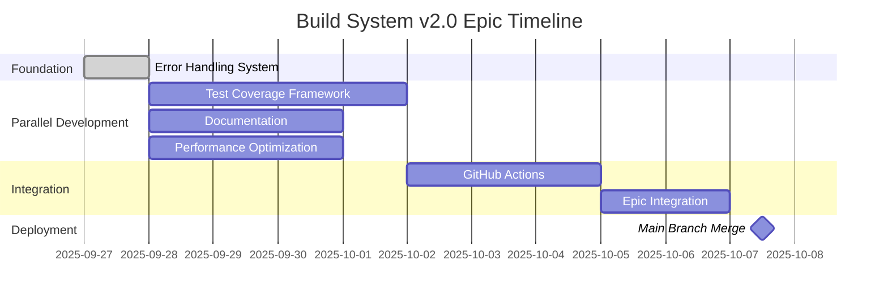
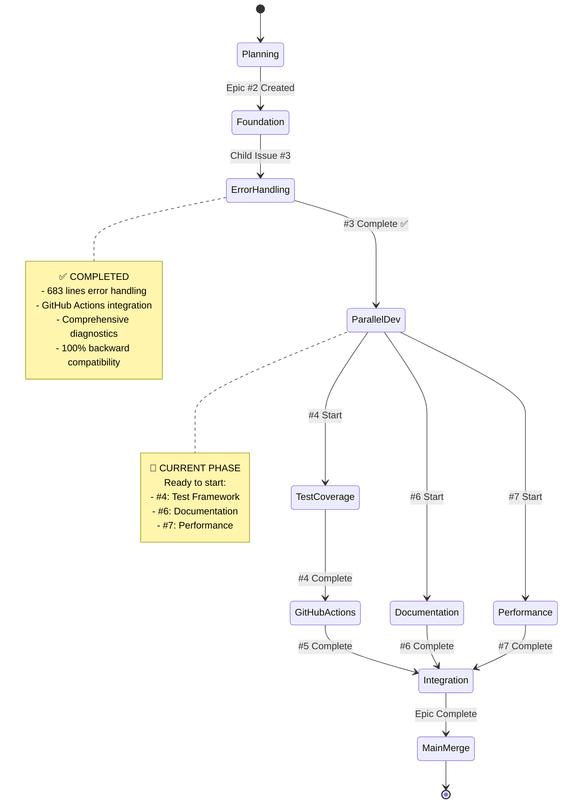
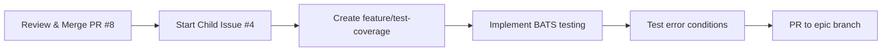
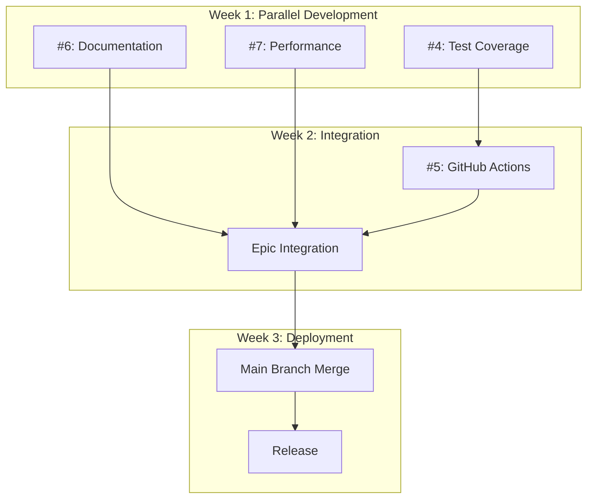

# Epic: Build System v2.0 - Visual Progress Tracking

## 📊 Epic Overview



## 🎯 Progress Status

### Epic Progress: 20% Complete (1/5 child issues)

| Child Issue | Status | Feature Branch | PR | Progress |
|-------------|--------|----------------|----|---------|
| #3 Error Handling | ✅ **COMPLETED** | `feature/error-handling-system` | #8 → epic | 100% |
| #4 Test Coverage | ⏳ **READY** | `feature/test-coverage` | pending | 0% |
| #5 GitHub Actions | ⏳ **READY** | `feature/github-actions` | pending | 0% |
| #6 Documentation | ⏳ **READY** | `feature/documentation` | pending | 0% |
| #7 Performance | ⏳ **READY** | `feature/performance` | pending | 0% |

### Development Timeline



## 🔄 Workflow Visualization

### Current Development Phase: Foundation Complete



## 📈 GitHub Integration

### Visual Tracking Locations

1. **GitHub Project Board**: [Build System v2.0 Epic](https://github.com/orgs/info-tech-io/projects/1)
   - Epic and all child issues tracked
   - Kanban-style progress visualization
   - Automated status updates

2. **Pull Request Tracking**:
   - PR #8: `feature/error-handling-system` → `epic/build-system-v2.0` ✅
   - Future PRs: Each child issue → epic branch → main

3. **Branch Strategy Visualization**:
   ```
   main
   ├── epic/build-system-v2.0
   │   ├── feature/error-handling-system ✅ (PR #8)
   │   ├── feature/test-coverage → pending
   │   ├── feature/github-actions → pending
   │   ├── feature/documentation → pending
   │   └── feature/performance → pending
   ```

## 🎯 Next Steps Visualization

### Immediate Actions (Next 1-2 days)


### Parallel Development Strategy


## 📊 Metrics Dashboard

### Code Quality Metrics
- **Error Handling Coverage**: 100% ✅
- **Test Coverage**: 0% → Target: 95%
- **Documentation Coverage**: 20% → Target: 100%
- **Performance Benchmarks**: Not established → Target: 50% improvement

### Epic Health Score: 🟢 Healthy
- ✅ Foundation established (Error Handling)
- ✅ Clear development path defined
- ✅ No blockers identified
- ✅ GitHub infrastructure ready
- ⏳ Ready for parallel development phase

## 🔗 Quick Links

- **Epic Issue**: [#2 Build System v2.0](https://github.com/info-tech-io/hugo-templates/issues/2)
- **Project Board**: [Visual Tracking](https://github.com/orgs/info-tech-io/projects/1)
- **Epic Branch**: [`epic/build-system-v2.0`](https://github.com/info-tech-io/hugo-templates/tree/epic/build-system-v2.0)
- **Active PR**: [#8 Error Handling System](https://github.com/info-tech-io/hugo-templates/pull/8)
- **Workflow Documentation**: [Contributing Guide](https://github.com/info-tech-io/info-tech/blob/main/docs/content/open-source/contributing.md#epic-issues--child-issues--feature-branches-strategy)