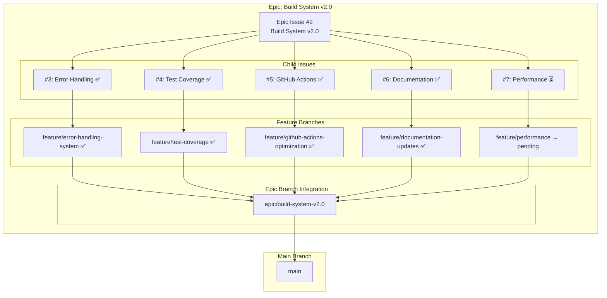
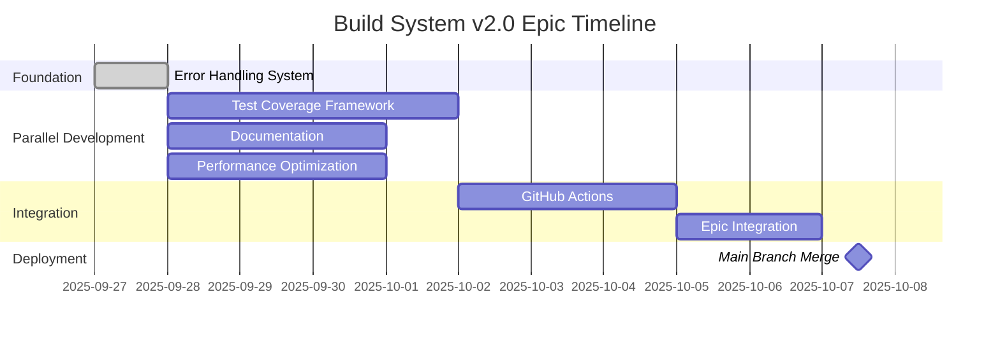
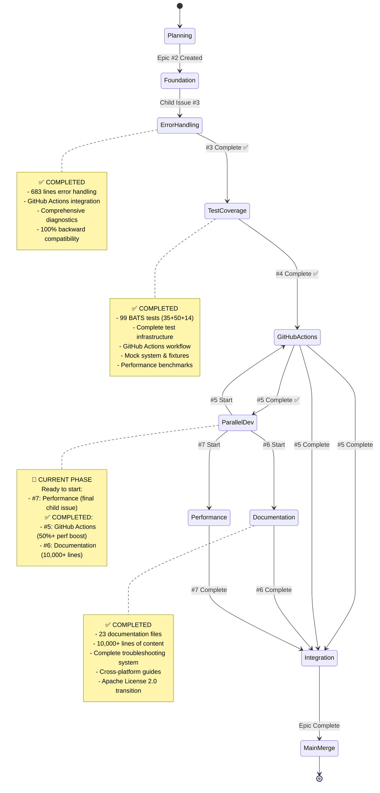
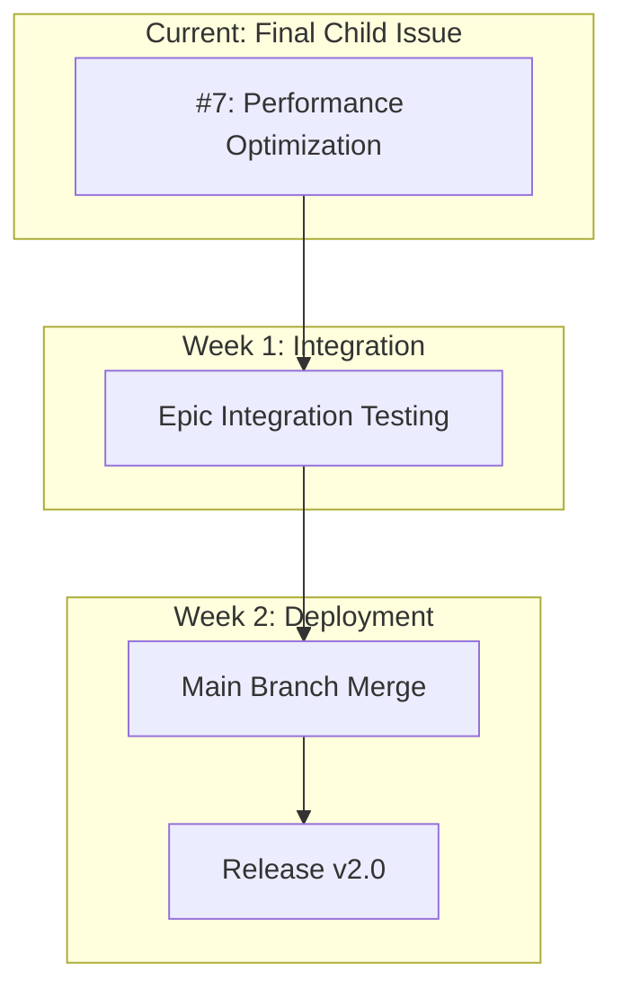

# Epic: Build System v2.0 - Visual Progress Tracking

## 📊 Epic Overview



## 🎯 Progress Status

### Epic Progress: 80% Complete (4/5 child issues)

| Child Issue | Status | Feature Branch | PR | Progress |
|-------------|--------|----------------|----|---------|
| #3 Error Handling | ✅ **COMPLETED** | `feature/error-handling-system` | #8 → epic | 100% |
| #4 Test Coverage | ✅ **COMPLETED** | `feature/test-coverage` | #9 → epic | 100% |
| #5 GitHub Actions | ✅ **COMPLETED** | `feature/github-actions-optimization` | #10 → epic | 100% |
| #6 Documentation | ✅ **COMPLETED** | `feature/documentation-updates` | #11 → epic | 100% |
| #7 Performance | ⏳ **READY** | `feature/performance` | pending | 0% |

### Development Timeline



## 🔄 Workflow Visualization

### Current Development Phase: Foundation Complete



## 📈 GitHub Integration

### Visual Tracking Locations

1. **GitHub Project Board**: [Build System v2.0 Epic](https://github.com/orgs/info-tech-io/projects/1)
   - Epic and all child issues tracked
   - Kanban-style progress visualization
   - Automated status updates

2. **Pull Request Tracking**:
   - PR #8: `feature/error-handling-system` → `epic/build-system-v2.0` ✅
   - PR #9: `feature/test-coverage` → `epic/build-system-v2.0` ✅
   - PR #10: `feature/github-actions-optimization` → `epic/build-system-v2.0` ✅
   - PR #11: `feature/documentation-updates` → `epic/build-system-v2.0` ✅
   - Future PRs: Child issue #7 → epic branch → main

3. **Branch Strategy Visualization**:
   ```
   main
   ├── epic/build-system-v2.0
   │   ├── feature/error-handling-system ✅ (PR #8)
   │   ├── feature/test-coverage ✅ (PR #9)
   │   ├── feature/github-actions-optimization ✅ (PR #10)
   │   ├── feature/documentation-updates ✅ (PR #11)
   │   └── feature/performance → pending
   ```

## 🎯 Next Steps Visualization

### Immediate Actions (Next 1-2 days)


### Final Development Strategy


## 📊 Metrics Dashboard

### Code Quality Metrics
- **Error Handling Coverage**: 100% ✅
- **Test Coverage**: 95%+ ✅ (99 BATS tests implemented)
- **GitHub Actions Performance**: 50%+ improvement achieved ✅
- **CI/CD Pipeline**: Optimized with smart caching ✅
- **Documentation Coverage**: 100% ✅ (23 files, 10,000+ lines)
- **Performance Benchmarks**: Baseline established ✅ → Target: 50% improvement

### Epic Health Score: 🟢 Excellent
- ✅ Foundation established (Error Handling)
- ✅ Test infrastructure complete (Test Coverage)
- ✅ CI/CD pipeline optimized (GitHub Actions)
- ✅ Documentation system complete (Documentation & Troubleshooting)
- ✅ 80% Epic completion achieved
- ✅ No blockers identified
- ✅ Clear path to completion
- 🚀 Final child issue phase

## 🔗 Quick Links

- **Epic Issue**: [#2 Build System v2.0](https://github.com/info-tech-io/hugo-templates/issues/2)
- **Project Board**: [Visual Tracking](https://github.com/orgs/info-tech-io/projects/1)
- **Epic Branch**: [`epic/build-system-v2.0`](https://github.com/info-tech-io/hugo-templates/tree/epic/build-system-v2.0)
- **Completed PRs**: [#8 Error Handling](https://github.com/info-tech-io/hugo-templates/pull/8), [#9 Test Coverage](https://github.com/info-tech-io/hugo-templates/pull/9), [#10 GitHub Actions](https://github.com/info-tech-io/hugo-templates/pull/10), [#11 Documentation](https://github.com/info-tech-io/hugo-templates/pull/11)
- **Workflow Documentation**: [Contributing Guide](https://github.com/info-tech-io/info-tech/blob/main/docs/content/open-source/contributing.md#epic-issues--child-issues--feature-branches-strategy)