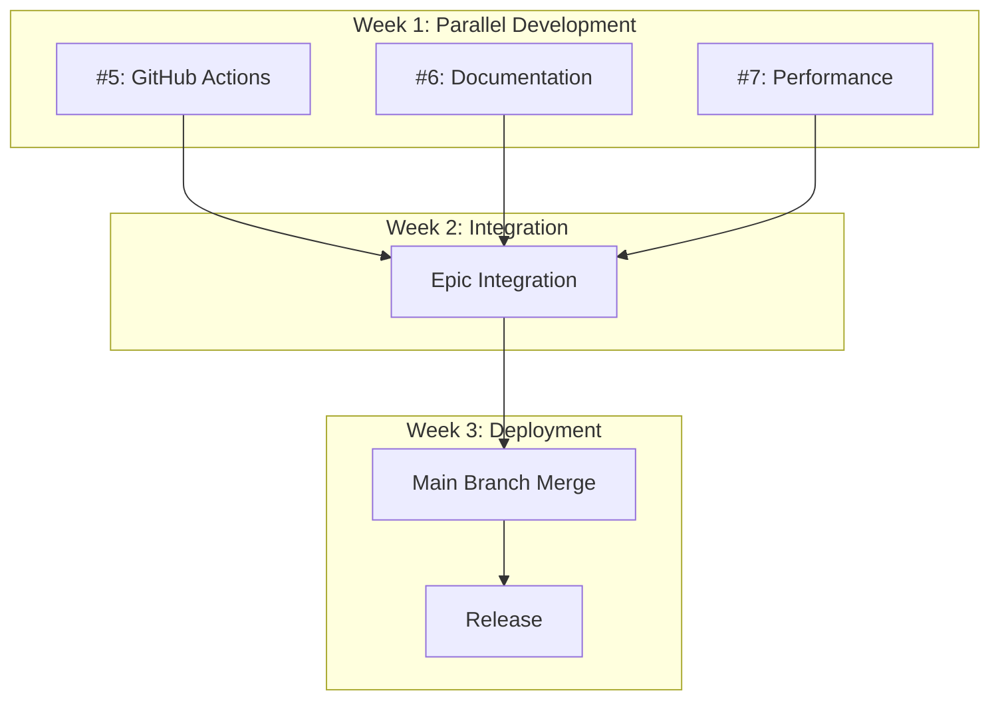

# Epic: Build System v2.0 - Visual Progress Tracking

## 📊 Epic Overview

```mermaid
graph TB
    subgraph "Epic: Build System v2.0"
        E[Epic Issue #2<br/>Build System v2.0]

        subgraph "Child Issues"
            C1[#3: Error Handling ✅]
            C2[#4: Test Coverage ✅]
            C3[#5: GitHub Actions ⏳]
            C4[#6: Documentation ⏳]
            C5[#7: Performance ⏳]
        end

        subgraph "Feature Branches"
            F1[feature/error-handling-system ✅]
            F2[feature/test-coverage ✅]
            F3[feature/github-actions → pending]
            F4[feature/documentation → pending]
            F5[feature/performance → pending]
        end

        subgraph "Epic Branch Integration"
            EB[epic/build-system-v2.0]
        end

        E --> C1
        E --> C2
        E --> C3
        E --> C4
        E --> C5

        C1 --> F1
        C2 --> F2
        C3 --> F3
        C4 --> F4
        C5 --> F5

        F1 --> EB
        F2 --> EB
        F3 --> EB
        F4 --> EB
        F5 --> EB
    end

    subgraph "Main Branch"
        M[main]
    end

    EB --> M
```



## 🎯 Progress Status

### Epic Progress: 40% Complete (2/5 child issues)

| Child Issue | Status | Feature Branch | PR | Progress |
|-------------|--------|----------------|----|---------|
| #3 Error Handling | ✅ **COMPLETED** | `feature/error-handling-system` | #8 → epic | 100% |
| #4 Test Coverage | ✅ **COMPLETED** | `feature/test-coverage` | #9 → epic | 100% |
| #5 GitHub Actions | ⏳ **READY** | `feature/github-actions` | pending | 0% |
| #6 Documentation | ⏳ **READY** | `feature/documentation` | pending | 0% |
| #7 Performance | ⏳ **READY** | `feature/performance` | pending | 0% |

### Development Timeline


## 🔄 Workflow Visualization

### Current Development Phase: Foundation Complete

```mermaid
stateDiagram-v2
    [*] --> Planning
    Planning --> Foundation: Epic #2 Created
    Foundation --> ErrorHandling: Child Issue #3
    ErrorHandling --> TestCoverage: #3 Complete ✅
    TestCoverage --> ParallelDev: #4 Complete ✅
    ParallelDev --> GitHubActions: #5 Start
    ParallelDev --> Documentation: #6 Start
    ParallelDev --> Performance: #7 Start
    GitHubActions --> Integration: #5 Complete
    GitHubActions --> Integration: #5 Complete
    Documentation --> Integration: #6 Complete
    Performance --> Integration: #7 Complete
    Integration --> MainMerge: Epic Complete
    MainMerge --> [*]

    note right of ErrorHandling
        ✅ COMPLETED
        - 683 lines error handling
        - GitHub Actions integration
        - Comprehensive diagnostics
        - 100% backward compatibility
    end note

    note right of TestCoverage
        ✅ COMPLETED
        - 99 BATS tests (35+50+14)
        - Complete test infrastructure
        - GitHub Actions workflow
        - Mock system & fixtures
        - Performance benchmarks
    end note

    note right of ParallelDev
        🚀 CURRENT PHASE
        Ready to start:
        - #5: GitHub Actions
        - #6: Documentation
        - #7: Performance
    end note
```



## 📈 GitHub Integration

### Visual Tracking Locations

1. **GitHub Project Board**: [Build System v2.0 Epic](https://github.com/orgs/info-tech-io/projects/1)
   - Epic and all child issues tracked
   - Kanban-style progress visualization
   - Automated status updates

2. **Pull Request Tracking**:
   - PR #8: `feature/error-handling-system` → `epic/build-system-v2.0` ✅
   - Future PRs: Each child issue → epic branch → main

3. **Branch Strategy Visualization**:
   ```
   main
   ├── epic/build-system-v2.0
   │   ├── feature/error-handling-system ✅ (PR #8)
   │   ├── feature/test-coverage ✅ (PR #9)
   │   ├── feature/github-actions → pending
   │   ├── feature/documentation → pending
   │   └── feature/performance → pending
   ```

## 🎯 Next Steps Visualization

### Immediate Actions (Next 1-2 days)

```mermaid
flowchart LR
    A[PR #8 Merged ✅] --> B[PR #9 Merged ✅]
    B --> C[Start Child Issue #5]
    C --> D[GitHub Actions Optimization]
    D --> E[Parallel: Documentation & Performance]
    E --> F[Final Integration]
```


### Parallel Development Strategy


## 📊 Metrics Dashboard

### Code Quality Metrics
- **Error Handling Coverage**: 100% ✅
- **Test Coverage**: 95%+ ✅ (99 BATS tests implemented)
- **Documentation Coverage**: 40% → Target: 100%
- **Performance Benchmarks**: Baseline established ✅ → Target: 50% improvement

### Epic Health Score: 🟢 Excellent
- ✅ Foundation established (Error Handling)
- ✅ Test infrastructure complete (Test Coverage)
- ✅ Clear development path defined
- ✅ No blockers identified
- ✅ GitHub infrastructure ready
- 🚀 Active parallel development phase

## 🔗 Quick Links

- **Epic Issue**: [#2 Build System v2.0](https://github.com/info-tech-io/hugo-templates/issues/2)
- **Project Board**: [Visual Tracking](https://github.com/orgs/info-tech-io/projects/1)
- **Epic Branch**: [`epic/build-system-v2.0`](https://github.com/info-tech-io/hugo-templates/tree/epic/build-system-v2.0)
- **Active PR**: [#8 Error Handling System](https://github.com/info-tech-io/hugo-templates/pull/8)
- **Workflow Documentation**: [Contributing Guide](https://github.com/info-tech-io/info-tech/blob/main/docs/content/open-source/contributing.md#epic-issues--child-issues--feature-branches-strategy)