# Issue #14: Caching System Blocks Custom Content - Progress Tracking

## 📊 Issue Overview

```mermaid
graph TB
    subgraph "Issue #14: Bug Fix - Caching System"
        I[Issue #14<br/>Caching blocks custom content<br/>⏳ IN PROGRESS]

        subgraph "Investigation Stages"
            S1[Stage 1: Bug Reproduction<br/>📋 PLANNED]
            S2[Stage 2: Hypothesis Verification<br/>⏸️ PENDING]
            S3[Stage 3: Fix Implementation<br/>⏸️ PENDING]
            S4[Stage 4: Testing & Validation<br/>⏸️ PENDING]
        end

        subgraph "Documentation"
            D1[design.md ✅]
            P1[progress.md ✅]
            ST1[001-reproduction.md ✅]
            PR1[001-progress.md 📝]
        end

        I --> D1
        I --> P1
        D1 --> ST1
        ST1 --> PR1
        PR1 --> S1
        S1 --> S2
        S2 --> S3
        S3 --> S4
    end

    subgraph "Final Outcome"
        F[Bug Fixed & Merged ⏸️]
    end

    S4 --> F
```



## 🎯 Current Status

**Phase**: Investigation Complete → Ready for Fix Implementation
**Current Stage**: Stage 1 COMPLETE → Stage 2 Planning
**Progress**: 25% (1/4 stages completed)

### Stage Progress

| Stage | Description | Status | Progress File | Commit |
|-------|-------------|--------|---------------|--------|
| **001** | Bug Reproduction | ✅ **COMPLETE** | [`001-progress.md`](./001-progress.md) | Pending |
| **002** | Fix Implementation | 📋 **PLANNING** | `002-progress.md` | - |
| **003** | Testing & Validation | ⏸️ PENDING | - | - |
| **004** | Documentation Update | ⏸️ PENDING | - | - |

### Documentation Status

| File | Status | Description |
|------|--------|-------------|
| `design.md` | ✅ **COMPLETE** | Problem analysis with 5 ranked hypotheses |
| `progress.md` | 🔄 **UPDATING** | This file - overall progress tracking |
| `001-reproduction.md` | ✅ **COMPLETE** | Stage 1 detailed plan |
| `001-progress.md` | ✅ **COMPLETE** | Stage 1 results - bug confirmed |
| `002-fix-implementation.md` | 📝 **PENDING** | Stage 2 plan (to be created) |
| `002-progress.md` | 📝 **PENDING** | Stage 2 results (to be created) |

## 🔄 Development Timeline

```mermaid
gantt
    title Issue #14 Bug Fix Timeline
    dateFormat YYYY-MM-DD
    section Planning
    Design & Analysis          :done, design, 2025-10-02, 1d
    Stage 1 Planning          :done, plan1, 2025-10-02, 1d
    section Investigation
    Stage 1: Reproduction     :active, stage1, 2025-10-03, 1d
    Stage 2: Hypothesis       :stage2, after stage1, 1d
    section Implementation
    Stage 3: Fix              :stage3, after stage2, 1d
    Stage 4: Testing          :stage4, after stage3, 1d
    section Completion
    Code Review               :review, after stage4, 1d
    Merge to Main            :milestone, merge, after review, 1d
```

## 📈 Hypothesis Analysis Status

From `design.md`, ranked by probability:

| # | Hypothesis | Probability | Status | Verification Result |
|---|------------|-------------|--------|-------------------|
| 1 | Cache key missing `$CONTENT` parameter | 90% 🔴 | ✅ **CONFIRMED** | Stage 1: Code inspection + cache key analysis |
| 2 | Content hash not recalculated | 60% 🟡 | ⏭️ SKIPPED | Not needed - #1 explains bug completely |
| 3 | Cache restoration timing issue | 40% 🟢 | ⏭️ SKIPPED | Not needed - #1 explains bug completely |
| 4 | Content variable overwrite | 20% 🟢 | ⏭️ SKIPPED | Not needed - #1 explains bug completely |
| 5 | Cache invalidation logic bug | 10% 🟢 | ⏭️ SKIPPED | Not needed - #1 explains bug completely |

**Result**: Hypothesis #1 confirmed in Stage 1. Root cause: lines 729, 768 in `build.sh` missing `${CONTENT}` variable.

## 🔍 Stage 1: Bug Reproduction - ✅ COMPLETE

### Objectives Achieved
- ✅ GitHub Pages workflow located and analyzed
- ✅ Test infrastructure created in production environment
- ✅ Cache key analysis performed with different content sources
- ✅ Bug confirmed through identical cache keys
- ✅ Root cause identified in code

### Success Criteria - All Met
- [x] GitHub Pages workflow found in `info-tech-io.github.io`
- [x] Bug reproduced through cache key analysis
- [x] Observable evidence documented (identical cache keys)
- [x] Reproducible - test workflow created for future verification
- [x] Production workaround confirmed (`--no-cache` in use)

### Evidence Collected
- [x] Test workflow: `test-cache-bug.yml` ([commits](https://github.com/info-tech-io/info-tech-io.github.io/commits/main))
- [x] Workflow runs: [#18221608898](https://github.com/info-tech-io/info-tech-io.github.io/actions/runs/18221608898), [#18221800796](https://github.com/info-tech-io/info-tech-io.github.io/actions/runs/18221800796)
- [x] Cache key comparison: Identical keys for different content
- [x] Code inspection: Lines 729, 768 in `scripts/build.sh`
- [x] Detailed report: [`001-progress.md`](./001-progress.md)

**Status**: ✅ **COMPLETE** - Bug reproduced, root cause identified
**Details**: See [`001-progress.md`](./001-progress.md)

## 📊 Metrics Dashboard

### Bug Impact Metrics
- **Severity**: 🔴 CRITICAL (Production Blocker)
- **Affected Users**: InfoTech.io corporate site deployment
- **Workaround Available**: Yes (`--no-cache` flag)
- **Performance Impact**: Builds 50%+ slower without cache

### Investigation Metrics
- **Time Invested**: 1 day (planning)
- **Hypotheses Identified**: 5
- **Stages Planned**: 4
- **Documentation**: 4 files created

### Target Metrics
- **Fix Timeline**: 2-3 days total
- **Test Coverage**: 100% for cache key generation
- **Regression Prevention**: Add test cases for `--content` parameter

## 🔄 Workflow State

```mermaid
stateDiagram-v2
    [*] --> IssueCreated: Bug reported
    IssueCreated --> DesignPhase: Issue #14 opened
    DesignPhase --> DesignComplete: design.md created
    DesignComplete --> StagePlanning: Stages defined
    StagePlanning --> Stage1Ready: 001-reproduction.md created
    Stage1Ready --> Stage1Execution: Ready to execute

    Stage1Execution --> Stage1Complete: Evidence collected
    Stage1Complete --> Stage2Planning: Plan hypothesis tests
    Stage2Planning --> Stage2Execution: Verify hypotheses
    Stage2Execution --> RootCauseFound: Hypothesis confirmed

    RootCauseFound --> FixImplementation: Stage 3
    FixImplementation --> Testing: Stage 4
    Testing --> CodeReview: All tests pass
    CodeReview --> Merged: PR approved
    Merged --> IssueClosed: Bug fixed
    IssueClosed --> [*]

    note right of Stage1Ready
        📍 CURRENT STATE
        Ready to execute
        001-reproduction.md
    end note
```



## 🔗 Related Resources

### Issue & Documentation
- **GitHub Issue**: [#14 Caching system blocks custom content](https://github.com/info-tech-io/hugo-templates/issues/14)
- **Design Doc**: [design.md](./design.md)
- **Stage 1 Plan**: [001-reproduction.md](./001-reproduction.md)
- **Stage 1 Results**: [001-progress.md](./001-progress.md) (pending)

### Code References
- **Cache Key Generation**: `scripts/build.sh:729, 768`
- **Cache System**: `scripts/cache.sh`
- **Related Epic**: [#2 Build System v2.0](../epic-2-build-system-v2-0/) (introduced caching)
- **Child Issue**: [#7 Performance Optimization](../epic-2-build-system-v2-0/child-7-performance-optimization/) (cache implementation)

### Test Content
- **Test Repository**: `info-tech-io/info-tech` (corporate site content)
- **Expected Output**: 370+ pages, 9.7MB
- **Bug Output**: 4 pages, 76KB

## 📝 Commit History

| Commit | Date | Description | Repository |
|--------|------|-------------|------------|
| `2772176` | Oct 2, 2025 | docs(issue-14): add design documentation and reproduction plan | hugo-templates |
| `3df8c36` | Oct 3, 2025 | test: add workflow for Issue #14 cache bug reproduction | info-tech-io.github.io |
| `1c7a736` | Oct 3, 2025 | test: add content source selection for cache bug reproduction | info-tech-io.github.io |
| Pending | Oct 3, 2025 | docs(issue-14): Stage 1 complete - bug reproduced and confirmed | hugo-templates |

## 🎯 Next Actions

### Immediate (Next Step)
1. ✅ Stage 1: Bug Reproduction - **COMPLETE**
2. ✅ Document results in `001-progress.md` - **COMPLETE**
3. 🔄 Update `progress.md` with Stage 1 results - **IN PROGRESS**
4. 📋 Commit Stage 1 documentation updates
5. 📝 Create Stage 2 plan: `002-fix-implementation.md`
6. 📋 Commit Stage 2 plan

### After Stage 2 Planning
7. 🔧 Implement fix: Add `${CONTENT}` to config_hash (lines 729, 768)
8. 📋 Commit implementation with proper message
9. 📊 Document results in `002-progress.md`
10. 🔁 Continue with Stage 3 (Testing) and Stage 4 (Documentation)

---

**Last Updated**: October 3, 2025
**Status**: ✅ Stage 1 Complete → Planning Stage 2 (Fix Implementation)
**Progress**: 25% (1/4 stages completed)
**Estimated Completion**: October 4-5, 2025
