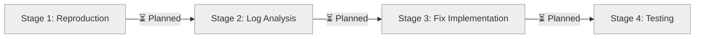

# Progress: Issue #22 - Build Script Returns Exit Code 1 on Successful Builds

## Status Dashboard

## Timeline

| Stage | Status | Started | Completed | Commits |
|-------|--------|---------|-----------|---------|
| 1. Bug Reproduction | ⏳ Planned | - | - | - |
| 2. Log Analysis | ⏳ Planned | - | - | - |
| 3. Fix Implementation | ⏳ Planned | - | - | - |
| 4. Testing & Validation | ⏳ Planned | - | - | - |

## Metrics

- **Bug Impact**: CI/CD blocker, deployment blocked
- **Target Resolution**: 1-2 days
- **Workflows Affected**: All GitHub Actions using build.sh
- **Related Issues**: Blocked Issue #14 testing

## Notes

- Reverted commit befb36f (failed quick fix)
- Following Issue #14 approach: reproduction → analysis → fix
- Started from clean state at commit cc5e0be

---

**Last Updated**: October 5, 2025
**Status**: 📋 Planning Stage 1 (Reproduction)
