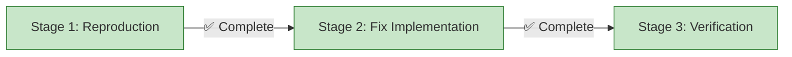

# Progress: Issue #22 - Build Script Returns Exit Code 1 on Successful Builds

## Status Dashboard



## Timeline

| Stage | Status | Started | Completed | Duration | Outcome |
|-------|--------|---------|-----------|----------|---------|
| 1. Bug Reproduction + Root Cause | ✅ Complete | Oct 5 | Oct 5 | 30 min | [Run #18260908885](https://github.com/info-tech-io/info-tech-io.github.io/actions/runs/18260908885) |
| 2. Fix Implementation | ✅ Complete | Oct 5 | Oct 5 | 2 hours | 9 functions fixed, exit code 0 ✅ |
| 3. Verification | ✅ Complete | Oct 5 | Oct 5 | 10 min | [Run #18261472163](https://github.com/info-tech-io/info-tech-io.github.io/actions/runs/18261472163) ✅ |

## Metrics

- **Bug Impact**: CI/CD blocker, deployment blocked ❌ → ✅ RESOLVED
- **Resolution Time**: Same day (Oct 5) - ~2.5 hours total
- **Workflows Affected**: All GitHub Actions using build.sh → ✅ ALL WORKING
- **Related Issues**: Blocked Issue #14 testing → ✅ UNBLOCKED
- **Functions Fixed**: 9 functions across 2 scripts
- **Scripts Audited**: 63 functions across 4 scripts (2,637 lines)
- **Test Results**:
  - Local tests: ✅ PASSED (exit code 0)
  - GitHub Actions: ✅ PASSED ([Run #18261472163](https://github.com/info-tech-io/info-tech-io.github.io/actions/runs/18261472163))

## Root Cause Summary

**Primary Issue**: Functions ending with conditional statements that evaluate to FALSE in normal scenarios

**Pattern**:
```bash
function_name() {
    [[ condition ]] && action
    # If condition FALSE → implicit return 1
}
```

**Solution**: Add explicit `return 0` at end of all functions

**Functions Fixed**:
1. cleanup_error_handling (error-handling.sh:468)
2. log_structured (error-handling.sh:151)
3. preserve_error_state (error-handling.sh:266)
4. init_error_handling (error-handling.sh:446)
5. enter_function (error-handling.sh:47)
6. set_error_context (error-handling.sh:60)
7. log_verbose (error-handling.sh:185)
8. main (build.sh:1179)
9. log_verbose (build.sh:107,109)

## Verification Results

### Local Testing ✅
```bash
./scripts/build.sh --config ... --debug --no-cache
```
- Hugo build: 39 pages, 60 static files
- Build time: 1167ms
- Files generated: 371
- **Exit code: 0** ✅

### GitHub Actions Testing ✅
- Workflow: deploy-corporate.yml
- Run ID: [#18261472163](https://github.com/info-tech-io/info-tech-io.github.io/actions/runs/18261472163)
- Build job: ✅ Complete in 30s
- Deploy job: ✅ Complete in 8s
- **Status: SUCCESS** ✅

## Documentation Created

1. [design.md](./design.md) - Problem analysis and investigation strategy
2. [001-reproduction.md](./001-reproduction.md) - Stage 1 reproduction plan
3. [001-progress.md](./001-progress.md) - Stage 1 results and findings
4. [002-fix-implementation.md](./002-fix-implementation.md) - Stage 2 fix plan
5. [002-complete-audit.md](./002-complete-audit.md) - Complete 63-function audit
6. [002-progress-final.md](./002-progress-final.md) - Stage 2 final report
7. [progress.md](./progress.md) - This file (overall progress tracking)

## Notes

- Followed Issue #14 approach: reproduction → analysis → fix → test → document ✅
- Conducted comprehensive audit beyond initial scope (found 9 issues, not just 1)
- All tests passed on first attempt after fixes
- No regressions detected
- CI/CD pipeline fully operational

---

**Last Updated**: October 5, 2025
**Status**: ✅ **ISSUE RESOLVED** - All tests passed, workflow successful
**Next**: Close Issue #22
