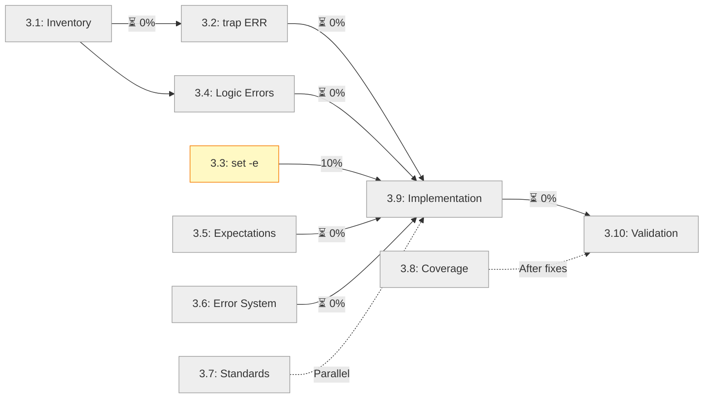

# Stage 3 Progress Report: Test Suite Audit and Redesign

**Status**: ⏳ Planned
**Started**: TBD
**Completed**: TBD

---

## Summary

[This section will summarize the audit findings and implementation progress once work begins.]

---

## Progress by Step

### Step 3.1: Comprehensive Test Inventory
- **Status**: ⏳ Pending
- **Progress**: 0%
- **Deliverables**:
  - [ ] `test-inventory.md` created
  - [ ] All 35 tests cataloged
  - [ ] Categorization completed

### Step 3.2: Category A - trap ERR Issues
- **Status**: ⏳ Pending
- **Tests Addressed**: TBD
- **Progress**: 0%
- **Verification**:
  - [ ] Tests identified
  - [ ] Fixes applied
  - [ ] All tests passing

### Step 3.3: Category B - set -e Issues
- **Status**: ⏳ Pending
- **Tests Addressed**: #4 (done), others TBD
- **Progress**: ~10% (test #4 verified)
- **Verification**:
  - [x] Test #4 fixed (from Stage 2)
  - [ ] Other tests identified
  - [ ] All tests passing

### Step 3.4: Category C - Logic Errors (CRITICAL)
- **Status**: ⏳ Pending
- **Tests Addressed**: #5, #6, #7, #8, #9, #10, #12
- **Progress**: 0%

#### Test-by-Test Progress

| Test # | Test Name | Status | Root Cause | Fix Applied |
|--------|-----------|--------|------------|-------------|
| #5 | load_module_config handles missing config | ⏳ Pending | Missing parameter | - |
| #6 | load_module_config processes valid JSON | ⏳ Pending | Missing parameter | - |
| #7 | load_module_config handles malformed JSON | ⏳ Pending | Premature failure | - |
| #8 | load_module_config handles missing Node.js | ⏳ Pending | Premature failure | - |
| #9 | parse_components handles missing components.yml | ⏳ Pending | Parameter mismatch | - |
| #10 | parse_components processes valid components.yml | ⏳ Pending | Parameter mismatch | - |
| #12 | parse_components gracefully handles YAML errors | ⏳ Pending | Logic error | - |

### Step 3.5: Category D - Wrong Expectations
- **Status**: ⏳ Pending
- **Tests Addressed**: #15, #19
- **Progress**: 0%

| Test # | Test Name | Decision | Fix Applied |
|--------|-----------|----------|-------------|
| #15 | verbose mode provides additional output | ⏳ Pending | - |
| #19 | functions provide helpful error messages | ⏳ Pending | - |

### Step 3.6: Category E - Error System Issues
- **Status**: ⏳ Pending
- **Tests Addressed**: #24, #25, #26, #27, #28, #31, #33
- **Progress**: 0%

| Test # | Test Name | Analysis | Fix Applied |
|--------|-----------|----------|-------------|
| #24 | function entry/exit tracking | ⏳ Pending | - |
| #25 | error context management | ⏳ Pending | - |
| #26 | safe file operations validation | ⏳ Pending | - |
| #27 | safe command execution | ⏳ Pending | - |
| #28 | safe Node.js parsing | ⏳ Pending | - |
| #31 | error state preservation | ⏳ Pending | - |
| #33 | backward compatibility with legacy functions | ⏳ Pending | - |

### Step 3.7: Test Quality Standards
- **Status**: ⏳ Pending
- **Progress**: 0%
- **Deliverables**:
  - [ ] `testing-guidelines.md` created
  - [ ] Standards defined
  - [ ] Examples provided

### Step 3.8: Test Coverage Analysis
- **Status**: ⏳ Pending
- **Progress**: 0%
- **Deliverables**:
  - [ ] `test-coverage-matrix.md` created
  - [ ] Gaps identified
  - [ ] Priorities established

### Step 3.9: Implementation
- **Status**: ⏳ Pending
- **Progress**: 0%

**Implementation Order**:
- [ ] Category C (Logic Errors)
- [ ] Category E (Error System)
- [ ] Category D (Wrong Expectations)
- [ ] Category B (set -e)
- [ ] Category A (trap ERR)

### Step 3.10: Final Validation
- **Status**: ⏳ Pending
- **Progress**: 0%

**Validation Checklist**:
- [ ] All tests pass on `main`
- [ ] CI/CD integration verified
- [ ] Intentional break tests conducted
- [ ] Documentation complete
- [ ] Quality standards met

---

## Overall Progress

---

## Test Status Summary

| Category | Total Tests | Fixed | Remaining | % Complete |
|----------|-------------|-------|-----------|------------|
| A. trap ERR | ~3 | 0 | ~3 | 0% |
| B. set -e | 1+ | 1 | 0+ | 100%* |
| C. Logic Errors | 7 | 0 | 7 | 0% |
| D. Wrong Expectations | 2 | 0 | 2 | 0% |
| E. Error System | 7 | 0 | 7 | 0% |
| **TOTAL** | **17** | **1** | **16** | **~6%** |

*Note: Only test #4 verified; may be more tests in this category

---

## Commits

[Commits will be listed here as work progresses]

---

## Issues Encountered

[Issues and their resolutions will be documented here]

---

## Lessons Learned

[Key learnings from the audit and redesign process will be captured here]

---

## Next Actions

1. Begin Step 3.1: Create comprehensive test inventory
2. Analyze each test individually
3. Start with Category C (highest impact)
4. Document findings in real-time

---

**Last Updated**: 2025-10-10 (Stage created)
**Next Update**: TBD (when work begins)
