# Stage 3 Progress Report: Test Suite Audit and Redesign

**Status**: 🔄 In Progress
**Started**: 2025-10-10
**Completed**: TBD

---

## Summary

Stage 3 is underway with comprehensive test suite audit. Initial test inventory completed, followed by successful Category C fixes.

**Current Status**: 25 passing (71%), 10 failing (29%) ✅

**Progress**:
- ✅ Step 3.1 (Test Inventory) - Complete
- ✅ Step 3.4 (Category C - Logic Errors) - Complete - **7 tests fixed!**
- ⏳ Step 3.5 (Category D - Wrong Expectations) - Next
- ⏳ Step 3.6 (Category E - Error System) - Pending

**Key Achievements**:
- **41% of failures resolved** by fixing Category C
- All 7 logic error tests now passing (#5-#10, #12)
- Test quality improved with proper parameter passing
- Test isolation improved (Test #9)

**Remaining**: 10 failing tests across Categories D, E, F

---

## Progress by Step

### Step 3.1: Comprehensive Test Inventory
- **Status**: ✅ Complete
- **Progress**: 100%
- **Completed**: 2025-10-10
- **Deliverables**:
  - [x] Test run executed and results captured
  - [x] All 35 tests cataloged
  - [x] Categorization completed
  - [ ] `test-inventory.md` document created (in progress)

**Test Run Results** (2025-10-10):
```
Total Tests: 35
Passing: 18 (51%)
Failing: 17 (49%)
Duration: 9s
```

**Category Distribution**:
- Category A (trap ERR): 0 tests - ✅ Already solved
- Category B (set -e): 1 test (#4) - ✅ Already solved
- Category C (Logic Errors): 7 tests (#5-#10, #12) - ⚠️ CRITICAL, 41% of failures
- Category D (Wrong Expectations): 2 tests (#15, #19) - ⚠️ Medium, 12% of failures
- Category E (Error System): 6 tests (#24-#28, #31) - ⚠️ Complex, 35% of failures
- Category F (Unknown): 1 test (#33) - ❓ Needs analysis, 6% of failures

**Failing Tests Detail**:
```
❌ #5  - load_module_config handles missing config file
❌ #6  - load_module_config processes valid JSON configuration
❌ #7  - load_module_config handles malformed JSON
❌ #8  - load_module_config handles missing Node.js
❌ #9  - parse_components handles missing components.yml
❌ #10 - parse_components processes valid components.yml
❌ #12 - parse_components gracefully handles YAML parsing errors
❌ #15 - verbose mode provides additional output
❌ #19 - functions provide helpful error messages
❌ #24 - function entry/exit tracking
❌ #25 - error context management
❌ #26 - safe file operations validation
❌ #27 - safe command execution
❌ #28 - safe Node.js parsing
❌ #31 - error state preservation
❌ #33 - backward compatibility with legacy functions
```

**Key Insights**:
1. **Category C dominates**: 7 out of 17 failures (41%) are simple logic errors in tests
2. **Quick wins available**: Fixing Category C will resolve nearly half of all failures
3. **Complex issues remain**: Category E requires deep analysis of error-handling.sh integration
4. **Test quality issues**: Many tests call functions without required parameters (tests #5-#10)

### Step 3.2: Category A - trap ERR Issues
- **Status**: ⏳ Pending
- **Tests Addressed**: TBD
- **Progress**: 0%
- **Verification**:
  - [ ] Tests identified
  - [ ] Fixes applied
  - [ ] All tests passing

### Step 3.3: Category B - set -e Issues
- **Status**: ⏳ Pending
- **Tests Addressed**: #4 (done), others TBD
- **Progress**: ~10% (test #4 verified)
- **Verification**:
  - [x] Test #4 fixed (from Stage 2)
  - [ ] Other tests identified
  - [ ] All tests passing

### Step 3.4: Category C - Logic Errors (CRITICAL)
- **Status**: ✅ Complete
- **Completed**: 2025-10-10
- **Tests Addressed**: #5, #6, #7, #8, #9, #10, #12
- **Progress**: 100% (7/7 tests fixed)

#### Test-by-Test Progress

| Test # | Test Name | Status | Root Cause | Fix Applied |
|--------|-----------|--------|------------|-------------|
| #5 | load_module_config handles missing config | ✅ Fixed | Missing parameter | Pass "$CONFIG" parameter; expect error status |
| #6 | load_module_config processes valid JSON | ✅ Fixed | Missing parameter | Pass "$CONFIG" parameter |
| #7 | load_module_config handles malformed JSON | ✅ Fixed | Missing parameter | Pass "$CONFIG" parameter; fix assertion |
| #8 | load_module_config handles missing Node.js | ✅ Fixed | Missing parameter + mock uses jq | Pass "$CONFIG"; note mock limitation |
| #9 | parse_components handles missing components.yml | ✅ Fixed | Parameter mismatch + test isolation | Pass template path; use isolated TEST_TEMP_DIR |
| #10 | parse_components processes valid components.yml | ✅ Fixed | Parameter mismatch | Pass template path |
| #12 | parse_components gracefully handles YAML errors | ✅ Fixed | Parameter mismatch + mock limitation | Pass template path; note mock doesn't parse YAML |

**Summary of Fixes**:
1. **Added missing parameters** to all function calls (#5-#12)
2. **Fixed Test #5**: Changed expectation from success to error (return 1)
3. **Fixed Test #9**: Used isolated directory to prevent test contamination
4. **Added comments** for Tests #8 and #12 noting mock function limitations
5. **Fixed Test #18** (bonus): Added missing parameter (not Category C but needed fix)

**Impact**: Fixed 7 tests (41% of all failures), reducing failures from 17 to 10.

### Step 3.5: Category D - Wrong Expectations
- **Status**: ⏳ Pending
- **Tests Addressed**: #15, #19
- **Progress**: 0%

| Test # | Test Name | Decision | Fix Applied |
|--------|-----------|----------|-------------|
| #15 | verbose mode provides additional output | ⏳ Pending | - |
| #19 | functions provide helpful error messages | ⏳ Pending | - |

### Step 3.6: Category E - Error System Issues
- **Status**: ⏳ Pending
- **Tests Addressed**: #24, #25, #26, #27, #28, #31, #33
- **Progress**: 0%

| Test # | Test Name | Analysis | Fix Applied |
|--------|-----------|----------|-------------|
| #24 | function entry/exit tracking | ⏳ Pending | - |
| #25 | error context management | ⏳ Pending | - |
| #26 | safe file operations validation | ⏳ Pending | - |
| #27 | safe command execution | ⏳ Pending | - |
| #28 | safe Node.js parsing | ⏳ Pending | - |
| #31 | error state preservation | ⏳ Pending | - |
| #33 | backward compatibility with legacy functions | ⏳ Pending | - |

### Step 3.7: Test Quality Standards
- **Status**: ⏳ Pending
- **Progress**: 0%
- **Deliverables**:
  - [ ] `testing-guidelines.md` created
  - [ ] Standards defined
  - [ ] Examples provided

### Step 3.8: Test Coverage Analysis
- **Status**: ⏳ Pending
- **Progress**: 0%
- **Deliverables**:
  - [ ] `test-coverage-matrix.md` created
  - [ ] Gaps identified
  - [ ] Priorities established

### Step 3.9: Implementation
- **Status**: ⏳ Pending
- **Progress**: 0%

**Implementation Order**:
- [ ] Category C (Logic Errors)
- [ ] Category E (Error System)
- [ ] Category D (Wrong Expectations)
- [ ] Category B (set -e)
- [ ] Category A (trap ERR)

### Step 3.10: Final Validation
- **Status**: ⏳ Pending
- **Progress**: 0%

**Validation Checklist**:
- [ ] All tests pass on `main`
- [ ] CI/CD integration verified
- [ ] Intentional break tests conducted
- [ ] Documentation complete
- [ ] Quality standards met

---

## Overall Progress

```mermaid
graph LR
    A[3.1: Inventory] -->|⏳ 0%| B[3.2: trap ERR]
    A --> C[3.4: Logic Errors]
    B -->|⏳ 0%| D[3.9: Implementation]
    C -->|⏳ 0%| D
    E[3.3: set -e] -->|10%| D
    F[3.5: Expectations] -->|⏳ 0%| D
    G[3.6: Error System] -->|⏳ 0%| D
    D -->|⏳ 0%| H[3.10: Validation]

    I[3.7: Standards] -.->|Parallel| D
    J[3.8: Coverage] -.->|After fixes| H

    style A fill:#eeeeee,stroke:#9e9e9e
    style B fill:#eeeeee,stroke:#9e9e9e
    style C fill:#eeeeee,stroke:#9e9e9e
    style D fill:#eeeeee,stroke:#9e9e9e
    style E fill:#fff9c4,stroke:#f57c00
    style F fill:#eeeeee,stroke:#9e9e9e
    style G fill:#eeeeee,stroke:#9e9e9e
    style H fill:#eeeeee,stroke:#9e9e9e
    style I fill:#eeeeee,stroke:#9e9e9e
    style J fill:#eeeeee,stroke:#9e9e9e
```



---

## Test Status Summary

| Category | Total Tests | Fixed | Remaining | % Complete |
|----------|-------------|-------|-----------|------------|
| A. trap ERR | 0 | 0 | 0 | ✅ 100% (solved in Stage 2) |
| B. set -e | 1 | 1 | 0 | ✅ 100% (test #4) |
| C. Logic Errors | 7 | 7 | 0 | ✅ **100%** |
| D. Wrong Expectations | 2 | 0 | 2 | ⏳ 0% |
| E. Error System | 6 | 0 | 6 | ⏳ 0% |
| F. Unknown | 1 | 0 | 1 | ⏳ 0% |
| **TOTAL** | **17** | **8** | **9** | **✅ 47%** |

**Note**: Categories A, B, C fully solved. Focus now on Categories D, E, F in that order.

**Progress Update (2025-10-10)**:
- Initial state: 18/35 passing (51%)
- After Category C: 25/35 passing (71%)
- **Improvement: +7 tests (+20 percentage points)**

---

## Commits

[Commits will be listed here as work progresses]

---

## Issues Encountered

[Issues and their resolutions will be documented here]

---

## Lessons Learned

[Key learnings from the audit and redesign process will be captured here]

---

## Next Actions

1. ✅ ~~Begin Step 3.1: Create comprehensive test inventory~~ - COMPLETE
2. ✅ ~~Analyze each test individually~~ - COMPLETE
3. ⏳ Skip Steps 3.2 & 3.3 (Categories A & B already solved)
4. ⏳ **Start Step 3.4: Fix Category C (Logic Errors)** - 7 tests, highest impact
5. ⏳ Create detailed fix plan for each test in Category C
6. ⏳ Apply fixes test by test, verifying after each

**Immediate Next Step**: Begin Category C fixes with test #5 (load_module_config missing parameter issue)

---

**Last Updated**: 2025-10-10 13:15 UTC
**Next Update**: After Category D fixes completed

**Latest Achievement**: ✅ Category C (Logic Errors) - 7 tests fixed, 41% of failures resolved!
