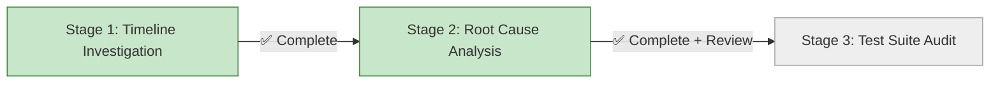

# Progress: Issue #26 - Fix Failing BATS Unit Tests

## Status Dashboard



## Timeline

| Stage | Status | Started | Completed | Duration | Key Findings |
|-------|--------|---------|-----------|----------|--------------|
| 1. Timeline Investigation | ✅ Complete | Oct 9 | Oct 9 | 0.5h | Tests failed since creation (Sept 27) |
| 2. Root Cause Analysis | ✅ Complete | Oct 9 | Oct 10 | 1h | Multiple systemic issues found |
| 2.1 Critical Review | ✅ Complete | Oct 10 | Oct 10 | 1.5h | Initial analysis incomplete |
| 3. Test Suite Audit & Redesign | ⏳ Planned | - | - | Est: 3-4 days | - |

## Metrics (Updated 2025-10-10)

- **Issue Priority**: HIGH (blocks Epic #15)
- **Initial Estimate**: 4-6 hours
- **Revised Estimate**: 3-4 days (after discovering scope)
- **Tests Status**: 18/35 passing, **17/35 failing** (initial count was wrong)
- **Blocker For**: Epic #15 merge, Child #19 start

## Major Findings

### Critical Discovery (Stage 2 Review)

**Initial analysis was incomplete and partially incorrect:**

| Metric | Initial Report | Actual Reality |
|--------|----------------|----------------|
| Failing tests on `main` | 11 tests | **17 tests** ❌ |
| After fixes | 7 remaining | **13 remaining** ❌ |

### Root Causes Breakdown

The problem is **NOT** just `trap ERR` and `set -e`. Tests have multiple systemic issues:

| Category | Tests | % of Failures | Root Cause | Status |
|----------|-------|---------------|------------|--------|
| **A. trap ERR** | ~3 | 18% | `trap ERR` intercepts expected errors | ✅ Partial fix |
| **B. set -e** | 1+ | 6% | `set -e` prevents status capture | ✅ Fixed (test #4) |
| **C. Logic Errors** | 7 | **41%** | Tests have implementation bugs | ⚠️ Critical |
| **D. Wrong Expectations** | 2 | 12% | Assertions don't match reality | ⚠️ Medium |
| **E. Error System** | 7 | 35% | Error handling integration issues | ⚠️ Complex |

### Key Insight

**Tests were written as "checkboxes" rather than real validation tools.** Many have never worked correctly since creation (Sept 27, 2025).

## Detailed Test Status

### Category C: Logic Errors (CRITICAL - 41% of failures)

Tests have fundamental logic bugs:

| Test # | Name | Issue | Priority |
|--------|------|-------|----------|
| #5 | load_module_config handles missing config | Missing parameter | High |
| #6 | load_module_config processes valid JSON | Missing parameter | High |
| #7 | load_module_config handles malformed JSON | Premature failure | High |
| #8 | load_module_config handles missing Node.js | Premature failure | High |
| #9 | parse_components handles missing components | Parameter mismatch | High |
| #10 | parse_components processes valid components | Parameter mismatch | High |
| #12 | parse_components gracefully handles YAML errors | Logic error | High |

**Example Problem** (Test #5):
```bash
# Test calls function WITHOUT parameter
run load_module_config    # No argument!
[ "$status" -eq 0 ]       # Expects SUCCESS

# Function receives empty string, correctly returns error
return 1                  # Test FAILS (but function is correct!)
```

### Category E: Error Handling System (35% of failures)

| Test # | Name | Analysis Needed |
|--------|------|-----------------|
| #24 | function entry/exit tracking | Deep analysis required |
| #25 | error context management | Deep analysis required |
| #26 | safe file operations validation | Deep analysis required |
| #27 | safe command execution | Deep analysis required |
| #28 | safe Node.js parsing | Deep analysis required |
| #31 | error state preservation | Deep analysis required |
| #33 | backward compatibility | Deep analysis required |

### Category D: Wrong Expectations (12% of failures)

| Test # | Name | Issue |
|--------|------|-------|
| #15 | verbose mode provides additional output | Expects strings mock doesn't produce |
| #19 | functions provide helpful error messages | Assertions don't match output |

### Categories A & B: Solved (24% of failures)

| Test # | Name | Solution | Status |
|--------|------|----------|--------|
| ~3 tests | Various | `DISABLE_ERROR_TRAP=true` in test-bash.sh | ✅ Implemented |
| #4 | validate_parameters handles missing Hugo | `run_safely()` wrapper | ✅ Verified |

## Stage 3: Revised Plan

**Original Plan**: "Apply `run_safely()` to remaining 7 tests" ❌

**Revised Plan**: "Complete Test Suite Audit and Redesign"

### Objectives

1. ✅ **Full Test Inventory** - Catalog and categorize all 35 tests
2. ✅ **Fix by Category** - Systematic approach, not one-by-one
3. ✅ **Test Quality Standards** - Define what makes a good test
4. ✅ **Coverage Analysis** - Identify gaps and priorities
5. ✅ **Redesign Where Needed** - Rewrite fundamentally flawed tests
6. ✅ **Validation** - Ensure tests actually validate functionality

### Deliverables

- [ ] `test-inventory.md` - Complete test catalog
- [ ] `testing-guidelines.md` - Quality standards
- [ ] `test-coverage-matrix.md` - Coverage analysis
- [ ] All 35/35 tests passing
- [ ] Tests actually validate real functionality

## Artifacts Preserved

From Stage 2 investigation:

- ✅ `DISABLE_ERROR_TRAP` mechanism - Useful, kept
- ✅ `run_safely()` helper function - Works for specific cases
- ❌ "Apply to all" approach - Abandoned after critical review

## Quick Links

- **Issue**: [#26](https://github.com/info-tech-io/hugo-templates/issues/26)
- **Branch**: `bugfix/issue-26`
- **Related Epic**: [#15 Federated Build System](https://github.com/info-tech-io/hugo-templates/issues/15)
- **Test Script**: `scripts/test-bash.sh`
- **Test Files**: `tests/bash/unit/*.bats`

## Progress Reports

- [Stage 1: Timeline Investigation](001-progress.md) - ✅ Complete
- [Stage 2: Root Cause Analysis](002-progress.md) - ✅ Complete (with critical review)
- [Stage 3: Test Suite Audit](003-test-suite-audit.md) - ⏳ Planned
- [Stage 3: Progress](003-progress.md) - ⏳ Not started

---

**Last Updated**: October 10, 2025
**Status**: 🔄 **PLANNING STAGE 3** - Comprehensive audit approach
**Next Action**: Begin Stage 3.1 - Create test inventory
