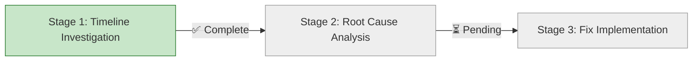

# Progress: Issue #26 - Fix Failing BATS Unit Tests

## Status Dashboard

## Timeline

| Stage | Status | Started | Completed | Duration | Commits |
|-------|--------|---------|-----------|----------|---------|
| 1. Timeline Investigation | ✅ Complete | Oct 9, 2025 | Oct 9, 2025 | 0.5h | [docs(issue-26): update Stage 1 progress](COMMIT_HASH) |
| 2. Root Cause Analysis | ⏳ Planned | - | - | Est: 1-2h | - |
| 3. Fix Implementation | ⏳ Planned | - | - | Est: 2-3h | - |

## Metrics

- **Issue Priority**: High (blocks Epic #15)
- **Estimated Total Time**: 4-6 hours
- **Actual Time**: TBD
- **Tests Status**: 24/35 passing (11 failing)
- **Blocker For**: Epic #15 merge, Child #19 start

## Test Failure Summary

### Failing Tests (11 total)

1. `validate_parameters handles missing Hugo`
2. `load_module_config handles missing config file`
3. `load_module_config processes valid JSON configuration`
4. `load_module_config handles malformed JSON`
5. `load_module_config handles missing Node.js`
6. `parse_components handles missing components.yml`
7. `parse_components processes valid components.yml`
8. `parse_components gracefully handles YAML parsing errors`
9. `verbose mode provides additional output`
10. Additional failures (TBD during investigation)

### Passing Tests

- New CSS tests: 10/10 ✅
- Some existing BATS tests: ~24/35 ✅

## Investigation Progress

### Stage 1: Timeline Investigation (⏳ Pending)

**Goal**: Identify when tests were created and when they started failing

**Tasks**:
- [ ] Review git history for test creation
- [ ] Check Epic #2 progress reports
- [ ] Check Epic #15 child issues (#16, #17, #18) progress reports
- [ ] Identify commit where tests started failing
- [ ] Document timeline

**Findings**: TBD

### Stage 2: Root Cause Analysis (⏳ Pending)

**Goal**: Understand why tests are failing

**Tasks**:
- [ ] Run failing tests with verbose output
- [ ] Analyze test expectations
- [ ] Compare with actual behavior
- [ ] Identify breaking changes
- [ ] Classify: test issue vs code issue

**Findings**: TBD

### Stage 3: Fix Implementation (⏳ Pending)

**Goal**: Fix all failing tests

**Tasks**:
- [ ] Implement fixes for each test
- [ ] Verify locally (35/35 passing)
- [ ] Verify CI pipeline
- [ ] Document changes

**Results**: TBD

## Quick Links

- **Issue**: [#26](https://github.com/info-tech-io/hugo-templates/issues/26)
- **Branch**: `epic/federated-build-system`
- **Related Epic**: [#15 Federated Build System](https://github.com/info-tech-io/hugo-templates/issues/15)
- **Test Script**: `scripts/test-bash.sh`
- **Test Files**: `tests/bash/unit/*.bats`

---

**Last Updated**: October 9, 2025
**Status**: ⏳ **PLANNING** - Ready to start Stage 1
**Next Action**: Begin timeline investigation
