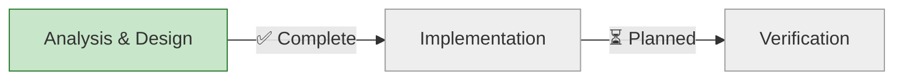

# Progress: Issue #27 - Fix CI Configuration: npm lockfile missing from repository

## Status Dashboard



## Timeline

| Stage | Status | Started | Completed | Duration | Key Deliverables |
|-------|--------|---------|-----------|----------|------------------|
| Root Cause Analysis | ✅ Complete | Oct 12 | Oct 12 | 1h | Identified config error |
| Design Documentation | ✅ Complete | Oct 12 | Oct 12 | 1h | design.md v2.0 |
| Implementation | ⏳ Planned | - | - | Est: 30min | .gitignore fix + lockfile |
| CI Verification | ⏳ Planned | - | - | Est: 10min | All tests passing |

## Executive Summary

### Problem (Corrected Understanding)

**Initial misdiagnosis** (design.md v1.0):
- ❌ Claimed "hugo-templates is Hugo-only without npm dependencies"
- ❌ Proposed creating minimal package.json as "quick fix"
- ❌ Suggested making npm cache optional as "proper solution"

**Actual root cause** (design.md v2.0):
- ✅ hugo-templates IS a Node.js CLI tool with real npm dependencies
- ✅ package.json EXISTS with jest, eslint, commander, etc.
- ✅ package-lock.json in .gitignore (configuration error!)
- ✅ CI requires lockfile but .gitignore prevents committing it

### Solution

**Correct fix**: Remove package-lock.json from .gitignore and commit it

**Why this is right**:
1. This is a CLI tool (application), not a library
2. npm best practice: applications MUST commit lockfiles
3. README already instructs `npm ci` - expects lockfile
4. Fixes both CI and developer experience

**Impact**:
- ✅ CI will work (lockfile available for caching)
- ✅ README instructions will work (`npm ci`)
- ✅ Reproducible builds guaranteed
- ✅ No code changes needed

## Metrics

- **Issue Priority**: Medium-High (blocks CI automation)
- **Actual Complexity**: Simple (configuration fix only)
- **Time Investment**: 2h analysis + 30min implementation
- **Root Cause**: Configuration error (.gitignore incorrectly ignoring lockfile)
- **CI Status**: ❌ Failing (setup-build-env step)
- **Local Tests**: ✅ 78/78 passing (100%)
- **Blocks**: Automated CI/CD validation for Epic #15

## Root Cause Analysis Summary

### Investigation Timeline

**October 12, 2025 - Morning**:
1. Issue #26 Stage 6 discovers CI failures
2. Initial assessment: "lockfile not found" error
3. Created Issue #27 with preliminary analysis

**October 12, 2025 - Afternoon** (Deep Dive):
1. ✅ Analyzed package.json - found REAL dependencies (not minimal!)
2. ✅ Checked .gitignore - found package-lock.json on line 6!
3. ✅ Reviewed npm best practices - CLI tools MUST commit lockfiles
4. ✅ Examined project type - this is an APPLICATION, not library
5. ✅ Identified contradiction: README says `npm ci` but lockfile ignored

### Key Findings

**What we discovered**:
```
❌ Myth:  "hugo-templates is Hugo-only project"
✅ Truth: Full-featured Node.js CLI tool with 13 npm dependencies

❌ Myth:  "No package.json exists"
✅ Truth: package.json exists with jest, eslint, commander, etc.

❌ Myth:  "Need to create minimal package.json"
✅ Truth: Need to REMOVE lockfile from .gitignore

❌ Myth:  "CI configuration is wrong"
✅ Truth: .gitignore configuration is wrong
```

**Evidence chain**:
1. `.gitignore:6` → `package-lock.json` (explicitly ignored)
2. `package.json` → exists, has dependencies, `preferGlobal: true`
3. `README.md` → instructs `npm ci` (requires lockfile!)
4. `setup-node@v4` → `cache: 'npm'` (requires lockfile)
5. **Conclusion** → Configuration error, not CI limitation

### npm Best Practices Validation

From [npm documentation](https://docs.npmjs.com/cli/v9/configuring-npm/package-lock-json):

**For Applications (CLI tools)**:
> It is **recommended** to commit package-lock.json. This ensures all developers and CI/CD environments install identical dependency trees.

**For Libraries**:
> You may choose **not** to commit lockfiles for libraries with peerDependencies.

**hugo-templates characteristics**:
- ✅ Has `bin/hugo-templates.js` (executable)
- ✅ Has `preferGlobal: true` (global install)
- ✅ NO peerDependencies
- ✅ Is published package (`private: null`)

**Classification**: APPLICATION → MUST commit lockfile ✅

## Implementation Plan

### Single-Stage Solution

**Total Duration**: 30 minutes

#### Step 1: Update .gitignore (5 min)
```diff
  # Node.js
  node_modules/
  npm-debug.log*
  yarn-debug.log*
  yarn-error.log*
- package-lock.json
  .npm
```

#### Step 2: Generate & Verify Lockfile (15 min)
```bash
npm install              # Generate lockfile
npm ci                   # Verify it works
./scripts/test-bash.sh --suite unit  # Run tests
npm audit                # Check security
```

#### Step 3: Commit & Push (10 min)
```bash
git add .gitignore package-lock.json
git commit -m "fix(ci): remove package-lock.json from .gitignore and commit lockfile"
git push origin epic/federated-build-system
```

#### Step 4: Verify CI (automatic)
- Monitor GitHub Actions
- Verify all 78 tests pass
- Confirm artifacts generated

## Affected Files

### Will Modify
- `.gitignore` - Remove package-lock.json (line 6)

### Will Add
- `package-lock.json` - Generated from current dependencies

### No Changes Required
- ✅ package.json - already exists, correct
- ✅ setup-build-env action - already correct
- ✅ bash-tests.yml - already correct
- ✅ README.md - already correct (will start working!)

## Verification Checklist

### Pre-Implementation
- [x] Analyzed root cause thoroughly
- [x] Verified package.json exists
- [x] Confirmed lockfile in .gitignore
- [x] Validated against npm best practices
- [x] Documented corrected understanding

### Implementation
- [ ] Remove package-lock.json from .gitignore
- [ ] Generate fresh package-lock.json via `npm install`
- [ ] Verify `npm ci` works locally
- [ ] Run all 78 tests locally (100% pass rate)
- [ ] Commit both files together
- [ ] Push to epic/federated-build-system

### Post-Implementation
- [ ] CI workflow triggered successfully
- [ ] Setup Build Environment step passes
- [ ] All 78 BATS tests execute
- [ ] All tests pass (100%)
- [ ] Test artifacts generated
- [ ] npm cache working (verify in logs)

## Alternative Solutions (Rejected)

### ❌ Alternative 1: Make npm cache optional
- Would fix CI symptom, not root cause
- README instructions would still be broken
- Fresh clones would still fail
- Violates npm best practices

### ❌ Alternative 2: Create minimal package.json
- package.json ALREADY exists!
- This was based on misunderstanding
- Would create duplicate/conflict

### ❌ Alternative 3: Remove npm caching
- Slower CI builds
- Doesn't fix developer experience
- Doesn't address root configuration error

### ✅ Chosen: Fix .gitignore configuration
- Addresses actual root cause
- Aligns with npm best practices
- Fixes both CI and developer experience
- Zero breaking changes

## Lessons Learned

### Investigation Process
1. **Don't accept initial diagnosis** - dig deeper
2. **Check actual files** - don't assume
3. **Validate against best practices** - npm docs are authoritative
4. **Understand project type** - application vs library matters

### Technical Insights
1. CLI tools (applications) commit lockfiles
2. Libraries (with peer deps) may skip lockfiles
3. .gitignore can create hidden issues
4. README instructions should align with repository config

## Quick Links

- **Issue**: [#27](https://github.com/info-tech-io/hugo-templates/issues/27)
- **Related Issue**: [#26](https://github.com/info-tech-io/hugo-templates/issues/26) (where discovered)
- **Branch**: epic/federated-build-system
- **Epic**: [#15 Federated Build System](https://github.com/info-tech-io/hugo-templates/issues/15)
- **CI Workflow**: `.github/workflows/bash-tests.yml`
- **Problem File**: `.gitignore` line 6

## Artifacts

### Planning Phase (Complete)
- ✅ `design.md` v1.0 - Initial (incorrect) analysis
- ✅ `design.md` v2.0 - Corrected analysis with root cause
- ✅ `progress.md` - This progress tracker

### Implementation Phase (Pending)
- [ ] Updated `.gitignore` (package-lock.json removed)
- [ ] `package-lock.json` (committed to repository)
- [ ] Implementation commit
- [ ] CI success verification

## Next Actions

1. **Immediate**: Remove package-lock.json from .gitignore
2. **Then**: Generate and verify lockfile
3. **Then**: Commit changes to epic branch
4. **Finally**: Verify CI passes with all tests

## Status Summary

**Current State**: ⏳ **ANALYSIS COMPLETE** - Ready for Implementation

**Key Achievement**: Identified actual root cause (config error, not CI limitation)

**Next Step**: Execute 30-minute implementation plan

---

**Last Updated**: October 12, 2025
**Status**: Analysis Complete, Implementation Pending
**Estimated Time to Resolution**: 30 minutes
**Risk Level**: Very Low (configuration-only change)
