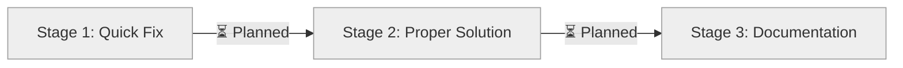

# Progress: Issue #27 - Fix CI Configuration: Remove Unnecessary npm Cache Requirement

## Status Dashboard



## Timeline

| Stage | Status | Started | Completed | Duration | Key Deliverables |
|-------|--------|---------|-----------|----------|------------------|
| 1. Quick Fix | ⏳ Planned | - | - | Est: 30 min | package.json, package-lock.json |
| 2. Proper Solution | ⏳ Planned | - | - | Est: 2-3h | Updated action, workflows |
| 3. Documentation | ⏳ Planned | - | - | Est: 1h | Action README, validation |

## Metrics

- **Issue Priority**: Medium-High (blocks CI automation)
- **Estimated Total Time**: 3-4 hours (all 3 stages)
- **Current Progress**: Stage 0 - Planning complete
- **CI Status**: ❌ Failing (setup-build-env step)
- **Local Tests**: ✅ 78/78 passing (100%)
- **Blocks**: Automated CI/CD validation for Epic #15

## Problem Summary

CI workflow fails with:
```
Dependencies lock file is not found in /home/runner/work/hugo-templates/hugo-templates.
Supported file patterns: package-lock.json,npm-shrinkwrap.json,yarn.lock
```

**Root Cause**: setup-build-env action expects npm dependencies but hugo-templates is Hugo-only project.

**Impact**:
- ❌ Cannot run automated tests in CI
- ✅ All tests pass locally (78/78)
- ✅ Code is correct (Issue #26 complete)
- ⚠️ Manual testing required for PRs

## Solution Approach

**Dual-Phase Strategy**:
1. **Phase 1 (Quick)**: Add minimal package.json to unblock CI immediately
2. **Phase 2 (Proper)**: Make npm setup optional in action configuration
3. **Phase 3 (Cleanup)**: Remove temporary files, document solution

## Stage Progress

### Stage 1: Quick Fix Implementation
- **Status**: ⏳ **PLANNED**
- **Progress**: 0%
- **Objective**: Unblock CI within 30 minutes

**Checklist**:
- [ ] Create minimal package.json
- [ ] Generate package-lock.json
- [ ] Commit with clear message (temporary fix)
- [ ] Push to epic/federated-build-system
- [ ] Verify CI passes
- [ ] Document temporary nature in README

**Expected Outcome**: CI green, all 78 tests passing

---

### Stage 2: Proper Solution Implementation
- **Status**: ⏳ **PLANNED**
- **Progress**: 0%
- **Objective**: Make npm setup optional in action

**Checklist**:
- [ ] Add enable-npm-cache input to action
- [ ] Implement conditional Node.js setup steps
- [ ] Implement conditional npm ci step
- [ ] Update bash-tests.yml workflow
- [ ] Test with Hugo project (enable-npm-cache: false)
- [ ] Remove package.json and package-lock.json
- [ ] Verify CI still passes without npm files

**Expected Outcome**: Action works for both Hugo and npm projects

---

### Stage 3: Documentation & Validation
- **Status**: ⏳ **PLANNED**
- **Progress**: 0%
- **Objective**: Document solution and validate

**Checklist**:
- [ ] Create setup-build-env README.md
- [ ] Document enable-npm-cache parameter
- [ ] Add usage examples (Hugo vs npm projects)
- [ ] Update workflow documentation
- [ ] Run full CI validation
- [ ] Document lessons learned

**Expected Outcome**: Comprehensive documentation for future use

---

## Affected Files

### Will Create (Stage 1)
- `package.json` - Minimal npm configuration (temporary)
- `package-lock.json` - Dependency lock file (temporary)

### Will Modify (Stage 2)
- `.github/actions/setup-build-env/action.yml` - Add enable-npm-cache input
- `.github/workflows/bash-tests.yml` - Use new parameter

### Will Create (Stage 2)
- `.github/actions/setup-build-env/README.md` - Action documentation

### Will Remove (Stage 2)
- `package.json` - Temporary file from Stage 1
- `package-lock.json` - Temporary file from Stage 1

---

## Quick Links

- **Issue**: [#27](https://github.com/info-tech-io/hugo-templates/issues/27)
- **Related Issue**: [#26](https://github.com/info-tech-io/hugo-templates/issues/26) (closed)
- **Branch**: epic/federated-build-system (no new branch needed)
- **Epic**: [#15 Federated Build System](https://github.com/info-tech-io/hugo-templates/issues/15)
- **CI Workflow**: `.github/workflows/bash-tests.yml`
- **Action**: `.github/actions/setup-build-env/action.yml`

---

## Artifacts

From planning:
- ✅ `design.md` - Complete design document
- ✅ `progress.md` - This progress tracker

To be created:
- [ ] Stage 1 commit - Quick fix
- [ ] Stage 2 commit - Proper solution
- [ ] Stage 3 commit - Documentation
- [ ] Action README.md

---

## Next Actions

1. **Immediate**: Begin Stage 1 implementation (Quick Fix)
2. **After Stage 1**: Validate CI passes with all tests
3. **Then**: Implement Stage 2 (Proper Solution)
4. **Finally**: Complete Stage 3 (Documentation)

---

**Last Updated**: October 12, 2025
**Status**: ⏳ **PLANNING COMPLETE** - Ready to start Stage 1
**Next Action**: Implement Quick Fix to unblock CI
