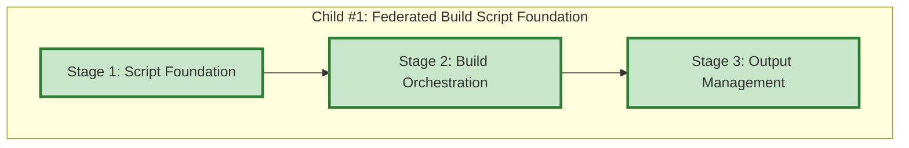

# Progress: Child #1 - Federated Build Script Foundation

## Implementation Plan Visualization

**Legend**:
- 🟩 Green: Completed
- 🟨 Yellow: In Progress
- 🟦 Blue: Ready to Start
- ⬜ Gray: Not Started

## Stage Status

| Stage | Status | Estimated Time | Actual Time | Progress | Commit |
|-------|--------|----------------|-------------|----------|--------|
| Stage 1: Script Foundation | ✅ **Complete** | 0.4 days | ~2.5 hours | 100% | ff1506a |
| Stage 2: Build Orchestration | ✅ **Complete** | 0.4 days | ~3 hours | 100% | [pending] |
| Stage 3: Output Management | ✅ **Complete** | 0.2 days | ~1.5 hours | 100% | [pending] |

**Total Progress**: 100% (3/3 stages completed) ✅

## Current Status
- **Phase**: ✅ **ALL STAGES COMPLETE**
- **Next Action**: Commit implementation, update Epic progress, start Child #2
- **Blockers**: None
- **Branch**: `feature/federated-build-script`

## Stage 1: Script Foundation - Summary

**Completed**: October 6, 2025

### Key Achievements
- ✅ Created `scripts/federated-build.sh` (686 lines)
- ✅ Implemented comprehensive argument parsing (both --option=value and --option value)
- ✅ Node.js-based modules.json parser with validation
- ✅ Configuration validation with conflict detection
- ✅ Output directory management with dry-run support
- ✅ Example configurations created (2 files)

See [001-progress.md](001-progress.md) for detailed report.

## Stage 2: Build Orchestration - Summary

**Completed**: October 6, 2025

### Key Achievements
- ✅ Module iteration and orchestration logic (~50 lines)
- ✅ Module source download with git clone support (~75 lines)
- ✅ Individual module build execution (~90 lines)
- ✅ Comprehensive build status reporting (~50 lines)
- ✅ Global variable pattern for clean return values

### Test Results
- ✅ Dry-run with 2 modules (test-modules.json)
- ✅ Dry-run with 5 modules (InfoTech.io federation)
- ✅ Verbose mode logging
- ✅ Build report generation

### Implementation Decisions
- Global variables (`MODULE_WORK_DIR`, `MODULE_OUTPUT_DIR`) instead of command substitution
- Local repository support (`"repository": "local"`)
- Graceful failure handling (continues with remaining modules)
- Parallel builds deferred to future optimization

See [002-progress.md](002-progress.md) for detailed report.

## Stage 3: Output Management - Summary

**Completed**: October 6, 2025

### Key Achievements
- ✅ Merge federation output function (~80 lines)
- ✅ Validate federation output function (~60 lines)
- ✅ Create federation manifest function (~65 lines)
- ✅ Integration with main() execution flow
- ✅ Complete federation build pipeline operational

### Test Results
- ✅ Dry-run with 2 modules (test-modules.json)
- ✅ Dry-run with 5 modules (InfoTech.io federation)
- ✅ Verbose mode logging validated
- ✅ Federation manifest generation
- ✅ Output validation logic

### Implementation Decisions
- Manual JSON construction (no external dependencies)
- Last-write-wins conflict resolution (simple and predictable)
- Non-critical manifest creation (build continues on failure)
- Directory structure created on-demand during merge

See [003-progress.md](003-progress.md) for detailed report.

---

**Last Updated**: October 6, 2025
**Current Stage**: ✅ ALL STAGES COMPLETE
**Total Time**: ~7 hours (Estimated: 8 hours / 1 day)