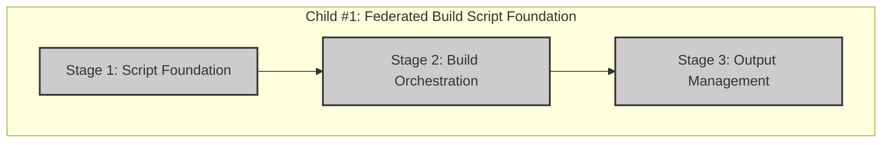

# Progress: Child #1 - Federated Build Script Foundation

## Implementation Plan Visualization

**Legend**:
- 🟩 Green: Completed
- 🟨 Yellow: In Progress
- 🟦 Blue: Ready to Start
- ⬜ Gray: Not Started

## Stage Status

| Stage | Status | Estimated Time | Progress |
|-------|--------|----------------|----------|
| Stage 1: Script Foundation | ⬜ Not Started | 0.4 days | 0% |
| Stage 2: Build Orchestration | ⬜ Not Started | 0.4 days | 0% |
| Stage 3: Output Management | ⬜ Not Started | 0.2 days | 0% |

**Total Progress**: 0% (0/3 stages completed)

## Current Status
- **Phase**: Design Complete, Ready for Implementation
- **Next Action**: Start Stage 1 - Script Foundation
- **Blockers**: None - design approved

---

**Last Updated**: September 30, 2025