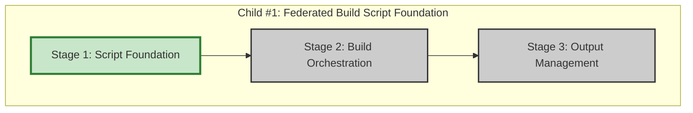

# Progress: Child #1 - Federated Build Script Foundation

## Implementation Plan Visualization

**Legend**:
- 🟩 Green: Completed
- 🟨 Yellow: In Progress
- 🟦 Blue: Ready to Start
- ⬜ Gray: Not Started

## Stage Status

| Stage | Status | Estimated Time | Actual Time | Progress | Commit |
|-------|--------|----------------|-------------|----------|--------|
| Stage 1: Script Foundation | ✅ **Complete** | 0.4 days | ~2.5 hours | 100% | TBD |
| Stage 2: Build Orchestration | ⏳ Ready | 0.4 days | - | 0% | - |
| Stage 3: Output Management | ⬜ Not Started | 0.2 days | - | 0% | - |

**Total Progress**: 33% (1/3 stages completed)

## Current Status
- **Phase**: Stage 1 Complete → Stage 2 Ready
- **Next Action**: Implement Stage 2 - Build Orchestration
- **Blockers**: None
- **Branch**: `feature/federated-build-script`

## Stage 1: Script Foundation - Summary

**Completed**: October 6, 2025

### Key Achievements
- ✅ Created `scripts/federated-build.sh` (686 lines)
- ✅ Implemented comprehensive argument parsing (both --option=value and --option value)
- ✅ Node.js-based modules.json parser with validation
- ✅ Configuration validation with conflict detection
- ✅ Output directory management with dry-run support
- ✅ Example configurations created (2 files)

### Test Results
- ✅ Help message display
- ✅ Validation with 2-module config
- ✅ Validation with 5-module config (InfoTech.io federation)
- ✅ Dry-run mode
- ✅ Verbose mode

### Additional Work
- ✅ Documentation restructuring: migrated all docs to `docs/content/` (15 files)

### Files Created/Modified
**New Files**:
- `scripts/federated-build.sh` (main script)
- `docs/content/examples/modules.json` (InfoTech.io example)
- `test-modules.json` (local testing)
- `docs/proposals/.../001-progress.md` (this stage report)

**Documentation Migration**: 15 files moved to `docs/content/`

See [001-progress.md](001-progress.md) for detailed report.

---

**Last Updated**: October 6, 2025
**Current Stage**: Stage 2 - Build Orchestration
**Estimated Completion**: 1 day (0.6 days remaining)