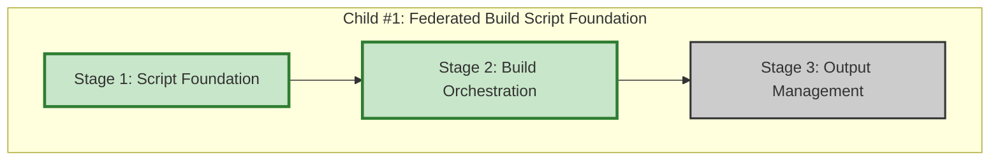

# Progress: Child #1 - Federated Build Script Foundation

## Implementation Plan Visualization

**Legend**:
- 🟩 Green: Completed
- 🟨 Yellow: In Progress
- 🟦 Blue: Ready to Start
- ⬜ Gray: Not Started

## Stage Status

| Stage | Status | Estimated Time | Actual Time | Progress | Commit |
|-------|--------|----------------|-------------|----------|--------|
| Stage 1: Script Foundation | ✅ **Complete** | 0.4 days | ~2.5 hours | 100% | ff1506a |
| Stage 2: Build Orchestration | ✅ **Complete** | 0.4 days | ~3 hours | 100% | TBD |
| Stage 3: Output Management | ⏳ Ready | 0.2 days | - | 0% | - |

**Total Progress**: 67% (2/3 stages completed)

## Current Status
- **Phase**: Stage 2 Complete → Stage 3 Ready
- **Next Action**: Implement Stage 3 - Output Management
- **Blockers**: None
- **Branch**: `feature/federated-build-script`

## Stage 1: Script Foundation - Summary

**Completed**: October 6, 2025

### Key Achievements
- ✅ Created `scripts/federated-build.sh` (686 lines)
- ✅ Implemented comprehensive argument parsing (both --option=value and --option value)
- ✅ Node.js-based modules.json parser with validation
- ✅ Configuration validation with conflict detection
- ✅ Output directory management with dry-run support
- ✅ Example configurations created (2 files)

See [001-progress.md](001-progress.md) for detailed report.

## Stage 2: Build Orchestration - Summary

**Completed**: October 6, 2025

### Key Achievements
- ✅ Module iteration and orchestration logic (~50 lines)
- ✅ Module source download with git clone support (~75 lines)
- ✅ Individual module build execution (~90 lines)
- ✅ Comprehensive build status reporting (~50 lines)
- ✅ Global variable pattern for clean return values

### Test Results
- ✅ Dry-run with 2 modules (test-modules.json)
- ✅ Dry-run with 5 modules (InfoTech.io federation)
- ✅ Verbose mode logging
- ✅ Build report generation

### Implementation Decisions
- Global variables (`MODULE_WORK_DIR`, `MODULE_OUTPUT_DIR`) instead of command substitution
- Local repository support (`"repository": "local"`)
- Graceful failure handling (continues with remaining modules)
- Parallel builds deferred to future optimization

See [002-progress.md](002-progress.md) for detailed report.

---

**Last Updated**: October 6, 2025
**Current Stage**: Stage 2 - Build Orchestration
**Estimated Completion**: 1 day (0.6 days remaining)