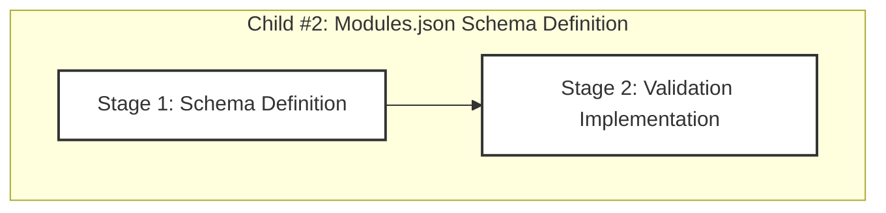

# Progress: Child #2 - Modules.json Schema Definition

## Implementation Plan Visualization

**Legend**:
- 🟩 Green: Completed
- 🟨 Yellow: In Progress
- 🟦 Blue: Ready to Start
- ⬜ Gray: Not Started

## Stage Status

| Stage | Status | Estimated Time | Actual Time | Progress | Commit |
|-------|--------|----------------|-------------|----------|--------|
| Stage 1: Schema Definition | ⬜ **Not Started** | 0.3 days (~2.5 hours) | - | 0% | - |
| Stage 2: Validation Implementation | ⬜ **Not Started** | 0.2 days (~2 hours) | - | 0% | - |

**Total Progress**: 0% (0/2 stages completed)

## Current Status
- **Phase**: Planning Complete → Ready to Start
- **Next Action**: Begin Stage 1 - Schema Definition
- **Blockers**: None
- **Branch**: `feature/modules-json-schema` (to be created)

## Planning Complete ✅

### Stage Plans Created
- ✅ [001-schema-definition.md](001-schema-definition.md) - Complete stage 1 plan
- ✅ [002-validation-implementation.md](002-validation-implementation.md) - Complete stage 2 plan

### Progress Files Created
- ✅ [001-progress.md](001-progress.md) - Empty, ready for stage 1 progress
- ✅ [002-progress.md](002-progress.md) - Empty, ready for stage 2 progress

### Design Documentation
- ✅ [design.md](design.md) - High-level design (existing)

## Implementation Overview

### Stage 1: Schema Definition (~2.5 hours)
**Objective**: Create comprehensive JSON Schema for modules.json

**Key Deliverables**:
- `schemas/modules.schema.json` - JSON Schema Draft-07 file
- Federation configuration schema (required + optional fields)
- Module configuration schema (required + optional fields)
- Validation rules and patterns
- 3 example configurations

**Steps**:
1. Create JSON Schema file structure
2. Define federation configuration schema
3. Define module configuration schema
4. Add schema validation rules
5. Add schema examples and documentation
6. Create comprehensive example files

### Stage 2: Validation Implementation (~2 hours)
**Objective**: Integrate schema validation into federated-build.sh

**Key Deliverables**:
- Enhanced `load_modules_config()` with schema validation
- Comprehensive error reporting
- Validation test suite (15+ test cases)
- CI/CD workflow for schema validation
- Updated documentation

**Steps**:
1. Enhance modules.json parser
2. Implement comprehensive error reporting
3. Add validation-only mode improvements
4. Create validation test suite
5. Add schema validation to CI/CD
6. Update documentation

## Success Criteria

### Stage 1
- [ ] JSON Schema file created and valid
- [ ] Federation schema complete
- [ ] Module schema complete
- [ ] Validation rules defined
- [ ] 3 example files created

### Stage 2
- [ ] Schema validation integrated
- [ ] Error messages comprehensive
- [ ] 15+ test cases passing
- [ ] CI/CD workflow created
- [ ] Documentation updated

## Dependencies

- ✅ Child Issue #16 complete (provides federated-build.sh context)
- ⬜ Stage 1 must complete before Stage 2

## Files to Create

### New Files
- `schemas/modules.schema.json` - JSON Schema definition
- `docs/content/examples/modules-simple.json` - Simple example
- `docs/content/examples/modules-advanced.json` - Advanced example
- `tests/test-modules-schema.sh` - Test suite
- `.github/workflows/validate-schemas.yml` - CI/CD workflow
- `docs/content/troubleshooting/schema-validation.md` - Troubleshooting guide

### Files to Modify
- `scripts/federated-build.sh` - Add schema validation
- `docs/content/examples/modules.json` - Rename to modules-infotech.json
- `docs/content/user-guides/federated-builds.md` - Add validation docs

## Estimated Timeline

**Total**: 0.5 days (~4.5 hours)
- Stage 1: 0.3 days (~2.5 hours)
- Stage 2: 0.2 days (~2 hours)

**Target Completion**: Same day as start (half-day work)

---

**Last Updated**: October 6, 2025
**Current Stage**: Planning Complete
**Ready to Start**: Yes
**Next Commit**: Stage plans documentation
