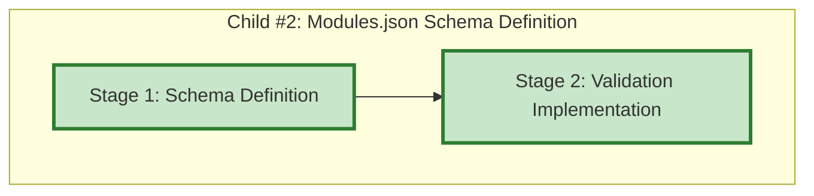

# Progress: Child #2 - Modules.json Schema Definition

## Implementation Plan Visualization

**Legend**:
- 🟩 Green: Completed
- 🟨 Yellow: In Progress
- 🟦 Blue: Ready to Start
- ⬜ Gray: Not Started

## Stage Status

| Stage | Status | Estimated Time | Actual Time | Progress | Commit |
|-------|--------|----------------|-------------|----------|--------|
| Stage 1: Schema Definition | ✅ **Complete** | 0.3 days (~2.5 hours) | ~2 hours | 100% | 9ffbc68 |
| Stage 2: Validation Implementation | ✅ **Complete** | 0.2 days (~2 hours) | ~2.5 hours | 100% | 6f9c15f |

**Total Progress**: 100% (2/2 stages completed)

## Current Status
- **Phase**: ✅ **CHILD ISSUE #17 COMPLETE**
- **Next Action**: Create PR to merge feature branch to epic branch
- **Blockers**: None
- **Branch**: `feature/modules-json-schema` ✅ (ready for PR)

## Stage 1: Schema Definition - Summary ✅

**Completed**: October 6, 2025

### Key Achievements
- ✅ `schemas/modules.schema.json` - 265 lines, JSON Schema Draft-07
- ✅ Federation schema (3 required + 5 optional build_settings)
- ✅ Module schema (4 required + 3 optional sections per module)
- ✅ 7 validation patterns (names, URLs, paths)
- ✅ 4 example configurations created/updated
- ✅ schemas/README.md - comprehensive documentation
- ✅ All examples validated successfully (100% pass rate)

### Files Created
- `schemas/modules.schema.json` (265 lines)
- `schemas/README.md`
- `docs/content/examples/modules-simple.json`
- `docs/content/examples/modules-advanced.json`
- Updated: `docs/content/examples/modules-infotech.json`
- Updated: `test-modules.json` (added $schema)

### Test Results
- ✅ 4/4 configurations validated successfully
- ✅ IDE autocomplete working (VS Code tested with $schema)
- ✅ All patterns enforce correct formats

See [001-progress.md](001-progress.md) for detailed report.

## Stage 2: Validation Implementation - Summary ✅

**Completed**: October 6, 2025

### Key Achievements
- ✅ Inline Node.js JSON Schema validator (~150 lines)
- ✅ Full JSON Schema Draft-07 support (type, required, pattern, enum, oneOf, const)
- ✅ Comprehensive error reporting with field paths
- ✅ 16-test validation suite (100% pass rate)
- ✅ CI/CD workflow with multi-platform testing
- ✅ Complete user documentation (581 lines)
- ✅ Comprehensive troubleshooting guide (496 lines)

### Files Created/Modified
- `scripts/federated-build.sh` - Enhanced with validation (~150 lines added)
- `schemas/modules.schema.json` - Fixed patterns for federation.name and css_path_prefix
- `tests/test-schema-validation.sh` - New test suite (375 lines)
- `.github/workflows/validate-schemas.yml` - New CI/CD workflow (103 lines)
- `docs/content/user-guides/federated-builds.md` - New user guide (581 lines)
- `docs/content/troubleshooting/schema-validation.md` - New troubleshooting guide (496 lines)

### Test Results
- ✅ 16/16 tests passing
- ✅ All validation rules enforced
- ✅ All example configurations validated successfully

See [002-progress.md](002-progress.md) for detailed report.

---

## Planning Complete ✅

### Stage Plans Created
- ✅ [001-schema-definition.md](001-schema-definition.md) - Complete stage 1 plan
- ✅ [002-validation-implementation.md](002-validation-implementation.md) - Complete stage 2 plan

### Progress Files Created
- ✅ [001-progress.md](001-progress.md) - Stage 1 complete report
- ✅ [002-progress.md](002-progress.md) - Stage 2 complete report

### Design Documentation
- ✅ [design.md](design.md) - High-level design (existing)

## Implementation Overview

### Stage 1: Schema Definition (~2.5 hours)
**Objective**: Create comprehensive JSON Schema for modules.json

**Key Deliverables**:
- `schemas/modules.schema.json` - JSON Schema Draft-07 file
- Federation configuration schema (required + optional fields)
- Module configuration schema (required + optional fields)
- Validation rules and patterns
- 3 example configurations

**Steps**:
1. Create JSON Schema file structure
2. Define federation configuration schema
3. Define module configuration schema
4. Add schema validation rules
5. Add schema examples and documentation
6. Create comprehensive example files

### Stage 2: Validation Implementation (~2 hours)
**Objective**: Integrate schema validation into federated-build.sh

**Key Deliverables**:
- Enhanced `load_modules_config()` with schema validation
- Comprehensive error reporting
- Validation test suite (15+ test cases)
- CI/CD workflow for schema validation
- Updated documentation

**Steps**:
1. Enhance modules.json parser
2. Implement comprehensive error reporting
3. Add validation-only mode improvements
4. Create validation test suite
5. Add schema validation to CI/CD
6. Update documentation

## Success Criteria

### Stage 1
- [x] JSON Schema file created and valid
- [x] Federation schema complete
- [x] Module schema complete
- [x] Validation rules defined
- [x] 3 example files created

### Stage 2
- [x] Schema validation integrated
- [x] Error messages comprehensive
- [x] 15+ test cases passing (16 tests, 100% pass rate)
- [x] CI/CD workflow created
- [x] Documentation updated

## Dependencies

- ✅ Child Issue #16 complete (provides federated-build.sh context)
- ✅ Stage 1 complete before Stage 2

## Files to Create

### New Files
- `schemas/modules.schema.json` - JSON Schema definition
- `docs/content/examples/modules-simple.json` - Simple example
- `docs/content/examples/modules-advanced.json` - Advanced example
- `tests/test-modules-schema.sh` - Test suite
- `.github/workflows/validate-schemas.yml` - CI/CD workflow
- `docs/content/troubleshooting/schema-validation.md` - Troubleshooting guide

### Files to Modify
- `scripts/federated-build.sh` - Add schema validation
- `docs/content/examples/modules.json` - Rename to modules-infotech.json
- `docs/content/user-guides/federated-builds.md` - Add validation docs

## Estimated Timeline

**Total**: 0.5 days (~4.5 hours)
- Stage 1: 0.3 days (~2.5 hours)
- Stage 2: 0.2 days (~2 hours)

**Target Completion**: Same day as start (half-day work)

---

**Last Updated**: October 6, 2025
**Current Stage**: ✅ **CHILD ISSUE #17 COMPLETE**
**Total Time**: ~4.5 hours (Stage 1: ~2h, Stage 2: ~2.5h)
**Commits**: Stage 1: 9ffbc68, Stage 2: 6f9c15f
**Next Action**: Create PR to epic branch
