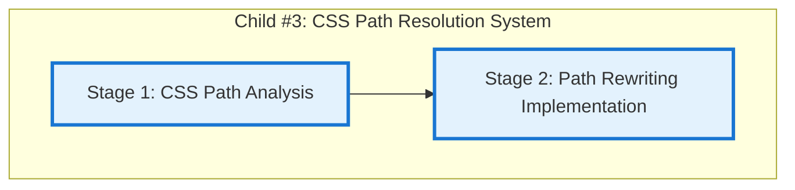

# Progress: Child #3 - CSS Path Resolution System

## Implementation Plan Visualization

**Legend**:
- 🟩 Green: Completed
- 🟨 Yellow: In Progress
- 🟦 Blue: Ready to Start
- ⬜ Gray: Not Started (awaiting dependencies)

## Stage Status

| Stage | Status | Estimated Time | Actual Time | Progress | Commit |
|-------|--------|----------------|-------------|----------|--------|
| Stage 1: CSS Path Analysis | 🟦 **Ready to Start** | 0.5 days (~4 hours) | TBD | 0% | TBD |
| Stage 2: Path Rewriting Implementation | ⬜ **Not Started** | 1 day (~7 hours) | TBD | 0% | TBD |

**Total Progress**: 0% (0/2 stages completed)

## Current Status
- **Phase**: 📋 **Planning Complete - Ready for Implementation**
- **Next Action**: Create feature branch, begin Stage 1 implementation
- **Blockers**: None
- **Dependencies**: ✅ Child #16 complete, ✅ Child #17 complete

## Planning Complete ✅

### Stage Plans Created
- ✅ [001-css-path-analysis.md](001-css-path-analysis.md) - Complete Stage 1 plan (6 steps)
- ✅ [002-path-rewriting-implementation.md](002-path-rewriting-implementation.md) - Complete Stage 2 plan (6 steps)

### Progress Files Created
- ✅ [001-progress.md](001-progress.md) - Ready for Stage 1 reporting
- ✅ [002-progress.md](002-progress.md) - Ready for Stage 2 reporting

### Design Documentation
- ✅ [design.md](design.md) - High-level design (existing)

## Implementation Overview

### Stage 1: CSS Path Analysis & Detection (~4 hours)
**Objective**: Analyze Hugo theme asset patterns and implement path detection logic.

**Key Deliverables**:
- Research Hugo asset referencing patterns across all 4 templates
- Implement `detect_asset_paths()` function - identifies local asset paths
- Implement `calculate_css_prefix()` function - computes prefix from destination
- Implement `analyze_module_paths()` function - generates analysis reports
- Create test suite: `tests/test-css-path-detection.sh` (4 tests)
- Analyze all 4 theme templates (minimal, default, academic, enterprise)

**Steps**:
1. Research Hugo asset patterns (1 hour)
2. Implement path detection function (1 hour)
3. Implement CSS prefix calculation (0.5 hours)
4. Implement analysis reporting (0.5 hours)
5. Test with all 4 templates (0.5 hours)
6. Create test suite (0.5 hours)

### Stage 2: Path Rewriting Implementation (~7 hours)
**Objective**: Implement post-build asset path rewriting with CSS prefix.

**Key Deliverables**:
- Implement `rewrite_asset_paths()` function - rewrites paths in HTML files
- Implement `validate_rewritten_paths()` function - validates correctness
- Integrate with federated-build.sh main loop
- Create test suite: `tests/test-css-path-rewriting.sh` (8 tests)
- Test with all 4 theme templates in federation build
- Performance testing (1000+ files)

**Steps**:
1. Implement path rewriting function (2 hours)
2. Implement validation function (1 hour)
3. Integrate with federation workflow (1 hour)
4. Test with all 4 templates (1.5 hours)
5. Create comprehensive test suite (1 hour)
6. Performance testing (0.5 hours)

## Success Criteria

### Stage 1
- [ ] Research complete for all asset patterns
- [ ] `detect_asset_paths()` function working
- [ ] `calculate_css_prefix()` function working
- [ ] `analyze_module_paths()` function working
- [ ] Test suite passing (4/4 tests)
- [ ] All 4 templates analyzed

### Stage 2
- [ ] `rewrite_asset_paths()` function working
- [ ] `validate_rewritten_paths()` function working
- [ ] Integration with federation complete
- [ ] Test suite passing (8/8 tests)
- [ ] All 4 templates working in federation
- [ ] Performance acceptable (<10s for 1000 files)

## Dependencies

- ✅ Child Issue #16 complete (federated-build.sh exists)
- ✅ Child Issue #17 complete (modules.json schema with css_path_prefix)
- ✅ Stage 1 must complete before Stage 2

## Files to Create

### New Files (Stage 1)
- `tests/test-css-path-detection.sh` - Path detection test suite

### New Files (Stage 2)
- `tests/test-css-path-rewriting.sh` - Path rewriting test suite

### Files to Modify
- `scripts/federated-build.sh` - Add CSS path resolution (~350 lines total)
  - Stage 1: ~150 lines (detection functions)
  - Stage 2: ~200 lines (rewriting functions)

### Documentation
- `docs/proposals/.../child-3-css-path-resolution/001-progress.md` - Stage 1 report
- `docs/proposals/.../child-3-css-path-resolution/002-progress.md` - Stage 2 report
- `docs/proposals/epic-15-federated-build-system/progress.md` - Epic update

## Estimated Timeline

**Total**: 1.5 days (~11 hours)
- Stage 1: 0.5 days (~4 hours) - CSS Path Analysis
- Stage 2: 1 day (~7 hours) - Path Rewriting Implementation

**Target Completion**: 1.5 days from start

## Key Technical Decisions

### 1. Post-Build Rewriting Strategy
- **Decision**: Rewrite paths after Hugo build completes
- **Rationale**: No theme modification, works with all templates, preserves build.sh
- **Alternative Rejected**: Pre-build Hugo config modification (would affect templates)

### 2. sed for In-Place Modification
- **Decision**: Use sed with regex for file modifications
- **Rationale**: Fast, atomic, handles large files efficiently
- **Alternative Rejected**: Custom parser (slower, more complex)

### 3. Validation Layer
- **Decision**: Add validation step after rewriting
- **Rationale**: Catch errors early, provide clear diagnostics
- **Implementation**: Check for double slashes, verify prefixed paths exist

### 4. Conditional Execution
- **Decision**: Skip rewriting for root deployments (`destination: "/"`)
- **Rationale**: No prefix needed, saves processing time, prevents unnecessary modifications

## Risk Assessment

### Risk 1: Template Variations
**Issue**: Different themes may use non-standard asset patterns
**Likelihood**: Low
**Mitigation**: Test all 4 templates, comprehensive regex patterns
**Status**: Mitigated by multi-template testing

### Risk 2: Performance on Large Sites
**Issue**: Rewriting 1000+ HTML files may be slow
**Likelihood**: Low
**Mitigation**: sed is fast, performance testing included
**Status**: Will validate in Step 2.6

### Risk 3: Edge Cases
**Issue**: Inline JavaScript, complex CSS, unusual paths
**Likelihood**: Medium
**Mitigation**: Comprehensive test suite, validation layer
**Status**: Addressed via 8-test suite in Stage 2

## Next Steps

1. ✅ Planning complete
2. **Next**: Create feature branch `feature/css-path-resolution`
3. **Next**: Begin Stage 1 implementation (Step 1.1: Research Hugo patterns)
4. **Next**: Commit Stage 1 code + tests
5. **Next**: Begin Stage 2 implementation
6. **Next**: Create PR to epic branch

---

**Last Updated**: October 7, 2025
**Current Stage**: Planning Complete
**Planning Time**: ~1 hour
**Next Action**: Create feature branch, start Stage 1 implementation
**Feature Branch**: `feature/css-path-resolution` (to be created)
