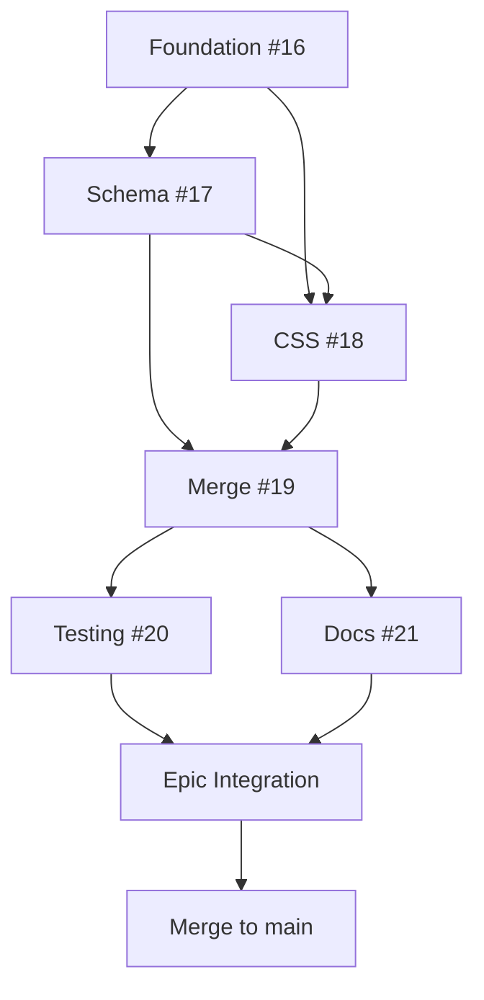

# Epic #15: Federated Build System for GitHub Pages Federation - Design Document

## Executive Summary

Implement a Download-Merge-Deploy pattern for federated GitHub Pages builds, enabling independent corporate site and multi-product documentation federation while maintaining 100% backward compatibility with existing Hugo Templates Framework functionality.

**Epic Issue**: #15
**Status**: 🚀 Ready for Implementation
**Estimated Duration**: 6-7 days
**Foundation**: Builds upon Build System v2.0 (Epic #2)

## Problem Statement

### Current State (Post-Epic #2)

After completing Epic #2 (Build System v2.0), the hugo-templates framework provides production-ready single-site build capability. However, InfoTech.io organizational needs require multi-site federation:

**What works (v0.2.0)**:
- ✅ Single-site builds via `module.json` + `build.sh`
- ✅ Production-grade error handling and testing
- ✅ Performance optimization (60-66% improvements)
- ✅ Cross-platform compatibility
- ✅ Component modularity (quiz engine, themes)

**Current limitations**:
- ❌ No multi-site federation orchestration
- ❌ Cannot build corporate site + product docs in single workflow
- ❌ No CSS path resolution for subdirectory deployment
- ❌ Manual coordination required for multi-repository updates
- ❌ No unified configuration for federated builds

### Business Drivers

1. **info-tech-io.github.io Federation**: Requires automatic deployment of corporate site + documentation for all products (quiz, hugo-templates, web-terminal, info-tech-cli)
2. **Autonomous Product Updates**: Each product team must update documentation independently without coordinating with other teams
3. **Scalable Architecture**: System must support adding new products to federation without workflow changes
4. **Preserve Existing Infrastructure**: All current single-site builds (`infotecha`, `mod_*`) must continue working unchanged

### Real-World Use Case

**Current Problem** (info-tech-io.github.io):
```
# Manual steps to deploy federation:
1. Manually clone info-tech/docs
2. Manually clone quiz/docs
3. Manually clone hugo-templates/docs
4. Manually clone each product docs
5. Manually build each with build.sh
6. Manually merge outputs to correct subdirectories
7. Manually fix CSS paths for subdirectory deployment
8. Manually deploy to GitHub Pages
```

**Desired Workflow**:
```bash
# Single command deploys entire federation:
./scripts/federated-build.sh --config=modules.json --output=public/
```

### Success Criteria

**Technical**:
- ✅ Federated builds via `modules.json` configuration
- ✅ Automatic CSS path resolution for subdirectory deployment
- ✅ Download-Merge-Deploy automation for multi-repository content
- ✅ 100% backward compatibility (existing builds unchanged)
- ✅ Build time < 3 minutes per federation
- ✅ 95%+ test coverage for federation features

**Operational**:
- ✅ Single workflow deploys entire federation
- ✅ Products update documentation independently
- ✅ No breaking changes to existing projects
- ✅ Scalable to 10+ products in federation

## Technical Solution

### Architectural Approach: Two-Layer System

**Core Principle**: Add orchestration layer WITHOUT modifying existing build infrastructure

```
┌─────────────────────────────────────────────────────────┐
│  Layer 2: Federation Orchestration (NEW)                │
│  ┌───────────────────────────────────────────────────┐  │
│  │ federated-build.sh + modules.json                 │  │
│  │ - Reads federation configuration                  │  │
│  │ - Orchestrates multiple site builds               │  │
│  │ - Applies CSS path resolution                     │  │
│  │ - Merges outputs to federated structure           │  │
│  └───────────────────────────────────────────────────┘  │
└─────────────────────────────────────────────────────────┘
                           ↓
                    Calls existing
                           ↓
┌─────────────────────────────────────────────────────────┐
│  Layer 1: Individual Site Building (EXISTING - UNCHANGED)│
│  ┌───────────────────────────────────────────────────┐  │
│  │ build.sh + module.json                            │  │
│  │ - Template selection                              │  │
│  │ - Component integration                           │  │
│  │ - Hugo build execution                            │  │
│  │ - Error handling, caching, performance            │  │
│  └───────────────────────────────────────────────────┘  │
└─────────────────────────────────────────────────────────┘
```

### Architecture Advantages

**Zero Breaking Changes**:
- Existing `build.sh` and `module.json` remain unchanged
- Current projects (`infotecha`, `mod_*`) continue working
- Federation is optional (Layer 2 only used when needed)

**Modular Design**:
- Each product repository remains autonomous
- Products update documentation independently
- Federation layer coordinates without coupling

**Reuse Existing Logic**:
- Federation uses proven `build.sh` workflow
- Error handling, caching, performance from v2.0
- No duplication of build logic

## Child Issues Overview

### Child Issue #16: Federated Build Script Foundation

**Objective**: Create `federated-build.sh` orchestration script

**Key Components**:
- Script foundation with argument parsing
- modules.json configuration loading
- Build orchestration for multiple sites
- Temporary directory management
- Output merging logic

**Deliverables**:
- `scripts/federated-build.sh` (new)
- Basic federation workflow

**Stages**: 3 (Foundation, Orchestration, Output Management)
**Estimated Duration**: 1 day
**Dependencies**: None
**Pull Request**: TBD → epic/federated-build-system

### Child Issue #17: Modules.json Configuration Schema

**Objective**: Define and implement federation configuration schema

**Key Components**:
- JSON Schema v2.0 for `modules.json`
- Federation-level settings
- Module-level configuration
- Validation implementation
- Example configurations

**Deliverables**:
- `schemas/modules.schema.json` (new)
- Validation functions in federated-build.sh
- Example modules.json for info-tech-io.github.io

**Stages**: 2 (Schema Design, Validation Implementation)
**Estimated Duration**: 0.5 days
**Dependencies**: #16
**Pull Request**: TBD → epic/federated-build-system

### Child Issue #18: CSS Path Resolution System

**Objective**: Fix CSS paths for subdirectory deployment

**Key Components**:
- CSS path rewriting functions
- Support for Hugo themes (based on template CSS approach)
- Configurable path prefixes per module
- Validation of CSS path fixes

**Deliverables**:
- CSS resolution functions in federated-build.sh
- Integration with build orchestration
- Tests for path resolution

**Stages**: 2 (CSS Analysis, Path Resolution Implementation)
**Estimated Duration**: 1.5 days
**Dependencies**: #16, #17
**Pull Request**: TBD → epic/federated-build-system

### Child Issue #19: Download-Merge-Deploy Logic

**Objective**: Implement multi-repository content download and merging

**Key Components**:
- Repository cloning functions (GitHub, local paths)
- Content path resolution
- Directory merging with conflict detection
- preserve-base-site functionality
- Deployment preparation

**Deliverables**:
- Download/clone functions in federated-build.sh
- Merge logic with validation
- Deployment-ready output structure

**Stages**: 3 (Download Logic, Merge Logic, Preserve-Base-Site)
**Estimated Duration**: 1.5 days
**Dependencies**: #16, #17, #18
**Pull Request**: TBD → epic/federated-build-system

### Child Issue #20: Testing Infrastructure for Federation

**Objective**: Comprehensive testing for federation features

**Key Components**:
- Unit tests for federation functions
- Integration tests for full federation workflow
- Multi-module test scenarios
- CSS path resolution tests
- Performance benchmarks

**Deliverables**:
- `tests/bash/federated-*.bats` (new)
- Test fixtures and mock configurations
- GitHub Actions workflow integration

**Stages**: 2 (Unit Tests, Integration Tests)
**Estimated Duration**: 1 day
**Dependencies**: #16-#19
**Pull Request**: TBD → epic/federated-build-system

### Child Issue #21: Documentation and Migration Guide

**Objective**: Complete user and developer documentation for federation

**Key Components**:
- Federation user guide
- modules.json configuration reference
- Migration guide (single-site → federation)
- info-tech-io.github.io case study
- Troubleshooting guide

**Deliverables**:
- `docs/user-guides/federated-builds.md` (new)
- `docs/user-guides/modules-json-reference.md` (new)
- `docs/tutorials/federation-migration.md` (new)
- Updated README.md with federation features

**Stages**: 2 (User Documentation, Developer Documentation)
**Estimated Duration**: 0.5 days
**Dependencies**: #16-#20
**Pull Request**: TBD → epic/federated-build-system

## Implementation Strategy

### Development Workflow

**Dependency-Driven Sequential Strategy**: Build foundation first, then parallel development where possible



**Phase Breakdown**:
- **Phase 1 (1.5 days)**: Foundation (#16) + Schema (#17) - sequential
- **Phase 2 (3 days)**: CSS (#18) + Merge (#19) - can be parallel after dependencies
- **Phase 3 (1.5 days)**: Testing (#20) + Docs (#21) - parallel
- **Phase 4 (1 day)**: Epic integration testing and main merge

### Branch Strategy

```
main
  ↓
epic/federated-build-system (to be created)
  ├── feature/federated-build-script (Child #16)
  ├── feature/modules-json-schema (Child #17)
  ├── feature/css-path-resolution (Child #18)
  ├── feature/download-merge-deploy (Child #19)
  ├── feature/testing-infrastructure (Child #20)
  └── feature/documentation-migration (Child #21)
  ↓
PR: epic/federated-build-system → main
```

### Timeline

| Child Issue | Title | Dependencies | Duration | Start |
|-------------|-------|--------------|----------|-------|
| #16 | Federated Build Script | None | 1.0 day | Day 1 |
| #17 | Modules.json Schema | #16 | 0.5 days | Day 2 |
| #18 | CSS Path Resolution | #16, #17 | 1.5 days | Day 2 |
| #19 | Download-Merge-Deploy | #16, #17, #18 | 1.5 days | Day 3 |
| #20 | Testing Infrastructure | #16-19 | 1.0 day | Day 5 |
| #21 | Documentation | #16-20 | 0.5 days | Day 6 |

**Total Duration**: 6-7 days (with optimized parallelization)

## Technical Specifications

### modules.json Schema v2.0

**High-Level Structure**:
```json
{
  "federation": {
    "name": "InfoTech.io Documentation Federation",
    "baseURL": "https://info-tech-io.github.io",
    "strategy": "download-merge-deploy",
    "build_settings": {
      "parallel_builds": true,
      "preserve_base_site": true,
      "css_path_resolution": true
    }
  },
  "modules": [
    {
      "name": "corporate-site",
      "source": {
        "repository": "https://github.com/info-tech-io/info-tech",
        "path": "docs",
        "branch": "main"
      },
      "module_json": "docs/module.json",
      "destination": "/",
      "css_path_prefix": "/",
      "overrides": {
        "template": "default",
        "components": "quiz"
      }
    },
    {
      "name": "quiz-docs",
      "source": {
        "repository": "https://github.com/info-tech-io/quiz",
        "path": "docs",
        "branch": "main"
      },
      "module_json": "docs/module.json",
      "destination": "/quiz/",
      "css_path_prefix": "/quiz/",
      "overrides": {}
    }
  ]
}
```

### CSS Path Resolution Strategy

**Problem**: Hugo themes use absolute CSS paths like `/css/style.css`, which break when deployed to subdirectories like `/quiz/`

**Solution**: Post-build CSS path rewriting
```bash
# In subdirectory builds, rewrite:
/css/style.css → /quiz/css/style.css
/js/main.js → /quiz/js/main.js
```

**Implementation**:
- Scan HTML files in output directory
- Apply regex replacements for CSS/JS paths
- Respect `css_path_prefix` from modules.json
- Validate path fixes don't break absolute external URLs

### Federation Build Workflow

```bash
federated-build.sh --config=modules.json --output=public/

# Internal workflow:
1. Load modules.json configuration
2. Validate schema and dependencies
3. For each module:
   a. Clone/download source repository
   b. Read module.json from source
   c. Call build.sh with module parameters
   d. Apply CSS path fixes (if css_path_prefix != "/")
   e. Merge output to federation structure
4. Verify complete federation structure
5. Generate deployment manifest
```

## Integration Points

### With Existing Systems

**Build System v2.0 (Epic #2)**:
- Federation uses existing `build.sh` as black box
- Error handling, caching, performance carried forward
- No modifications to Layer 1 infrastructure

**infotecha CI/CD**:
- Continues using single-site builds (unchanged)
- No impact on educational modules

**info-tech-io.github.io CI/CD**:
- Replaces manual federation process
- Single workflow file calls federated-build.sh
- Triggered by repository_dispatch from any product repo

### External Dependencies

**Required** (already present from v2.0):
- Hugo ≥0.148.0 (extended version)
- Node.js ≥18.0.0 (for JSON parsing)
- Git ≥2.30.0 (for repository cloning)
- Bash ≥4.0 (for associative arrays)

**New Optional**:
- GitHub CLI (gh) for repository operations
- jq for advanced JSON manipulation (with fallback)

## Risk Assessment

### Technical Risks

**Risk 1: CSS Path Resolution Complexity** 🟡 MEDIUM
- **Issue**: Different themes may use varied CSS patterns
- **Mitigation**: Comprehensive testing with all 4 templates (minimal, default, academic, enterprise)
- **Fallback**: Manual CSS path configuration per module

**Risk 2: Build Time Accumulation** 🟢 LOW
- **Issue**: N modules = N × build_time total
- **Mitigation**: Parallel builds option in modules.json, leverage existing caching from v2.0
- **Target**: < 3 minutes for 5-module federation (info-tech-io.github.io)

**Risk 3: Repository Access Failures** 🟡 MEDIUM
- **Issue**: Network issues, authentication failures, missing repos
- **Mitigation**: Comprehensive error handling from v2.0, graceful degradation, clear diagnostics
- **Fallback**: Local path sources (file://) for testing/development

**Risk 4: Backward Compatibility** 🟢 LOW
- **Issue**: Breaking existing single-site builds
- **Mitigation**: Two-layer architecture guarantees Layer 1 unchanged, comprehensive integration testing
- **Validation**: All existing builds tested in epic branch before main merge

## Success Metrics

### Performance
- ✅ Federation build time: < 3 minutes (5 modules)
- ✅ CSS path resolution: < 5 seconds per module
- ✅ No degradation of single-site build performance
- ✅ Parallel builds reduce total time by 30-40%

### Quality
- ✅ Test coverage: 95%+ for federation features
- ✅ CSS path accuracy: 100% (all themes work in subdirectories)
- ✅ Documentation coverage: 100% (user guides, reference, tutorials)
- ✅ Backward compatibility: 100% (all existing builds pass)

### Functionality
- ✅ info-tech-io.github.io federation: Fully automated
- ✅ Multi-repository coordination: Zero manual steps
- ✅ Independent product updates: Autonomous deployment
- ✅ Scalability: Support 10+ products without workflow changes

## Use Cases

### Use Case 1: info-tech-io.github.io Federation

**Configuration**: 5 modules
- Corporate site (info-tech/docs) → /
- Quiz docs (quiz/docs) → /quiz/
- Hugo Templates docs (hugo-templates/docs) → /hugo-templates/
- Web Terminal docs (web-terminal/docs) → /web-terminal/
- InfoTech CLI docs (info-tech-cli/docs) → /info-tech-cli/

**Workflow**:
```yaml
# .github/workflows/deploy-federation.yml
- name: Build Federation
  run: ./scripts/federated-build.sh --config=modules.json --output=public/

- name: Deploy to GitHub Pages
  uses: peaceiris/actions-gh-pages@v3
  with:
    publish_dir: ./public
```

**Result**: Single workflow deploys entire federated site

### Use Case 2: Product Documentation Update

**Scenario**: Quiz team updates documentation

**Workflow**:
```yaml
# quiz/.github/workflows/notify-hub.yml (existing)
- name: Trigger Federation Rebuild
  run: gh api repos/info-tech-io/info-tech-io.github.io/dispatches \
       -f event_type=content_update -f client_payload[source]=quiz
```

**Result**: Autonomous update without coordination

## Post-Epic Evolution

### Immediate Next Steps
1. Create epic/federated-build-system branch
2. Begin Child Issue #16 (Federated Build Script Foundation)
3. Sequential implementation of all 6 child issues
4. Integration testing in epic branch
5. Final PR to main

### Future Enhancements (Post-Epic #15)

**Multi-Language Federation**:
- Support for i18n federated builds
- Per-module language configuration
- Unified language switcher across federation

**Advanced Caching**:
- Federation-level caching (cache unchanged modules)
- Incremental federation builds
- Smart dependency detection

**Production Monitoring**:
- Federation build analytics
- Per-module performance tracking
- Deployment success metrics

**Community Templates**:
- NPM package publication with federation support
- Federation examples and starter kits
- Video tutorials for federation setup

## Conclusion

Epic #15: Federated Build System implements the final piece of hugo-templates architecture evolution: multi-site orchestration for GitHub Pages federation. By adding Layer 2 orchestration WITHOUT modifying Layer 1 infrastructure, this Epic achieves:

**Key Innovations**:
- 🏗️ Two-layer architecture with zero breaking changes
- 🔄 Download-Merge-Deploy automation for multi-repository coordination
- 🎨 CSS path resolution for subdirectory deployment
- 📦 Modular federation configuration via modules.json
- 🚀 Foundation for scalable multi-product documentation

**Strategic Impact**:
- Enables info-tech-io.github.io fully automated federation
- Establishes hugo-templates as enterprise-ready framework
- Provides unique federation capability in Hugo ecosystem
- Maintains 100% backward compatibility guarantee

Upon completion, hugo-templates will be the **only Hugo framework** supporting automated multi-repository federation with CSS path resolution, positioning InfoTech.io as a leader in Hugo ecosystem innovation.

**Status**: 🚀 **READY FOR IMPLEMENTATION** - All planning complete, awaiting epic branch creation

---

**Version**: 1.0
**Last Updated**: October 6, 2025
**Next Review**: After epic branch creation and Child Issue #16 start
