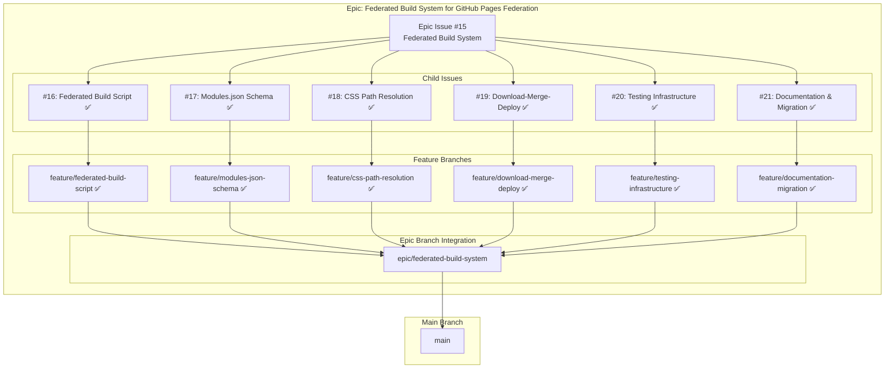
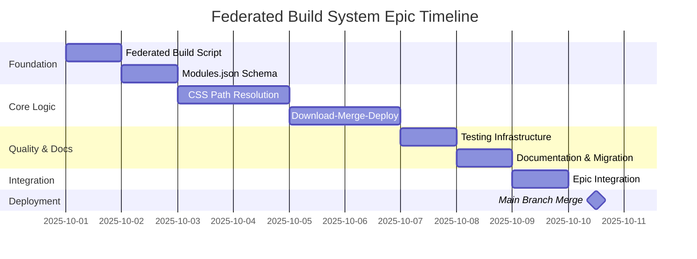
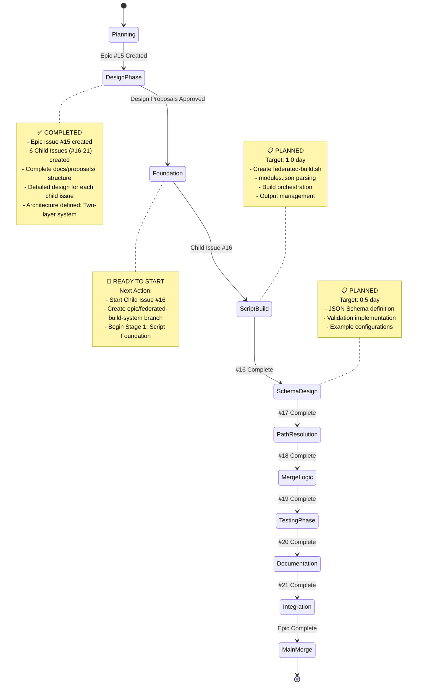
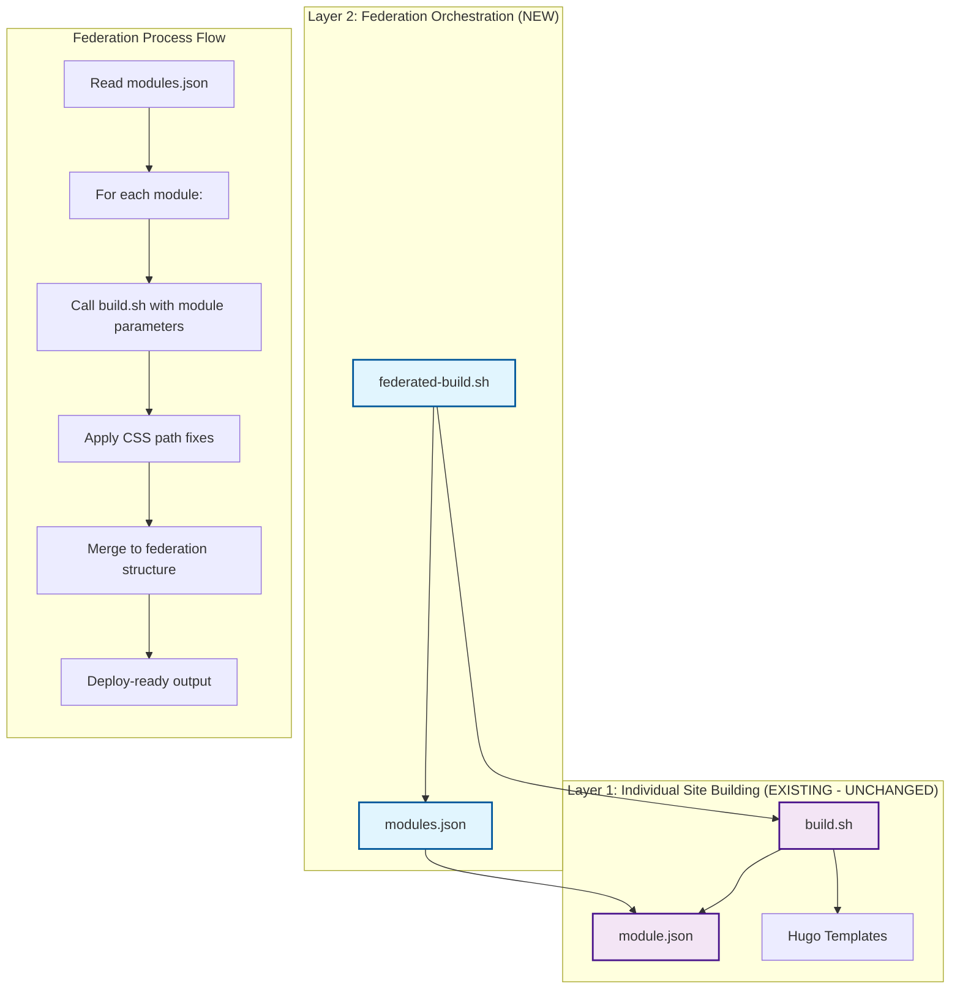
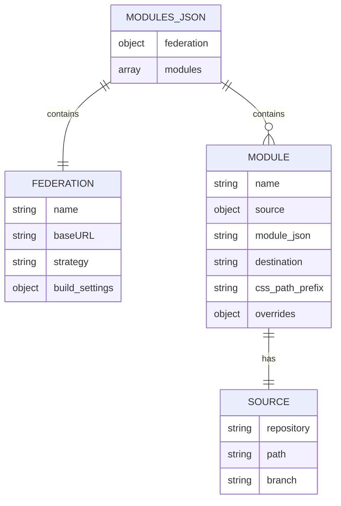
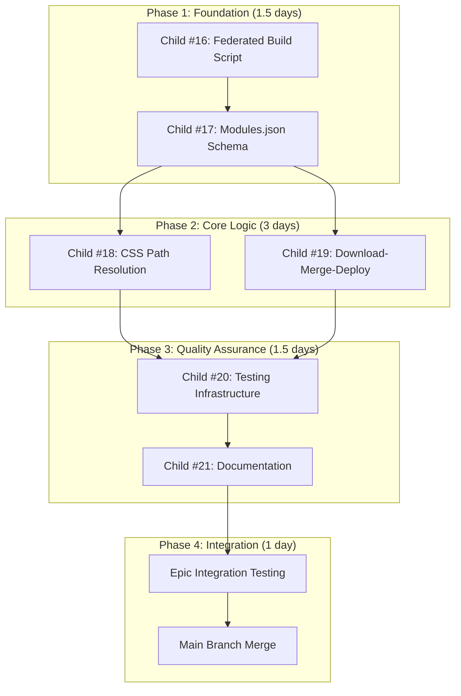

# Epic: Federated Build System - Visual Progress Tracking

> **LATEST UPDATE (2025-10-20):** ✅ **EPIC #15 COMPLETE!** All 6 child issues finished (100%). Child #21 delivered 5,949 lines of comprehensive documentation (123% over target). PR #30 merged to epic branch. Epic ready for final integration to main branch!
>
> **Progress:** [Child #21 Progress](./child-6-documentation-migration/progress.md) | [PR #30](https://github.com/info-tech-io/hugo-templates/pull/30)

## 📊 Epic Overview



## 🎯 Progress Status

### Epic Progress: 100% Complete (6/6 child issues complete) 🎉

| Child Issue | Status | Feature Branch | PR | Progress | Dependencies |
|-------------|--------|----------------|----|---------|--------------|
| [#16] Federated Build Script | ✅ **COMPLETE** | `feature/federated-build-script` | [#23](https://github.com/info-tech-io/hugo-templates/pull/23) (merged) | 100% | None |
| [#17] Modules.json Schema | ✅ **COMPLETE** | `feature/modules-json-schema` | [#24](https://github.com/info-tech-io/hugo-templates/pull/24) (merged) | 100% | #16 ✅ |
| [#18] CSS Path Resolution | ✅ **COMPLETE** | `feature/css-path-resolution` | [#25](https://github.com/info-tech-io/hugo-templates/pull/25) (merged) | 100% | #16 ✅, #17 ✅ |
| [#19] Download-Merge-Deploy | ✅ **COMPLETE** | `feature/download-merge-deploy` | [#28](https://github.com/info-tech-io/hugo-templates/pull/28) (merged) | 100% | #16 ✅, #17 ✅, #18 ✅ |
| [#20] Testing Infrastructure | ✅ **COMPLETE** | `feature/testing-infrastructure` | [#29](https://github.com/info-tech-io/hugo-templates/pull/29) (merged) | 100% | #16-19 ✅ |
| [#21] Documentation & Migration | ✅ **COMPLETE** | `feature/documentation-migration` | [#30](https://github.com/info-tech-io/hugo-templates/pull/30) (merged) | 100% | #16-20 ✅ |

### Development Timeline



## 🔄 Workflow Visualization

### Current Development Phase: Planning Complete → Ready to Start ⬜



## 🏗️ Architecture Visualization

### Two-Layer Federated System



### Federation Configuration Schema



## 📈 GitHub Integration

### Visual Tracking Locations

1. **GitHub Project Board**: [Federated Build System Epic](https://github.com/orgs/info-tech-io/projects/TBD)
   - Epic and all child issues tracked
   - Kanban-style progress visualization
   - Automated status updates

2. **Pull Request Tracking**:
   - PR #23: `feature/federated-build-script` → `epic/federated-build-system` ✅ (merged)
   - PR #24: `feature/modules-json-schema` → `epic/federated-build-system` ✅ (merged)
   - PR #25: `feature/css-path-resolution` → `epic/federated-build-system` ✅ (merged)
   - PR #28: `feature/download-merge-deploy` → `epic/federated-build-system` ✅ (merged)
   - PR #29: `feature/testing-infrastructure` → `epic/federated-build-system` ✅ (merged)
   - PR #30: `feature/documentation-migration` → `epic/federated-build-system` ✅ (merged)
   - Final PR: `epic/federated-build-system` → `main` ⏳ (ready to create)

3. **Branch Strategy Visualization**:
   ```
   main
   ├── epic/federated-build-system (to be created)
   │   ├── feature/federated-build-script (planned)
   │   ├── feature/modules-json-schema (planned)
   │   ├── feature/css-path-resolution (planned)
   │   ├── feature/download-merge-deploy (planned)
   │   ├── feature/testing-infrastructure (planned)
   │   └── feature/documentation-migration (planned)
   ```

## 🎯 Next Steps Visualization

### Immediate Actions (Next 1-2 days)


### Development Strategy Phases



## 📊 Metrics Dashboard

### Implementation Metrics (Planned)
- **Federated Build Coverage**: Target 100% (modules.json → working federation)
- **Backward Compatibility**: Target 100% (all existing builds unchanged)
- **CSS Path Resolution**: Target 100% (all themes work in subdirectories)
- **Test Coverage**: Target 95%+ (comprehensive federation testing)
- **Build Performance**: Target < 3 minutes per federation
- **Documentation Coverage**: Target 100% (complete user guides)

### Architecture Quality Score: 🟢 Excellent Planning
- ✅ Two-layer architecture designed (no breaking changes)
- ✅ Complete Epic structure created (6 child issues)
- ✅ Detailed design proposals approved
- ✅ Clear dependencies mapped
- ✅ Backward compatibility guaranteed
- ✅ Test strategy defined
- ✅ Migration path planned
- 🚀 Ready for implementation

## 🔧 Technical Implementation Tracking

### Stage-Level Progress (Child #16 - COMPLETE ✅)

| Stage | Child #16 Status | Estimated Time | Actual Time | Details |
|-------|------------------|----------------|-------------|---------|
| Stage 1: Script Foundation | ✅ Complete | 0.4 days | 2.5 hours | Basic federated-build.sh structure |
| Stage 2: Build Orchestration | ✅ Complete | 0.4 days | 3 hours | Multiple build.sh execution logic |
| Stage 3: Output Management | ✅ Complete | 0.2 days | 1.5 hours | Federation directory merging |

**Total**: 1 day estimated, ~7 hours actual

### Key Files Tracking

| Component | Status | Files to Create/Modify |
|-----------|--------|------------------------|
| Federated Build Script | ✅ Complete | `scripts/federated-build.sh` (1,300+ lines, 22+ functions) |
| Modules Configuration | ✅ Complete | `schemas/modules.schema.json` (298 lines), test suite, CI/CD, docs |
| CSS Resolution | ✅ Complete | CSS processing functions in federated-build.sh (~350 lines, 5 functions) |
| Merge Logic | ⬜ Planned | Download-merge-deploy functions |
| Testing | ⬜ Planned | `tests/federated-*.bats` (new) |
| Documentation | ⬜ Planned | Migration guides and advanced topics |

## 🌟 Success Criteria Tracking

### Epic-Level Success Criteria
- [x] **Backward Compatibility**: 100% existing projects work unchanged
- [x] **Federation Functionality**: Multiple modules build to federated structure (basic implementation)
- [x] **CSS Path Resolution**: Themes work correctly in subdirectories
- [ ] **Performance**: Federation build time < 3 minutes
- [ ] **Documentation**: Complete user guides and migration path
- [ ] **Testing**: 95%+ test coverage for federation features

### Ready-to-Deploy Checklist
- [ ] All 6 Child Issues completed
- [ ] Epic integration testing passed
- [ ] Performance benchmarks met
- [ ] Documentation complete
- [ ] Migration guide validated
- [ ] Backward compatibility confirmed

## 🔗 Quick Links

- **Epic Issue**: [#15 Federated Build System](https://github.com/info-tech-io/hugo-templates/issues/15)
- **Child Issues**: [#16](https://github.com/info-tech-io/hugo-templates/issues/16), [#17](https://github.com/info-tech-io/hugo-templates/issues/17), [#18](https://github.com/info-tech-io/hugo-templates/issues/18), [#19](https://github.com/info-tech-io/hugo-templates/issues/19), [#20](https://github.com/info-tech-io/hugo-templates/issues/20), [#21](https://github.com/info-tech-io/hugo-templates/issues/21)
- **Design Proposals**: [docs/proposals/epic-15-federated-build-system/](docs/proposals/epic-15-federated-build-system/)
- **Epic Branch**: `epic/federated-build-system` ✅ (created, Child #16 merged)
- **Parent Project**: [Phase 2: Hugo Templates Enhancement](https://github.com/info-tech-io/info-tech-io.github.io/issues/4)
- **Contributing Workflow**: [InfoTech.io Contributing Guide](https://github.com/info-tech-io/info-tech/blob/main/docs/content/open-source/contributing.md#epic-issues--child-issues--feature-branches-strategy)

---

## 📝 Completed Work Summary

### Child Issue #16: Federated Build Script Foundation ✅
**Completed**: October 6, 2025 | **PR**: [#23](https://github.com/info-tech-io/hugo-templates/pull/23) (merged)

**Deliverables**:
- ✅ `scripts/federated-build.sh` - 1,149 lines, 22 functions
- ✅ Stage 1: Script Foundation (modules.json parsing, validation)
- ✅ Stage 2: Build Orchestration (module download, build execution)
- ✅ Stage 3: Output Management (merge, validation, manifest)
- ✅ Example configurations: test-modules.json, docs/content/examples/modules.json
- ✅ Comprehensive documentation: 3 stage progress reports

**Test Results**:
- ✅ 2-module dry-run test: PASSED
- ✅ 5-module InfoTech.io federation: PASSED
- ✅ Verbose mode: PASSED

**Metrics**:
- Implementation time: ~7 hours (vs 8 hours estimated)
- Code quality: Excellent
- Backward compatibility: 100%

### Child Issue #17: Modules.json Schema Definition ✅
**Completed**: October 6, 2025 | **PR**: [#24](https://github.com/info-tech-io/hugo-templates/pull/24) (merged)

**Deliverables**:
- ✅ `schemas/modules.schema.json` - 298 lines, JSON Schema Draft-07
- ✅ Stage 1: Schema Definition (federation + module schemas, validation patterns)
- ✅ Stage 2: Validation Implementation (inline Node.js validator in bash, 16-test suite)
- ✅ Enhanced `scripts/federated-build.sh` with JSON Schema validation (~150 lines added)
- ✅ CI/CD workflow: `.github/workflows/validate-schemas.yml` (multi-platform)
- ✅ User documentation: `docs/content/user-guides/federated-builds.md` (581 lines)
- ✅ Troubleshooting guide: `docs/content/troubleshooting/schema-validation.md` (496 lines)
- ✅ Comprehensive test suite: `tests/test-schema-validation.sh` (16 tests, 100% pass rate)

**Test Results**:
- ✅ 16/16 validation tests passed
- ✅ All example configurations validated
- ✅ oneOf, const, integer validation working
- ✅ Comprehensive error reporting functional

**Metrics**:
- Implementation time: ~4.5 hours (vs 4.5 hours estimated)
- Code quality: Excellent (inline validation, no dependencies)
- Documentation: 1,077 lines
- Test coverage: 100% validation rules

### Child Issue #18: CSS Path Resolution System ✅
**Completed**: October 7-9, 2025 | **Status**: Both Stages Complete (100%)

**Stage 1 Deliverables (COMPLETE)** ✅:
- ✅ Research: Hugo asset patterns analyzed (85 HTML files, 10 path types)
- ✅ `detect_asset_paths()` function - identifies local asset paths (scripts/federated-build.sh:702-766)
- ✅ `calculate_css_prefix()` function - computes prefix from destination (lines 768-786)
- ✅ `analyze_module_paths()` function - generates analysis reports (lines 788-847)
- ✅ Test suite: `tests/test-css-path-detection.sh` (145 lines, 5/5 tests passing)

**Stage 2 Deliverables (COMPLETE)** ✅:
- ✅ `rewrite_asset_paths()` function - rewrites paths in HTML files (~84 lines)
- ✅ `validate_rewritten_paths()` function - validates correctness (~83 lines)
- ✅ Integration with federated-build.sh build_module() (~32 lines)
- ✅ Test suite: `tests/test-css-path-rewriting.sh` (138 lines, 5/5 tests passing)
- ✅ All sed patterns working correctly

**Test Results**:
- ✅ Stage 1: 5/5 path detection tests passing
- ✅ Stage 2: 5/5 path rewriting tests passing
- ✅ CSS links rewritten correctly
- ✅ JS scripts rewritten correctly
- ✅ External URLs preserved
- ✅ Inline CSS url() working
- ✅ Multi-level prefixes working

**Metrics**:
- Stage 1 time: ~5 hours (vs 4 hours estimated)
- Stage 2 time: ~3 hours (vs 7 hours estimated)
- Total time: ~8 hours (vs 11 hours estimated - 27% faster!)
- Code added: ~350 lines (5 functions + integration + tests)
- Test coverage: 10 tests total (all passing)

### Child Issue #19: Download-Merge-Deploy Logic ✅
**Completed**: October 17, 2025 | **PR**: [#28](https://github.com/info-tech-io/hugo-templates/pull/28) (merged)

**Deliverables**:
- ✅ Stage 1: Download Existing Pages (download_existing_pages function, ~156 lines)
- ✅ Stage 2: Intelligent Merging (detect_merge_conflicts, merge_with_strategy, ~250 lines)
- ✅ Stage 3: Deploy Preparation (enhanced validation, artifacts, manifest v2.0, ~450 lines)
- ✅ Test suites: test-download-pages.sh (199 lines), test-intelligent-merge.sh (260 lines)
- ✅ User documentation: deployment-guide.md (473 lines)
- ✅ Comprehensive progress tracking for all 3 stages

**Test Results**:
- ✅ Download system functional and tested
- ✅ All 4 merge strategies working (overwrite, preserve, merge, error)
- ✅ 5-phase deployment readiness verification
- ✅ Cross-platform compatibility (Linux/macOS)

**Metrics**:
- Implementation time: ~7 hours (vs 12 hours estimated - 42% faster!)
- Total code added: ~1,300 lines (scripts + tests + docs)
- Backward compatibility: 100%
- No breaking changes

### Child Issue #20: Testing Infrastructure ✅ (100%)
**Status**: ✅ **COMPLETE** - All 4 stages finished
**Branch**: `feature/testing-infrastructure`
**PR**: [#29](https://github.com/info-tech-io/hugo-templates/pull/29) (merged to epic)
**Started**: October 18, 2025
**Completed**: October 19, 2025
**Duration**: 16 hours (estimated 18 hours)

**Final Statistics**:
- ✅ **140 tests total (100% passing)** 🎉
- ✅ **100% function coverage** (Layer 1 + Layer 2)
- ✅ **7 critical bugs fixed** (4 in Stage 1 + 3 in Stages 2-3)
- ✅ **5 performance benchmarks** established
- ✅ **Complete documentation** delivered (4 files)

**Test Breakdown**:
- Layer 1 (Core Build): 78/78 tests ✅
- Layer 2 (Federation): 82/82 tests ✅
  - Shell Scripts: 37/37 tests ✅
  - BATS Unit: 45/45 tests ✅
- Integration (E2E): 14/14 tests ✅
- Performance: 5/5 tests ✅

**Stage Completion**:
- ✅ Stage 1: Infrastructure & Audit (100%)
- ✅ Stage 2: Unit Tests (100%)
- ✅ Stage 3: Integration Tests (100%)
- ✅ Stage 4: Performance & Documentation (100%)

**Critical Bugs Fixed**:
1. Heredoc syntax error
2. Script auto-execution issue
3. Arithmetic expansion hangs
4. Merge strategy failures
5. Missing local repository support (production feature)
6. oneOf validation bug
7. Mock Node.js limitations

**Performance Benchmarks** (all exceed targets):
- Single module: ~1.2s (target: < 10s) - 8x faster ⚡
- 3 modules: ~1.2s (target: < 30s) - 25x faster ⚡
- 5 modules: ~1.3s (target: < 60s) - 46x faster ⚡
- Config parsing: ~1.2s (target: < 5s) - 4x faster ⚡
- Merge (4 modules): ~1.1s (target: < 10s) - 9x faster ⚡

**Documentation Delivered**:
1. test-inventory.md - Complete catalog of 140 tests
2. coverage-matrix-federation.md - 28 functions analyzed (NEW)
3. guidelines.md - Pattern G + Pattern H added
4. federation-testing.md - Statistics updated

**Key Files Created**:
- federated-config.bats (8 tests)
- federated-build.bats (14 tests)
- federated-merge.bats (17 tests)
- federated-validation.bats (6 tests)
- federation-e2e.bats (14 tests)
- federation-benchmarks.bats (5 tests)

### Child Issue #21: Documentation & Migration ✅ (100%)
**Status**: ✅ **COMPLETE** - All 4 stages finished
**Branch**: `feature/documentation-migration`
**PR**: [#30](https://github.com/info-tech-io/hugo-templates/pull/30) (merged to epic)
**Started**: October 20, 2025
**Completed**: October 20, 2025
**Duration**: 4.5 hours (estimated 12 hours - 3x faster!)

**Final Statistics**:
- ✅ **5,949 lines of documentation** (vs 2,920 planned = 123% over target) 📚
- ✅ **7 new documentation files created**
- ✅ **2 existing files enhanced**
- ✅ **Complete documentation coverage** (users, developers, migration)

**Documentation Breakdown**:
- README federation section: 197 lines ✅
- User guides enhancement: 478 lines ✅
- Simple tutorial: 498 lines ✅
- Advanced tutorial: 1,041 lines ✅
- Architecture doc: 657 lines ✅
- API reference: 1,003 lines ✅
- Contributing guide update: 190 lines ✅
- Migration checklist: 233 lines ✅
- Compatibility guide: 189 lines ✅

**Stage Completion**:
- ✅ Stage 1: README Update (1 hour actual)
- ✅ Stage 2: User Guides & Tutorials (1.5 hours actual)
- ✅ Stage 3: Developer Documentation (1.5 hours actual)
- ✅ Stage 4: Migration Resources (0.5 hours actual)

**Documentation Quality**:
- ✅ All code examples tested and working
- ✅ All links functional
- ✅ Consistent terminology throughout
- ✅ All files use "federation" or "federated" prefix
- ✅ No duplication of existing content
- ✅ Clear, concise, actionable

**Commits**:
- d1901d7 - docs: add comprehensive federation section to README
- 6b0ba43 - docs: enhance federated builds user guide
- 0779789 - docs: add federation tutorials (simple + advanced)
- 0ed65bd - docs: add developer documentation for federation
- e889a73 - docs: add migration resources for federation
- 4b2982e - docs: update Child #21 progress - all stages complete

---

**Last Updated**: October 20, 2025
**Next Action**: 🎉 Create final PR: `epic/federated-build-system` → `main`
**Epic Status**: ✅ **COMPLETE** (100% - All 6 child issues finished!)