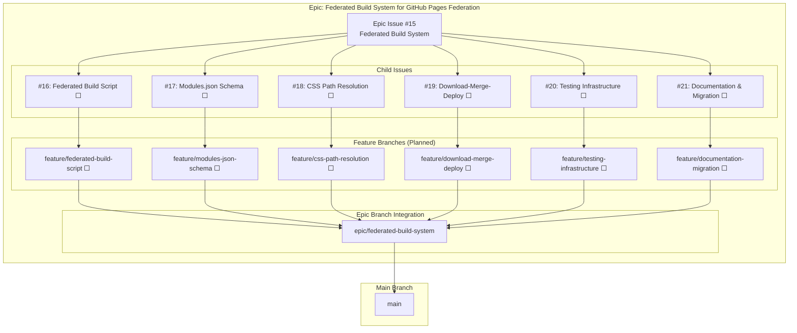
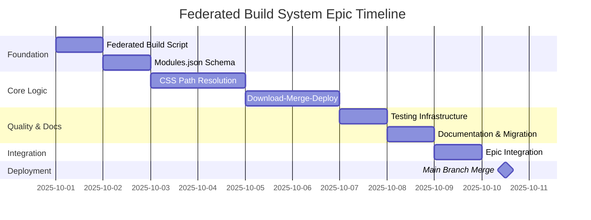
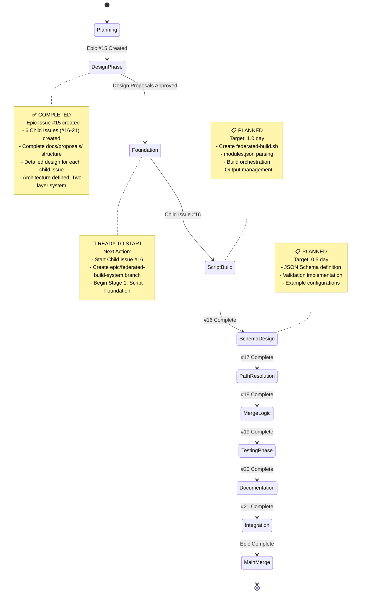
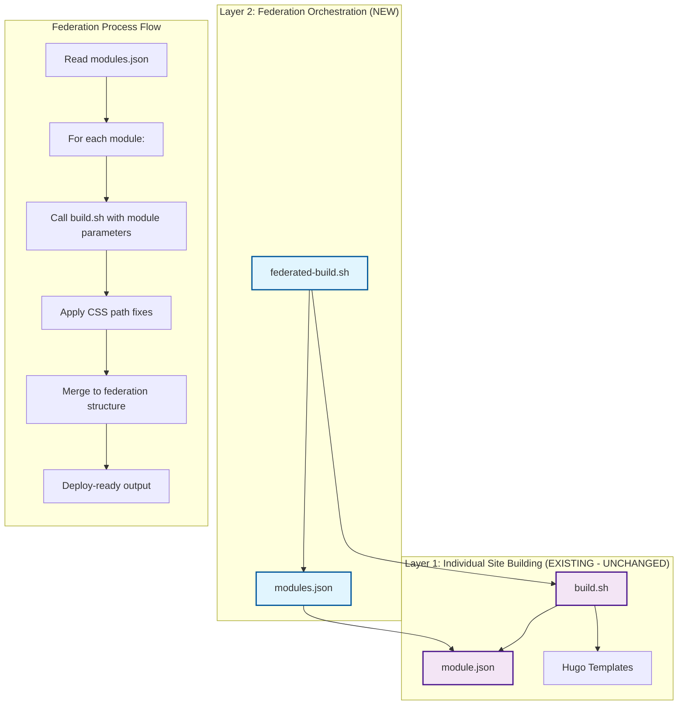
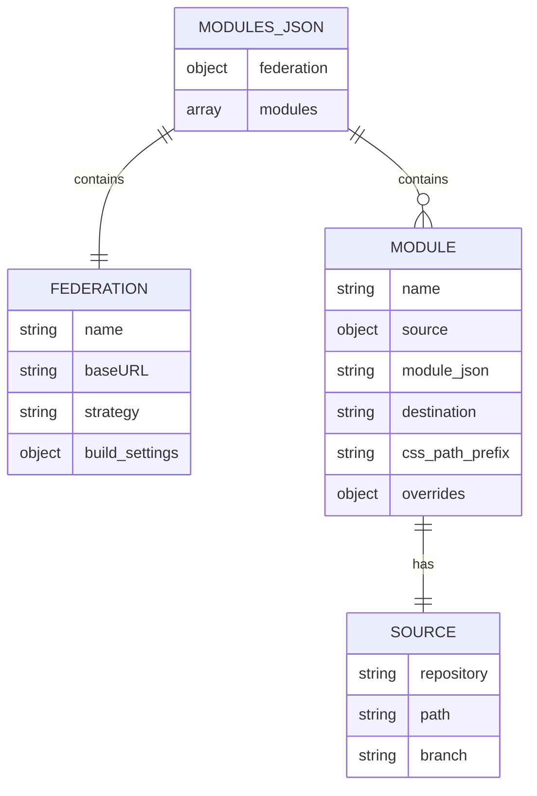
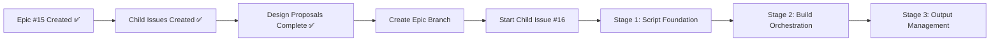
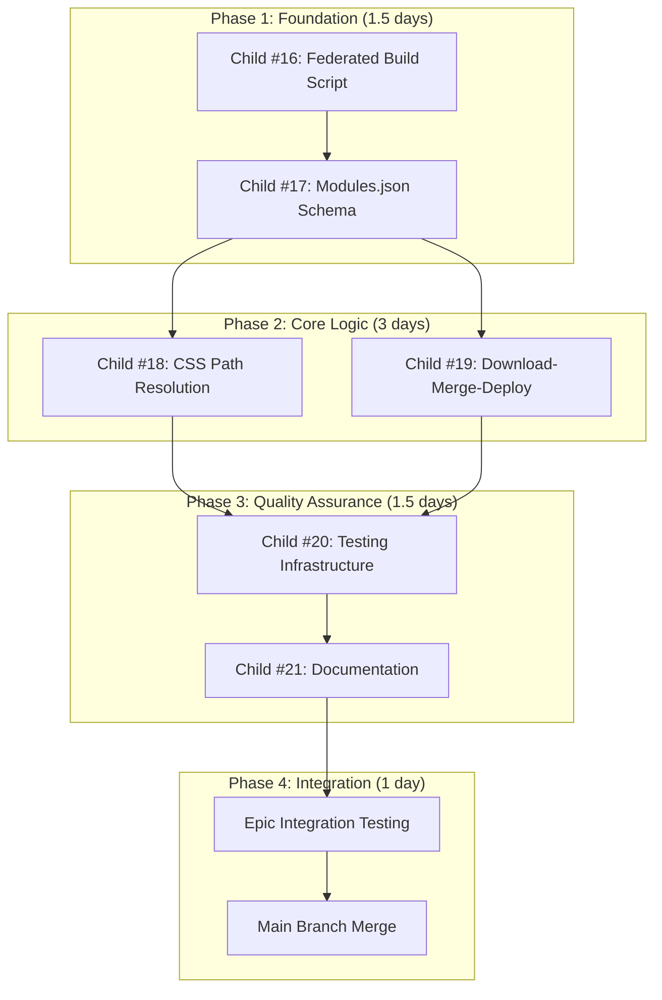

# Epic: Federated Build System - Visual Progress Tracking

## 📊 Epic Overview



## 🎯 Progress Status

### Epic Progress: 0% Complete (0/6 child issues)

| Child Issue | Status | Feature Branch | PR | Progress | Dependencies |
|-------------|--------|----------------|----|---------|--------------|
| [#16] Federated Build Script | ⬜ **NOT STARTED** | `feature/federated-build-script` | TBD → epic | 0% | None |
| [#17] Modules.json Schema | ⬜ **NOT STARTED** | `feature/modules-json-schema` | TBD → epic | 0% | #16 |
| [#18] CSS Path Resolution | ⬜ **NOT STARTED** | `feature/css-path-resolution` | TBD → epic | 0% | #16, #17 |
| [#19] Download-Merge-Deploy | ⬜ **NOT STARTED** | `feature/download-merge-deploy` | TBD → epic | 0% | #16, #17, #18 |
| [#20] Testing Infrastructure | ⬜ **NOT STARTED** | `feature/testing-infrastructure` | TBD → epic | 0% | #16-19 |
| [#21] Documentation & Migration | ⬜ **NOT STARTED** | `feature/documentation-migration` | TBD → epic | 0% | #16-20 |

### Development Timeline



## 🔄 Workflow Visualization

### Current Development Phase: Planning Complete → Ready to Start ⬜



## 🏗️ Architecture Visualization

### Two-Layer Federated System



### Federation Configuration Schema



## 📈 GitHub Integration

### Visual Tracking Locations

1. **GitHub Project Board**: [Federated Build System Epic](https://github.com/orgs/info-tech-io/projects/TBD)
   - Epic and all child issues tracked
   - Kanban-style progress visualization
   - Automated status updates

2. **Pull Request Tracking** (Planned):
   - PR TBD: `feature/federated-build-script` → `epic/federated-build-system`
   - PR TBD: `feature/modules-json-schema` → `epic/federated-build-system`
   - PR TBD: `feature/css-path-resolution` → `epic/federated-build-system`
   - PR TBD: `feature/download-merge-deploy` → `epic/federated-build-system`
   - PR TBD: `feature/testing-infrastructure` → `epic/federated-build-system`
   - PR TBD: `feature/documentation-migration` → `epic/federated-build-system`
   - Final PR: `epic/federated-build-system` → `main`

3. **Branch Strategy Visualization**:
   ```
   main
   ├── epic/federated-build-system (to be created)
   │   ├── feature/federated-build-script (planned)
   │   ├── feature/modules-json-schema (planned)
   │   ├── feature/css-path-resolution (planned)
   │   ├── feature/download-merge-deploy (planned)
   │   ├── feature/testing-infrastructure (planned)
   │   └── feature/documentation-migration (planned)
   ```

## 🎯 Next Steps Visualization

### Immediate Actions (Next 1-2 days)



### Development Strategy Phases



## 📊 Metrics Dashboard

### Implementation Metrics (Planned)
- **Federated Build Coverage**: Target 100% (modules.json → working federation)
- **Backward Compatibility**: Target 100% (all existing builds unchanged)
- **CSS Path Resolution**: Target 100% (all themes work in subdirectories)
- **Test Coverage**: Target 95%+ (comprehensive federation testing)
- **Build Performance**: Target < 3 minutes per federation
- **Documentation Coverage**: Target 100% (complete user guides)

### Architecture Quality Score: 🟢 Excellent Planning
- ✅ Two-layer architecture designed (no breaking changes)
- ✅ Complete Epic structure created (6 child issues)
- ✅ Detailed design proposals approved
- ✅ Clear dependencies mapped
- ✅ Backward compatibility guaranteed
- ✅ Test strategy defined
- ✅ Migration path planned
- 🚀 Ready for implementation

## 🔧 Technical Implementation Tracking

### Stage-Level Progress (Child #16 Example)

| Stage | Child #16 Status | Estimated Time | Details |
|-------|------------------|----------------|---------|
| Stage 1: Script Foundation | ⬜ Not Started | 0.4 days | Basic federated-build.sh structure |
| Stage 2: Build Orchestration | ⬜ Not Started | 0.4 days | Multiple build.sh execution logic |
| Stage 3: Output Management | ⬜ Not Started | 0.2 days | Federation directory merging |

### Key Files Tracking

| Component | Status | Files to Create/Modify |
|-----------|--------|------------------------|
| Federated Build Script | ⬜ Planned | `scripts/federated-build.sh` (new) |
| Modules Configuration | ⬜ Planned | `schemas/modules.schema.json` (new) |
| CSS Resolution | ⬜ Planned | CSS processing functions in federated-build.sh |
| Merge Logic | ⬜ Planned | Download-merge-deploy functions |
| Testing | ⬜ Planned | `tests/federated-*.bats` (new) |
| Documentation | ⬜ Planned | `docs/user-guides/federated-builds.md` (new) |

## 🌟 Success Criteria Tracking

### Epic-Level Success Criteria
- [ ] **Backward Compatibility**: 100% existing projects work unchanged
- [ ] **Federation Functionality**: Multiple modules build to federated structure
- [ ] **CSS Path Resolution**: Themes work correctly in subdirectories
- [ ] **Performance**: Federation build time < 3 minutes
- [ ] **Documentation**: Complete user guides and migration path
- [ ] **Testing**: 95%+ test coverage for federation features

### Ready-to-Deploy Checklist
- [ ] All 6 Child Issues completed
- [ ] Epic integration testing passed
- [ ] Performance benchmarks met
- [ ] Documentation complete
- [ ] Migration guide validated
- [ ] Backward compatibility confirmed

## 🔗 Quick Links

- **Epic Issue**: [#15 Federated Build System](https://github.com/info-tech-io/hugo-templates/issues/15)
- **Child Issues**: [#16](https://github.com/info-tech-io/hugo-templates/issues/16), [#17](https://github.com/info-tech-io/hugo-templates/issues/17), [#18](https://github.com/info-tech-io/hugo-templates/issues/18), [#19](https://github.com/info-tech-io/hugo-templates/issues/19), [#20](https://github.com/info-tech-io/hugo-templates/issues/20), [#21](https://github.com/info-tech-io/hugo-templates/issues/21)
- **Design Proposals**: [docs/proposals/epic-15-federated-build-system/](docs/proposals/epic-15-federated-build-system/)
- **Epic Branch**: `epic/federated-build-system` (to be created)
- **Parent Project**: [Phase 2: Hugo Templates Enhancement](https://github.com/info-tech-io/info-tech-io.github.io/issues/4)
- **Contributing Workflow**: [InfoTech.io Contributing Guide](https://github.com/info-tech-io/info-tech/blob/main/docs/content/open-source/contributing.md#epic-issues--child-issues--feature-branches-strategy)

---

**Last Updated**: September 30, 2025
**Next Review**: After epic branch creation and Child Issue #16 start
**Epic Status**: 🚀 **READY FOR IMPLEMENTATION**