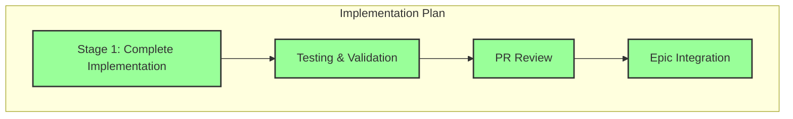

# Progress: Child Issue #3 - Error Handling System

## Implementation Status: ✅ COMPLETED

## Timeline

| Stage | Status | Started | Completed | Duration |
|-------|--------|---------|-----------|----------|
| Stage 1: Complete Implementation | ✅ Complete | 2025-09-27 | 2025-09-27 | ~5 hours |
| Testing & Validation | ✅ Complete | 2025-09-27 | 2025-09-27 | ~2 hours |
| PR Review | ✅ Complete | 2025-09-27 | 2025-09-27 | ~1 hour |
| Epic Integration | ✅ Complete | 2025-09-27 | 2025-09-27 | Immediate |

## Key Deliverables

### ✅ Completed
- [x] **scripts/error-handling.sh** (464 lines)
  - Structured error system with hierarchical levels
  - Error categorization (CONFIG, DEPENDENCY, BUILD, IO, VALIDATION)
  - Function tracking and context preservation
  - GitHub Actions annotations integration

- [x] **scripts/build.sh** (301 lines modified)
  - Enhanced load_module_config() with robust error handling
  - Improved parse_components() with non-fatal errors
  - Fixed show_build_summary() exit code issues

- [x] **docs/error-handling-design.md** (241 lines)
  - Complete architecture documentation
  - Usage patterns and examples
  - Best practices guide

### Testing Coverage
- ✅ Syntax validation
- ✅ Help command functionality
- ✅ Error scenario handling
- ✅ Debug mode tracing
- ✅ Full build tests (115 HTML files)
- ✅ Exit code stability

## Implementation Metrics

| Metric | Value |
|--------|-------|
| Total Lines Added | 933+ |
| New Files | 2 (error-handling.sh, design.md) |
| Modified Files | 1 (build.sh) |
| Error Levels Implemented | 5 |
| Error Categories | 5 |
| Safe Wrappers Created | 3 |
| Functions Enhanced | 3 |
| Test Scenarios Validated | 6 |

## GitHub Integration

- **Pull Request**: [#8 - feat: Error Handling System v2.0](https://github.com/info-tech-io/hugo-templates/pull/8)
- **Feature Branch**: `feature/error-handling-system`
- **Epic Branch**: `epic/build-system-v2.0`
- **Main Commit**: `a235533e76b54af285b7b8acacfb0bc625957dc5`
- **Merged**: September 27, 2025 at 15:32 UTC

## Impact on Epic

This Child Issue provides the **foundational infrastructure** for:
- ✅ Child #4 (Test Coverage) - Can now test error conditions systematically
- ✅ Child #5 (GitHub Actions) - Has proper error reporting for CI/CD
- ✅ Child #6 (Documentation) - Has comprehensive error references
- ✅ Child #7 (Performance) - Can track performance issues with proper logging

## Next Steps
✅ All steps completed. Child Issue #3 successfully integrated into Epic branch.

---

**Child Issue**: [#3 - Error Handling System](https://github.com/info-tech-io/hugo-templates/issues/3)
**Status**: ✅ **CLOSED** (September 27, 2025)
**Epic Progress**: 1/5 (20%) → First milestone achieved
