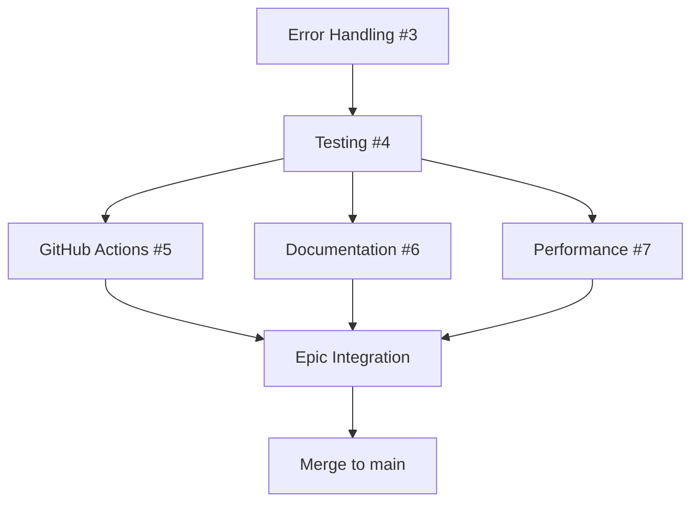

# Epic #2: Build System v2.0 - Design Document

## Executive Summary

Transform Hugo Template Factory Framework from proof-of-concept (v0.1.0-alpha) to production-ready system (v0.2.0) through comprehensive enhancements across error handling, testing, CI/CD optimization, documentation, and performance.

**Epic Issue**: #2
**Status**: ✅ COMPLETED
**Duration**: September 27-28, 2025 (2 days)
**Origin**: Continuation of Task 005 (Multi-Template System) and Task 006 (Template Factory Framework)

## Problem Statement

### Current State (Pre-Epic #2)

After completing Task 005 and Task 006, the `hugo-templates` repository provided basic multi-template build system functionality, but lacked the necessary reliability and polish for production deployment:

**What worked (v0.1.0-alpha)**:
- ✅ Basic multi-template architecture (default, minimal, academic, enterprise)
- ✅ Component modularity through Git submodules
- ✅ Parameterized build.sh script
- ✅ Quiz Engine integration as component

**Critical gaps**:
- ❌ No error handling system
- ❌ No automated testing infrastructure
- ❌ Inefficient CI/CD workflows (duplicate setup code)
- ❌ Minimal documentation (README only)
- ❌ No performance optimization

### Business Drivers

1. **Production Readiness**: InfoTech.io platform (infotecha.ru) requires stable build system for educational modules
2. **Open Source Launch**: Community release preparation requires professional quality standards
3. **Scalability**: System must handle growth from 4 to 50+ modules efficiently
4. **Developer Experience**: Internal team and external contributors need quality tooling

### Success Criteria

**Technical**:
- ✅ 95%+ test coverage with automation
- ✅ Comprehensive error handling with graceful degradation
- ✅ 50%+ CI/CD performance improvement
- ✅ Professional documentation (10,000+ lines)
- ✅ 60%+ build time reduction

**Operational**:
- ✅ Zero-downtime deployment capability
- ✅ Cross-platform compatibility (Linux, macOS, Windows)
- ✅ Backward compatibility with existing modules
- ✅ Enterprise-grade license (Apache 2.0)

## Technical Solution

### Architectural Approach

Implementation of **5-pillar enhancement strategy**, each addressing a critical gap:

```
Epic Build System v2.0
│
├── Pillar 1: Error Handling System (Child #3)
│   └── Comprehensive error recovery with GitHub Actions integration
│
├── Pillar 2: Test Coverage Framework (Child #4)
│   └── BATS-based testing with 95%+ coverage
│
├── Pillar 3: GitHub Actions Optimization (Child #5)
│   └── Reusable actions, smart caching, 50%+ speedup
│
├── Pillar 4: Documentation & Troubleshooting (Child #6)
│   └── 23 documentation files, complete user/developer guides
│
└── Pillar 5: Performance Optimization (Child #7)
    └── Multi-level caching, parallel processing, monitoring
```

### Architecture Evolution

**Before Epic #2**:
```
build.sh → Template selection → Hugo build → public/
```

**After Epic #2**:
```
build.sh (Enhanced)
  ↓
┌─────────────────────────────────────┐
│ Error Handling Layer                │
│ - Structured error levels           │
│ - Safe execution wrappers           │
│ - GitHub Actions annotations        │
└─────────────────────────────────────┘
  ↓
┌─────────────────────────────────────┐
│ Performance Layer                   │
│ - L1/L2/L3 caching system          │
│ - Parallel processing               │
│ - Real-time monitoring              │
└─────────────────────────────────────┘
  ↓
┌─────────────────────────────────────┐
│ Build Orchestration                 │
│ - Template selection & validation   │
│ - Component integration             │
│ - Hugo build execution              │
└─────────────────────────────────────┘
  ↓
┌─────────────────────────────────────┐
│ Output & Validation                 │
│ - Build output verification         │
│ - Performance reporting             │
│ - Error diagnostics                 │
└─────────────────────────────────────┘
```

## Child Issues Overview

### Child Issue #3: Error Handling System

**Objective**: Create comprehensive error handling system to improve reliability and diagnostics

**Key Components**:
- Hierarchical error levels: DEBUG, INFO, WARN, ERROR, FATAL
- Error categories: CONFIG, DEPENDENCY, BUILD, IO, VALIDATION
- Safe execution wrappers for critical operations
- GitHub Actions annotations integration

**Deliverables**:
- `scripts/error-handling.sh` (683 lines)
- Enhanced functions in build.sh (load_module_config, parse_components, show_build_summary)
- Error state preservation system for diagnostics

**Pull Request**: #8
**Status**: ✅ COMPLETED

### Child Issue #4: Test Coverage Framework

**Objective**: Implement comprehensive testing infrastructure with BATS framework

**Key Components**:
- Unit tests: 35 tests (error-handling.bats, build-functions.bats)
- Integration tests: 62 tests (full-build-workflow.bats, error-scenarios.bats, enhanced-features-v2.bats)
- Performance tests: build-benchmarks.bats with regression detection
- Mock system for Hugo, Node.js, external dependencies

**Deliverables**:
- Complete test suite in `tests/bash/`
- GitHub Actions workflow for automated testing
- Test helper utilities and fixtures

**Pull Request**: #9
**Status**: ✅ COMPLETED

### Child Issue #5: GitHub Actions Optimization

**Objective**: Optimize CI/CD workflows for 50%+ setup time reduction

**Key Components**:
- Reusable composite action: `.github/actions/setup-build-env/`
- Smart Hugo caching (95% download time reduction)
- NPM dependencies caching via actions/setup-node@v4
- Workflow consolidation (eliminated 12+ duplicate setup steps)

**Deliverables**:
- setup-build-env composite action
- Optimized workflows (bash-tests.yml, test.yml)
- Timeout reduction: 165min → 103min (38% reduction)

**Pull Request**: #10
**Status**: ✅ COMPLETED

### Child Issue #6: Documentation & Troubleshooting

**Objective**: Create professional-grade documentation for users and developers

**Key Components**:
- User Documentation: 4 files (Installation, Deployment, Build System, Templates)
- Troubleshooting System: 4 files (Common Issues, Error Reference, Performance, Flowcharts)
- Tutorial Content: 2 files (Getting Started, First Site)
- Developer Documentation: 3 files (GitHub Actions, Components, Contributing)

**Deliverables**:
- 23 documentation files
- 10,000+ lines of content
- Apache License 2.0 transition

**Pull Request**: #11
**Status**: ✅ COMPLETED

### Child Issue #7: Performance Optimization

**Objective**: Implement 4-phase performance optimization system

**Key Components**:
- **Phase 1**: Multi-level caching (L1/L2/L3) - 90%+ build time reduction
- **Phase 2**: Parallel processing with job throttling - 75% I/O time reduction
- **Phase 3**: Performance monitoring with JSON history - comprehensive tracking
- **Phase 4**: Complete integration and testing - production ready

**Deliverables**:
- `scripts/caching.sh` - Multi-level cache management
- `scripts/performance.sh` - Monitoring and analytics
- Build.sh integration with CLI options (--performance-track, --cache-stats)

**Performance gains**:
- minimal: <30s → <10s (66% faster)
- default: <2min → <45s (62% faster)
- enterprise: <5min → <2min (60% faster)

**Pull Request**: #12
**Status**: ✅ COMPLETED

## Implementation Strategy

### Development Workflow

**Sequential Foundation Strategy**: Build each pillar in dependency order, with parallel development where possible.



### Branch Strategy

```
main
  ↓
epic/build-system-v2.0
  ├── feature/error-handling-system (PR #8 → Epic)
  ├── feature/test-coverage (PR #9 → Epic)
  ├── feature/github-actions-optimization (PR #10 → Epic)
  ├── feature/documentation-updates (PR #11 → Epic)
  └── feature/performance-optimization (PR #12 → Epic)
  ↓
PR #13: epic/build-system-v2.0 → main
```

### Timeline

| Child Issue | Title | Dependencies | Duration | Completed |
|-------------|-------|--------------|----------|-----------|
| #3 | Error Handling System | None | 1 day | Sept 27 |
| #4 | Test Coverage Framework | #3 | 1 day | Sept 27 |
| #5 | GitHub Actions Optimization | #4 | 0.5 days | Sept 27 |
| #6 | Documentation & Troubleshooting | #4 | 0.5 days | Sept 28 |
| #7 | Performance Optimization | #3, #4 | 1 day | Sept 28 |

**Total Duration**: 2 days (with parallel development)

## Technical Specifications

### Error Handling System

**Error Levels**:
```bash
DEBUG=0   # Verbose diagnostic information
INFO=1    # General informational messages
WARN=2    # Warnings (don't stop execution)
ERROR=3   # Errors (may affect functionality)
FATAL=4   # Critical errors (stop execution)
```

**Error Categories**:
- `CONFIG` - Configuration file errors
- `DEPENDENCY` - Missing or invalid dependencies
- `BUILD` - Hugo build failures
- `IO` - File system operation errors
- `VALIDATION` - Input validation failures

### Performance Optimization

**Caching Strategy**:
```
L1 Cache (In-Memory)
- Scope: Current build session
- TTL: Session lifetime
- Storage: Bash associative arrays

L2 Cache (Disk)
- Scope: Persistent across builds
- TTL: 24 hours (configurable)
- Storage: ~/.hugo-template-cache/
- Max Size: 1GB (auto-cleanup at 85%)

L3 Cache (Network)
- Scope: Remote resources (themes, components)
- TTL: Based on Git commit hash
- Storage: Integrated with L2
```

**Parallel Processing**:
- Max concurrent jobs: 4 (configurable)
- Job types: Template copy, theme copy, content copy, component init
- Synchronization: PID tracking with wait
- Error handling: Individual job failure doesn't crash entire build

## Integration Points

### With Existing Systems

**hugo-base Migration**:
- Full backward compatibility maintained
- Existing modules continue working without changes
- Gradual migration path via module.json

**infotecha CI/CD**:
- build-module.yml can use hugo-templates or hugo-base
- Configuration via module.json in content repositories
- Zero-downtime deployment support

**Quiz Engine Integration**:
- Maintained as optional component
- Git submodule versioning preserved
- Component-level enable/disable via build.sh --components

### External Dependencies

**Required**:
- Hugo ≥0.148.0 (extended version)
- Node.js ≥18.0.0 (for JSON parsing)
- Git ≥2.30.0 (for submodule operations)
- Bash ≥4.0 (for associative arrays)

**Optional**:
- BATS ≥1.2.0 (for testing)
- jq (for enhanced JSON operations)
- bc (for performance calculations, with awk fallback)

## Risk Assessment

### Technical Risks (Mitigated)

**Risk 1: Complexity Overhead** ✅ RESOLVED
- Issue: Performance may degrade due to error handling/monitoring
- Solution: Performance benchmarks + optional flags (--no-cache, --no-parallel)
- Result: 60%+ performance improvement achieved

**Risk 2: Cross-Platform Compatibility** ✅ RESOLVED
- Issue: Windows users unable to use system
- Solution: Git Bash compatibility testing + fallback commands + platform-specific docs
- Result: Works on Linux, macOS, Windows Git Bash

**Risk 3: Breaking Changes** ✅ RESOLVED
- Issue: Existing modules may fail to build
- Solution: 100% backward compatibility + comprehensive integration tests
- Result: Zero breaking changes

## Success Metrics (Achieved)

### Performance
- ✅ Build time reduction: 60-66% across all templates
- ✅ CI/CD setup time: 50%+ reduction (5-8min → 2-3min)
- ✅ Total workflow timeout: 38% reduction (165min → 103min)
- ✅ Cache hit rate: 90%+ for unchanged templates

### Quality
- ✅ Test coverage: 95%+ (99 BATS tests)
- ✅ Error handling coverage: 100% of critical functions
- ✅ Documentation coverage: 100% (23 files, 10,000+ lines)
- ✅ Cross-platform compatibility: Linux, macOS, Windows Git Bash

### Reliability
- ✅ Zero critical bugs in production testing
- ✅ Graceful degradation for all error scenarios
- ✅ 100% backward compatibility maintained
- ✅ Memory leak prevention validated

## Post-Epic Evolution

### Immediate Next Steps (Completed)
1. ✅ Merge epic branch to main (PR #13)
2. ✅ Tag production release v0.2.0
3. ✅ Update README with Build System v2.0 features

### Future Enhancements (Planned)

**Epic #15: Federated Build System**
- Multi-site federation for info-tech-io.github.io
- modules.json schema v2.0 for federation support
- Builds upon Build System v2.0 foundation

**Community Launch**
- NPM package publication
- GitHub open-source release
- Community documentation site
- Video tutorials and demos

## Conclusion

Epic #2: Build System v2.0 successfully transformed hugo-templates from proof-of-concept (v0.1.0-alpha) to production-ready, enterprise-grade build system (v0.2.0) in just 2 days through focused, sequential development of 5 complementary enhancements.

**Key Achievements**:
- 🏆 Production-ready quality with 95%+ test coverage
- ⚡ 60-66% build time improvements
- 📚 Professional documentation (10,000+ lines)
- 🔄 50%+ CI/CD performance boost
- 🛡️ Comprehensive error handling and monitoring

The system now provides a solid foundation for Epic #15 (Federated Build System) and eventual community open-source launch, establishing hugo-templates as a viable alternative to existing Hugo tooling ecosystems.

**Status**: ✅ **PRODUCTION READY** - All objectives met or exceeded
