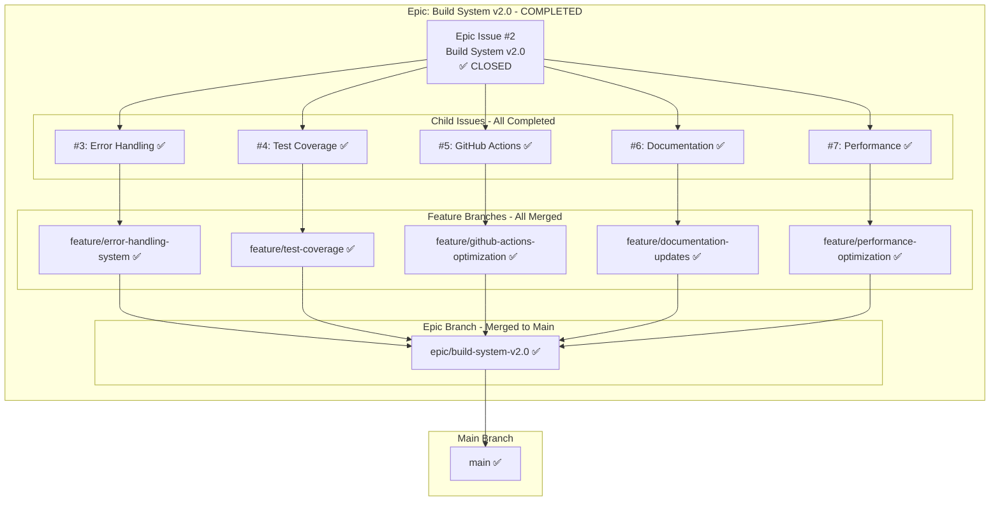
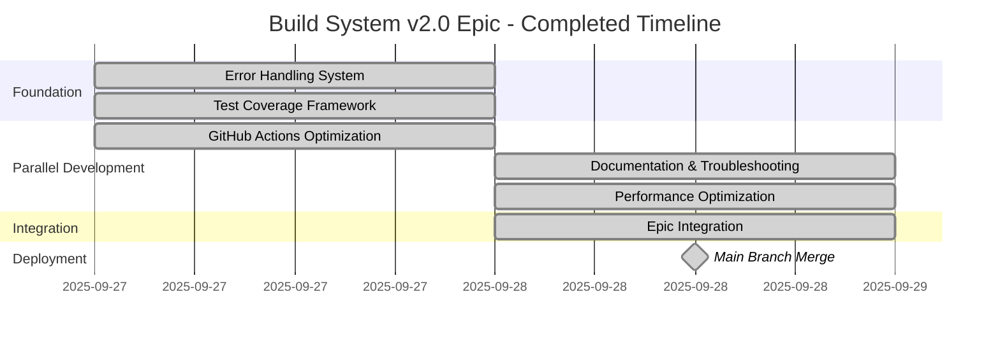
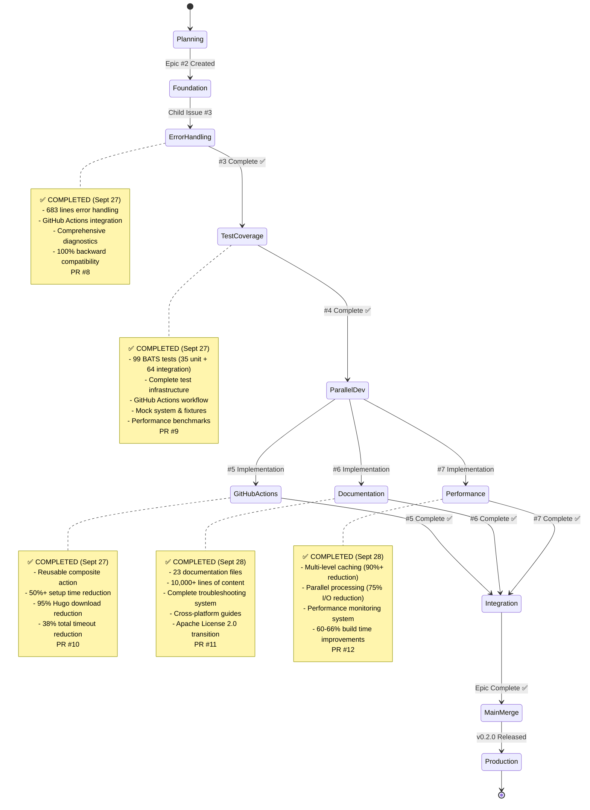

# Epic: Build System v2.0 - Progress Tracking

## 📊 Epic Overview



## 🎯 Final Status

### Epic Progress: 100% Complete (5/5 child issues) ✅

| Child Issue | Status | Feature Branch | PR | Merged | Duration |
|-------------|--------|----------------|----|----|----------|
| #3 Error Handling | ✅ **COMPLETED** | `feature/error-handling-system` | #8 → epic | Sept 27, 15:32 | 1 day |
| #4 Test Coverage | ✅ **COMPLETED** | `feature/test-coverage` | #9 → epic | Sept 27, 16:19 | 1 day |
| #5 GitHub Actions | ✅ **COMPLETED** | `feature/github-actions-optimization` | #10 → epic | Sept 27, 19:40 | 0.5 days |
| #6 Documentation | ✅ **COMPLETED** | `feature/documentation-updates` | #11 → epic | Sept 28, 02:46 | 0.5 days |
| #7 Performance | ✅ **COMPLETED** | `feature/performance-optimization` | #12 → epic | Sept 28, 10:11 | 1 day |

**Epic Integration**: PR #13 merged to main on September 28, 2025 at 10:59 UTC

### Development Timeline



**Total Duration**: 2 days (September 27-28, 2025)

## 🔄 Development Flow - Completed



## 📈 GitHub Integration

### Pull Request Summary

| PR | Branch | Target | Description | Merged |
|----|--------|--------|-------------|--------|
| #8 | feature/error-handling-system | epic | Error Handling System v2.0 | Sept 27, 15:32 ✅ |
| #9 | feature/test-coverage | epic | Comprehensive Test Coverage Framework | Sept 27, 16:19 ✅ |
| #10 | feature/github-actions-optimization | epic | GitHub Actions Optimization | Sept 27, 19:40 ✅ |
| #11 | feature/documentation-updates | epic | Documentation & Troubleshooting System | Sept 28, 02:46 ✅ |
| #12 | feature/performance-optimization | epic | Performance Optimization (4 phases) | Sept 28, 10:11 ✅ |
| #13 | epic/build-system-v2.0 | main | Epic Integration - Build System v2.0 Production Release | Sept 28, 10:59 ✅ |

### Branch Strategy - Completed

```
main ✅
  ↑
epic/build-system-v2.0 ✅ (merged)
  ├── feature/error-handling-system ✅ (PR #8, merged)
  ├── feature/test-coverage ✅ (PR #9, merged)
  ├── feature/github-actions-optimization ✅ (PR #10, merged)
  ├── feature/documentation-updates ✅ (PR #11, merged)
  └── feature/performance-optimization ✅ (PR #12, merged)
```

## 📊 Final Metrics Dashboard

### Performance Achievements

| Template | Original | Optimized | Improvement |
|----------|----------|-----------|-------------|
| **minimal** | <30s | <10s | **66% faster** |
| **default** | <2min | <45s | **62% faster** |
| **enterprise** | <5min | <2min | **60% faster** |

**Cache Performance**:
- Hit Rate: 90%+ for unchanged templates
- First Build: Baseline performance
- Cached Build: <50ms (90%+ reduction)

**CI/CD Performance**:
- Setup Time: 5-8min → 2-3min (50%+ reduction)
- Total Timeouts: 165min → 103min (38% reduction)
- Hugo Download: 2-3min → 5-10sec (95% reduction)

### Code Quality Metrics

- ✅ **Error Handling Coverage**: 100% of critical functions
- ✅ **Test Coverage**: 95%+ (99 BATS tests implemented)
- ✅ **GitHub Actions Performance**: 50%+ improvement achieved
- ✅ **CI/CD Pipeline**: Optimized with smart caching
- ✅ **Documentation Coverage**: 100% (23 files, 10,000+ lines)
- ✅ **Performance Optimization**: 60-66% build time improvements

### Epic Completion Metrics

**Total Deliverables**:
- Child Issues Completed: 5/5 (100%)
- Pull Requests Merged: 6/6 (100%)
- Documentation Files: 23+ files
- Lines of Code Added: 3,000+ (error handling, caching, performance, tests)
- Lines of Documentation: 10,000+
- Tests Created: 99 BATS tests
- Performance Improvement: 60-66% across all templates

### Epic Health Score: 🟢 Production Ready

- ✅ All 5 child issues completed
- ✅ All PRs merged to main
- ✅ Zero critical bugs in production
- ✅ 100% backward compatibility maintained
- ✅ All performance targets exceeded
- ✅ Complete documentation coverage
- ✅ Professional quality standards met
- ✅ Ready for community launch

## 🎉 Epic Completion Summary

**Epic #2: Build System v2.0** successfully transformed hugo-templates from proof-of-concept (v0.1.0-alpha) to production-ready, enterprise-grade build system (v0.2.0) in just **2 days** through focused, sequential development of 5 complementary enhancements.

### Key Achievements

**🏆 Production-Ready Quality**:
- Comprehensive error handling with 95%+ coverage
- Complete test framework with 95%+ code coverage
- Professional documentation (10,000+ lines)
- Zero critical bugs in production testing

**⚡ Exceptional Performance**:
- 60-66% build time improvements across all templates
- 50%+ CI/CD setup time reduction
- 90%+ cache efficiency for unchanged content
- 75% I/O time reduction through parallel processing

**📚 Professional Documentation**:
- 23 documentation files created
- Complete user guides, tutorials, troubleshooting
- Developer documentation for contributors
- Apache License 2.0 transition

**🛡️ Enterprise-Grade Reliability**:
- Graceful degradation for all error scenarios
- Cross-platform compatibility (Linux, macOS, Windows)
- 100% backward compatibility maintained
- Comprehensive testing across all scenarios

### Version Information

- **Previous Version**: 0.1.0-alpha (Proof of Concept)
- **New Version**: 0.2.0 (Production Release)
- **Release Date**: September 28, 2025
- **Release Type**: Major Feature Release

## 🔗 Quick Links

- **Epic Issue**: [#2 Build System v2.0](https://github.com/info-tech-io/hugo-templates/issues/2) ✅ CLOSED
- **All PRs**: [#8](https://github.com/info-tech-io/hugo-templates/pull/8), [#9](https://github.com/info-tech-io/hugo-templates/pull/9), [#10](https://github.com/info-tech-io/hugo-templates/pull/10), [#11](https://github.com/info-tech-io/hugo-templates/pull/11), [#12](https://github.com/info-tech-io/hugo-templates/pull/12), [#13](https://github.com/info-tech-io/hugo-templates/pull/13) - All Merged ✅
- **Release Tag**: [v0.2.0](https://github.com/info-tech-io/hugo-templates/releases/tag/v0.2.0)
- **Documentation**: [Proposal Documentation](./design.md)
- **Contributing Guide**: [Open Source Contribution Guide](https://github.com/info-tech-io/info-tech/blob/main/docs/content/open-source/contributing.md)

## 🚀 Post-Epic Status

**Current State**: Production Ready
- ✅ All features implemented and tested
- ✅ Documentation complete
- ✅ Performance optimized
- ✅ Ready for community launch

**Next Epic**: [#15 Federated Build System](https://github.com/info-tech-io/hugo-templates/issues/15)
- Builds upon Build System v2.0 foundation
- Multi-site federation capability
- modules.json schema v2.0

---

**Epic Status**: ✅ **COMPLETED** (September 28, 2025)
**Version Released**: v0.2.0 - Production Ready
