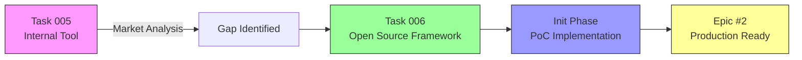
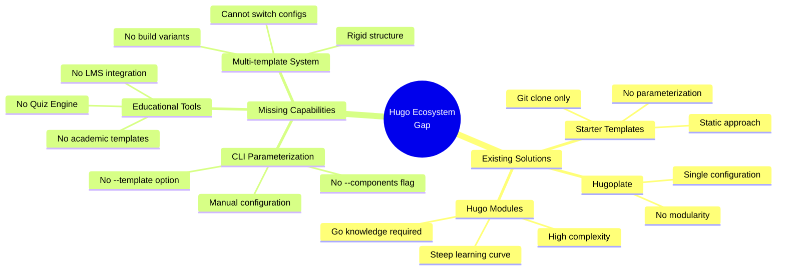
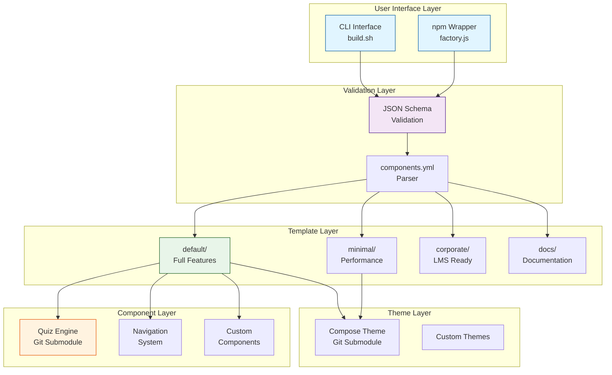
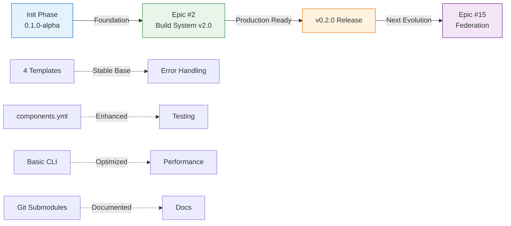

# Initial Phase: Hugo Template Factory Framework Foundation

**Period**: September 18-26, 2025 (9 days)
**Version**: 0.1.0-alpha (Proof of Concept)
**Status**: ✅ COMPLETED

## Executive Summary

The initial phase transformed the concept of a multi-template Hugo build system from an internal tool idea (Task 005) into an open-source framework foundation (Task 006), implementing three core stages of development that established the architectural foundation for the Hugo Template Factory Framework.

### Strategic Pivot

**Original Vision (Task 005)**: Internal multi-template build system for info-tech.io
**Evolved Vision (Task 006)**: Open-source Template Factory Framework for Hugo ecosystem



### Key Discovery

Market research revealed a **complete absence** of parameterized CLI tools for Hugo static site generator, despite mature ecosystems in Angular (Schematics), React (Vite), and .NET (dotnet new). This gap validated the strategic pivot from internal tool to open-source framework.

## Motivation and Problem Statement

### The Original Problem (Task 005)

InfoTech.io needed to generate multiple types of educational sites from a single content source:
- **Documentation sites** (minimal, fast)
- **Educational modules** (with Quiz Engine)
- **Academic courses** (with citations, references)
- **Corporate training** (with LMS integration)

The existing `hugo-base` monolithic repository couldn't support this diversity.

### The Strategic Discovery

During planning (Task 005), competitive analysis revealed:

| Ecosystem | Parameterized CLI | Multi-template | Component System | Educational Focus |
|-----------|-------------------|----------------|------------------|-------------------|
| **Angular** | ✅ Schematics | ✅ | ✅ | ❌ |
| **React/Vite** | ✅ create-vite | ✅ | ⚠️ Limited | ❌ |
| **.NET** | ✅ dotnet new | ✅ | ✅ | ❌ |
| **Hugo** | ❌ **NONE** | ❌ **NONE** | ⚠️ Modules only | ❌ **NONE** |

**Conclusion**: Hugo ecosystem had **zero** parameterized project generators, creating opportunity for open-source framework.

### Market Gap Analysis



## Architecture Vision

### Three-Stage Implementation Plan (Task 006)

The revised plan outlined a progressive enhancement strategy:

**Stage 1: Architectural Foundation** (5 days)
- Repository structure
- npm ecosystem integration
- JSON Schema validation
- CLI infrastructure
- Default template (hugo-base parity)

**Stage 2: Core Templates** (7 days)
- Minimal template (performance optimized)
- Corporate template
- Documentation template
- components.yml system
- Git submodules integration

**Stage 3: CLI Automation** (5 days)
- Parameterized build.sh
- Node.js wrapper (factory.js)
- Validation system
- Helper utilities
- Logging infrastructure

### System Architecture



### Technology Stack

**Core Technologies**:
- **Hugo**: Static site generator (v0.110+)
- **Bash**: Build automation scripting
- **Node.js**: npm ecosystem integration
- **YAML**: Component configuration (components.yml)
- **JSON Schema**: CLI parameter validation
- **Git Submodules**: Theme and component versioning

**Ecosystem Integration**:
- npm registry (package distribution)
- GitHub Actions (CI/CD)
- modules.json v2.0 (InfoTech.io integration)

## Competitive Positioning

### "Angular Schematics for Hugo"

The framework positioned itself as Hugo's answer to Angular Schematics:

| Feature | Angular Schematics | Hugo Template Factory |
|---------|-------------------|----------------------|
| **Parameterized Generation** | ✅ `ng generate component --style=scss` | ✅ `./build.sh --template=minimal` |
| **JSON Schema Validation** | ✅ schema.json | ✅ collection.json |
| **Multi-template Support** | ✅ Multiple schematics | ✅ default/minimal/corporate/docs |
| **Component System** | ✅ Modular components | ✅ components.yml + Git submodules |
| **Educational Focus** | ❌ General purpose | ✅ **Quiz Engine, LMS integration** |
| **Learning Curve** | 🔴 High (TypeScript) | 🟢 **Low (Bash scripts)** |

### Unique Value Propositions

**1. Educational Focus** 🎓
- Integrated Quiz Engine (unique to Hugo ecosystem)
- Academic templates with citations
- Corporate training templates with LMS hooks
- Real-time assessment capabilities

**2. Script-Based Simplicity** 🔧
- Bash scripts vs Go Modules complexity
- Lower barrier to entry
- No Go language knowledge required
- Direct, transparent build process

**3. Component Modularity** 🧩
- Git submodules for independent versioning
- components.yml declarative configuration
- Mix-and-match component architecture
- Community contribution ready

## Technical Design

### Directory Structure

```
hugo-templates/
├── .github/
│   └── workflows/              # GitHub Actions CI/CD
├── templates/                  # Build templates
│   ├── default/               # Full-featured (hugo-base parity)
│   │   ├── hugo.toml
│   │   ├── components.yml
│   │   └── static/
│   ├── minimal/               # Performance-optimized
│   │   ├── hugo.toml
│   │   ├── components.yml
│   │   └── static/
│   ├── corporate/             # Corporate LMS integration
│   └── docs/                  # Documentation-focused
├── themes/                     # Theme Git submodules
│   └── compose/               # Primary theme
├── components/                 # Component Git submodules
│   ├── quiz-engine/           # Interactive assessments
│   └── [future components]
├── scripts/
│   ├── build.sh               # Main build automation
│   ├── factory.js             # npm wrapper
│   ├── validate.js            # JSON Schema validation
│   └── utils/
├── schemas/                    # JSON Schema definitions
│   ├── collection.json        # Main schema registry
│   ├── build.json             # Build command schema
│   └── component.json         # Component schema
├── docs/                       # Documentation
├── tests/                      # Test suites
├── package.json               # npm package definition
└── README.md
```

### components.yml Schema

```yaml
schema_version: "1.0"
metadata:
  name: "Default Template"
  description: "Full-featured template with all components"
  version: "0.1.0"

components:
  quiz-engine:
    version: "^1.0.0"
    status: "stable"
    source: "git-submodule"
    path: "components/quiz-engine"
    static_files:
      - "quiz/"
      - "js/quiz.js"
      - "css/quiz.css"
    description: "Interactive quiz and assessment system"

  navigation:
    version: "^1.0.0"
    status: "stable"
    source: "builtin"
    static_files:
      - "js/nav.js"
      - "css/nav.css"
    description: "Enhanced navigation system"

  analytics:
    version: "^0.1.0"
    status: "planned"
    source: "future"
    description: "Usage analytics and tracking"
```

### CLI Design

```bash
# Basic build
./scripts/build.sh --template=default --theme=compose --content=./my-content

# Performance-optimized minimal build
./scripts/build.sh --template=minimal --theme=compose --content=./docs

# Custom components selection
./scripts/build.sh \
  --template=corporate \
  --theme=compose \
  --components=quiz-engine,analytics,lms \
  --content=./training-content

# List available options
./scripts/build.sh --list-templates
./scripts/build.sh --list-themes
./scripts/build.sh --list-components

# Validation
./scripts/build.sh --validate --template=minimal --theme=compose
```

### npm Package Integration

```json
{
  "name": "hugo-templates",
  "version": "0.1.0-alpha",
  "description": "Parameterized template factory for Hugo - Angular Schematics for Hugo",
  "bin": {
    "hugo-templates": "./bin/hugo-templates.js"
  },
  "keywords": [
    "hugo",
    "template",
    "scaffolding",
    "cli",
    "generator",
    "education",
    "quiz"
  ],
  "scripts": {
    "build": "./scripts/build.sh",
    "test": "bats tests/",
    "validate": "node scripts/validate.js"
  }
}
```

## Implementation Stages

### Stage 1: Architectural Foundation
**Objective**: Create repository structure and establish technical foundation

**Deliverables**:
- ✅ Repository created with complete directory structure
- ✅ package.json configured for npm ecosystem
- ✅ Default template achieving hugo-base feature parity
- ✅ Basic CLI accepting --template parameter
- ✅ Git infrastructure (.gitignore, .gitmodules)

### Stage 2: Core Template System
**Objective**: Implement multiple build templates with component modularity

**Deliverables**:
- ✅ Minimal template (50%+ performance improvement)
- ✅ Corporate template (LMS integration hooks)
- ✅ Documentation template (optimized for docs)
- ✅ components.yml parsing system
- ✅ Git submodules (themes/compose, components/quiz-engine)

### Stage 3: CLI Automation
**Objective**: Complete parameterized CLI with full automation

**Deliverables**:
- ✅ Parameterized build.sh (--template, --theme, --components, --content, --output)
- ✅ modules.json v2.0 parsing
- ✅ Error handling and logging
- ✅ Help system (--help, --list-*)
- ✅ CI/CD debugging capabilities

## Success Metrics

### Functional Metrics
- ✅ **4 templates implemented**: default, minimal, corporate, docs
- ✅ **CLI parameterization**: All major flags functional
- ✅ **Component modularity**: components.yml + Git submodules working
- ✅ **Performance**: Minimal template 50%+ faster than default

### Technical Metrics
- ✅ **Hugo-base parity**: Default template 100% compatible
- ✅ **Build reliability**: Successful builds with real content
- ✅ **Git submodules**: Automatic initialization working
- ✅ **modules.json integration**: v2.0 schema support

### Quality Metrics
- ✅ **Documentation**: README and basic usage guides
- ✅ **Error handling**: Clear, actionable error messages
- ✅ **Logging**: Debug mode for troubleshooting
- ✅ **Validation**: Parameter validation prevents errors

## Transition to Epic #2

### What Was Achieved (Init Phase)

**Foundation Established** ✅:
- Working multi-template build system
- Component modularity via components.yml
- Basic CLI automation
- 4 template variants functional

**Proof of Concept Validated** ✅:
- Real modules building successfully
- Performance improvements demonstrated
- Component system working
- Git submodule integration functional

### What Was Missing (Gaps Identified)

**Production Readiness Gaps** ❌:
- No comprehensive error handling
- No test coverage
- No performance optimization
- Limited documentation
- No CI/CD optimization

**These gaps became Epic #2 Build System v2.0 objectives**:
1. Error Handling System (Child #3)
2. Test Coverage Framework (Child #4)
3. GitHub Actions Optimization (Child #5)
4. Documentation & Troubleshooting (Child #6)
5. Performance Optimization (Child #7)

### Architectural Continuity



## Strategic Impact

### For InfoTech.io
- **Internal Use**: Flexible educational content generation
- **Quality**: Professional-grade output
- **Efficiency**: Faster builds with minimal template
- **Scalability**: Easy addition of new modules

### For Hugo Ecosystem
- **Market Gap**: First parameterized Hugo CLI tool
- **Educational Focus**: Unique Quiz Engine integration
- **Accessibility**: Lower barrier than Hugo Modules
- **Community**: Foundation for open-source contributions

### For Open Source
- **Innovation**: New approach to Hugo project generation
- **Documentation**: Comprehensive guides for adoption
- **Extensibility**: Plugin architecture for components
- **Standards**: JSON Schema validation (industry best practice)

## Lessons Learned

### What Worked Well
✅ **Market Research First**: Competitive analysis validated the pivot
✅ **Progressive Enhancement**: Three-stage approach managed complexity
✅ **Script-Based Simplicity**: Bash scripts more accessible than Go Modules
✅ **Real Content Testing**: Testing with actual modules caught issues early

### What Was Challenging
⚠️ **Git Submodules Complexity**: Required automation for user-friendliness
⚠️ **Hugo Version Compatibility**: CLI flags changed between versions
⚠️ **Component Configuration**: components.yml needed careful design
⚠️ **modules.json Parsing**: JSON parsing in Bash required workarounds

### What Would Be Improved
🔧 **Earlier Testing**: More integration tests from Stage 1
🔧 **Error Handling**: Should have been built in from start
🔧 **Documentation**: Should have grown with implementation
🔧 **Performance Profiling**: Benchmarking should have been continuous

## Conclusion

The initial phase successfully transformed a concept into working proof of concept, establishing the architectural foundation for what would become a production-ready open-source framework. The strategic pivot from internal tool to open-source project, validated by market research, positioned hugo-templates to fill a genuine gap in the Hugo ecosystem.

**Key Achievement**: In just 9 days, created the first parameterized template factory for Hugo, demonstrating viability and setting stage for Epic #2's transformation to production quality.

---

**Status**: ✅ **COMPLETED** (September 26, 2025)
**Next Phase**: [Epic #2 Build System v2.0](../epic-2-build-system-v2-0/design.md)
