# Initial Phase: Hugo Template Factory Framework - Progress Tracking

## 📊 Phase Overview

```mermaid
graph TB
    subgraph "Init Phase: Proof of Concept - COMPLETED"
        IDEA[Task 005<br/>Internal Tool Concept<br/>Sept 10-17, 2025]

        PIVOT[Market Analysis<br/>Strategic Pivot Decision<br/>Sept 17, 2025]

        PLAN[Task 006<br/>Open Source Framework Plan<br/>Sept 17-18, 2025]

        subgraph "Implementation Stages - All Completed"
            S1[Stage 1: Foundation ✅<br/>Sept 18-19, 2025]
            S2[Stage 2: Templates ✅<br/>Sept 20-23, 2025]
            S3[Stage 3: CLI ✅<br/>Sept 24-26, 2025]
        end

        READY[PoC Complete<br/>Ready for Epic #2<br/>Sept 26, 2025]
    end

    subgraph "Next Phase"
        EPIC[Epic #2<br/>Build System v2.0<br/>Sept 27-28, 2025]
    end

    IDEA --> PIVOT
    PIVOT --> PLAN
    PLAN --> S1
    S1 --> S2
    S2 --> S3
    S3 --> READY
    READY --> EPIC

    style IDEA fill:#f9f,stroke:#333
    style PIVOT fill:#ff9,stroke:#333
    style PLAN fill:#9ff,stroke:#333
    style S1 fill:#9f9,stroke:#333
    style S2 fill:#9f9,stroke:#333
    style S3 fill:#9f9,stroke:#333
    style READY fill:#9f9,stroke:#333
    style EPIC fill:#e1f5ff,stroke:#01579b
```



## 🎯 Final Status

### Phase Completion: 100% (3/3 stages) ✅

| Stage | Duration | Status | Key Deliverable | Completion Date |
|-------|----------|--------|-----------------|-----------------|
| **Stage 1: Foundation** | 2 days | ✅ **COMPLETED** | Repository structure, default template | Sept 19, 2025 |
| **Stage 2: Templates** | 4 days | ✅ **COMPLETED** | 4 templates, components.yml, Git submodules | Sept 23, 2025 |
| **Stage 3: CLI** | 3 days | ✅ **COMPLETED** | Parameterized build.sh, automation | Sept 26, 2025 |

**Total Duration**: 9 days (September 18-26, 2025)

## 📅 Development Timeline

```mermaid
gantt
    title Init Phase - Completed Timeline
    dateFormat YYYY-MM-DD
    section Planning
    Task 005 Concept           :done, task005, 2025-09-10, 7d
    Market Analysis            :done, analysis, 2025-09-17, 1d
    Task 006 Planning          :done, task006, 2025-09-17, 2d
    section Implementation
    Stage 1: Foundation        :done, stage1, 2025-09-18, 2d
    Stage 2: Templates         :done, stage2, 2025-09-20, 4d
    Stage 3: CLI Automation    :done, stage3, 2025-09-24, 3d
    section Transition
    PoC Complete               :milestone, done, poc-done, 2025-09-26, 1d
    Epic #2 Starts             :milestone, done, epic2, 2025-09-27, 1d
```

## 🔄 Development Flow


## 📈 Implementation Progress by Commit

### Pre-Planning Phase (Sept 10-17, 2025)

**Task 005 Conceptualization**:
- Internal tool vision for info-tech.io multi-template system
- Blue-Green deployment strategy (new repo parallel to hugo-base)
- 4-template architecture: default, minimal, academic, enterprise

**Market Analysis (Sept 17)**:
- Competitive research completed
- Gap identified: No parameterized Hugo CLI tools exist
- Decision: Pivot from internal tool to open-source framework

**Task 006 Planning (Sept 17-18)**:
- Revised architecture for open-source
- npm ecosystem integration planned
- JSON Schema validation designed
- Three-stage implementation strategy

### Stage 1: Architectural Foundation ✅ (Sept 18-19, 2025)

| Commit | Date | Description |
|--------|------|-------------|
| `2c9cbd7` | Sept 18 | **Initial commit**: Repository structure created |
| `6205e68` | Sept 18 | **Stage 2 implementation**: Core Hugo Template Factory functionality |

**Achievements**:
- ✅ Repository created with full directory structure
- ✅ package.json configured for npm
- ✅ Default template achieving hugo-base parity
- ✅ Basic CLI accepting --template parameter
- ✅ .gitignore and .gitmodules setup

**Key Files Created**:
```
templates/default/              # Hugo-base feature parity
scripts/build.sh               # Basic build script
package.json                   # npm package config
.gitignore                     # Git configuration
README.md                      # Initial documentation
```

### Stage 2: Core Template System ✅ (Sept 20-23, 2025)

| Commit | Date | Description |
|--------|------|-------------|
| `5f85b57` | Sept 20 | Fix nested public directory - Hugo outputs to current dir |
| `5152685` | Sept 22 | **Templates created**: Corporate and documentation templates |
| `715a93a` | Sept 22 | Standardized docs structure for Hugo Templates |
| `c995a39` | Sept 23 | **Comprehensive documentation**: Hugo Templates Framework |

**Achievements**:
- ✅ **4 templates implemented**: default, minimal, corporate, docs
- ✅ Minimal template 50%+ performance improvement
- ✅ components.yml parsing system
- ✅ Git submodules for themes/compose
- ✅ Hugo output directory structure fixed

**Template Comparison**:

| Template | Size | Build Time | Use Case | Components |
|----------|------|------------|----------|------------|
| **default** | ~15MB | ~60s | Full-featured educational | quiz-engine, navigation, all features |
| **minimal** | ~5MB | ~25s | Fast documentation | navigation only |
| **corporate** | ~12MB | ~50s | Corporate training | quiz-engine, LMS hooks |
| **docs** | ~6MB | ~30s | Documentation sites | navigation, search |

**Performance Improvement**: 58% faster (minimal vs default)

### Stage 3: CLI Automation ✅ (Sept 24-26, 2025)

| Commit | Date | Description |
|--------|------|-------------|
| `4a60264` | Sept 24 | Fix Hugo CLI flags for v0.110+ compatibility |
| `ebbe2fe` | Sept 24 | Fix workflow location: move notify-hub.yml to root |
| `a2a2cbe` | Sept 24 | Clean up old workflow files and test artifacts |
| `f8cb413` | Sept 24 | **modules.json parsing**: Add configuration parsing |
| `1e860be` | Sept 24 | Fix hugo_config parsing: support both formats |
| `9f5628a` | Sept 24 | Fix docs module.json: use hugo_config format |
| `b44ecdf` | Sept 25 | Add --force flag support |
| `5bae1eb` | Sept 25 | Improve error handling and logging |
| `3d6ec14` | Sept 25 | Add debug mode for CI troubleshooting |
| `5c70f88` | Sept 26 | Add missing components.yml for corporate |
| `bc6d3f7` | Sept 26 | Fix Hugo error reporting in non-verbose mode |
| `825ecba` | Sept 26 | Update Hugo to v0.148.0 for compose theme |
| `0363fba` | Sept 26 | Add detailed step-by-step logging for CI/CD |
| `44124b5` | Sept 26 | Fix parse_components error handling + diagnostics |
| `f6bc5ad` | Sept 26 | Fix component processing and build failures |
| `c33c838` | Sept 26 | **Final fix**: Component config loading in build script |

**Achievements**:
- ✅ **Parameterized build.sh**: --template, --theme, --components, --content, --output
- ✅ **modules.json v2.0**: Dual-repo support (hugo-base + hugo-templates)
- ✅ **Error handling**: Clear, actionable messages
- ✅ **Debug mode**: Detailed logging for CI/CD troubleshooting
- ✅ **Hugo compatibility**: v0.110+ CLI flags
- ✅ **15+ bug fixes**: Production-ready reliability

**CLI Capabilities**:
```bash
# Basic build
./scripts/build.sh --template=default --theme=compose --content=./content

# Minimal performance build
./scripts/build.sh --template=minimal --theme=compose --content=./docs

# Corporate with specific components
./scripts/build.sh --template=corporate --components=quiz-engine,lms

# Debug mode
./scripts/build.sh --template=default --debug --verbose

# Force rebuild
./scripts/build.sh --template=minimal --force
```

## 📊 Final Metrics Dashboard

### Implementation Metrics

| Metric | Target | Achieved | Status |
|--------|--------|----------|--------|
| **Templates Created** | 4 | 4 | ✅ 100% |
| **CLI Parameters** | 5 core flags | 7 flags | ✅ 140% |
| **Performance Improvement** | 50% | 58% | ✅ 116% |
| **Hugo-base Parity** | 100% | 100% | ✅ 100% |
| **Build Reliability** | Stable | 15+ fixes applied | ✅ Stable |

### Code Metrics

- **Total Commits**: 28 commits (18 in Stage 3 alone)
- **Lines of Code**: ~3,000+ (scripts, templates, configs)
- **Templates**: 4 complete templates
- **Components**: 2 Git submodules (compose theme, quiz-engine)
- **Documentation**: README + comprehensive guides

### Quality Metrics

- ✅ **Hugo Compatibility**: v0.110+ support
- ✅ **Error Handling**: Comprehensive logging and debug mode
- ✅ **modules.json Support**: v2.0 schema parsing
- ✅ **Component System**: components.yml working
- ✅ **Git Submodules**: Automatic initialization

### Performance Benchmarks

**Build Time Comparison**:
```
Template: default
├── First build: ~60s
└── Content: Full educational module

Template: minimal
├── First build: ~25s (58% faster)
└── Content: Same educational module

Template: docs
├── First build: ~30s (50% faster)
└── Content: Documentation only
```

**Size Comparison**:
```
default:   ~15MB (all features)
minimal:   ~5MB (67% smaller)
docs:      ~6MB (60% smaller)
corporate: ~12MB (20% smaller)
```

## 🎉 Phase Completion Summary

### What Was Built

**🏗️ Infrastructure**:
- Complete repository structure following open-source best practices
- npm package configuration for distribution
- Git submodule system for themes and components
- GitHub Actions CI/CD foundation

**📦 Templates**:
- **default**: Full-featured template (hugo-base parity)
- **minimal**: Performance-optimized (58% faster)
- **corporate**: Corporate training with LMS hooks
- **docs**: Documentation-focused template

**🔧 Automation**:
- Parameterized build.sh with 7+ CLI flags
- modules.json v2.0 parsing for InfoTech.io integration
- components.yml component management system
- Debug mode with detailed logging

**📚 Documentation**:
- Comprehensive README
- Template usage guides
- Component documentation
- Troubleshooting guides

### Key Achievements

**🏆 Market Innovation**:
- **First parameterized Hugo CLI tool** in Hugo ecosystem
- Angular Schematics-inspired approach for Hugo
- Educational focus with Quiz Engine integration

**⚡ Performance**:
- 58% build time improvement (minimal vs default)
- 67% size reduction for minimal builds
- Maintained 100% hugo-base feature parity

**🛡️ Reliability**:
- 15+ bug fixes during Stage 3
- Comprehensive error handling
- Debug mode for troubleshooting
- Hugo v0.110+ compatibility

**🤝 Integration**:
- modules.json v2.0 dual-repo support
- Git submodules auto-initialization
- CI/CD GitHub Actions ready
- Real module testing successful

### Version Information

- **Version Released**: 0.1.0-alpha
- **Release Type**: Proof of Concept
- **Release Date**: September 26, 2025
- **Next Version**: 0.2.0 (Epic #2 Build System v2.0)

## 🔗 Strategic Context

### How Init Phase Fits Into Project Evolution


### Transition to Epic #2

**What Init Phase Delivered** ✅:
- Working multi-template build system
- Component modularity
- Basic CLI automation
- Performance improvements

**What Epic #2 Added** 🚀:
- Comprehensive error handling (Child #3)
- 95%+ test coverage with 99 BATS tests (Child #4)
- 50%+ CI/CD optimization (Child #5)
- 10,000+ lines documentation (Child #6)
- 60-66% performance optimization (Child #7)

**Result**: 0.1.0-alpha → 0.2.0 (Production Ready)

## 📚 Documentation Links

- **Design Document**: [design.md](./design.md)
- **Stage 1 Details**: [001-architectural-foundation.md](./001-architectural-foundation.md)
- **Stage 2 Details**: [002-core-templates.md](./002-core-templates.md)
- **Stage 3 Details**: [003-cli-automation.md](./003-cli-automation.md)
- **Next Phase**: [Epic #2 Build System v2.0](../epic-2-build-system-v2-0/design.md)

## 🚀 Post-Init Status

**Current State**: Proof of Concept Complete
- ✅ Core functionality implemented
- ✅ 4 templates working
- ✅ CLI automation functional
- ✅ Real modules building successfully

**Identified Gaps** (addressed in Epic #2):
- ⚠️ No comprehensive error handling
- ⚠️ No test coverage
- ⚠️ Basic performance (not optimized)
- ⚠️ Limited documentation
- ⚠️ No CI/CD optimization

**Next Phase**: Epic #2 Build System v2.0
- Transforms PoC into production-ready framework
- Adds enterprise-grade reliability
- Comprehensive documentation and testing
- Performance optimization (60-66% improvements)

---

**Phase Status**: ✅ **COMPLETED** (September 26, 2025)
**Version**: 0.1.0-alpha (Proof of Concept)
**Next**: [Epic #2 Build System v2.0](../epic-2-build-system-v2-0/progress.md) (September 27-28, 2025)
