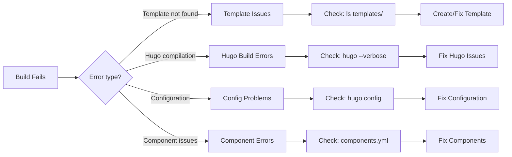
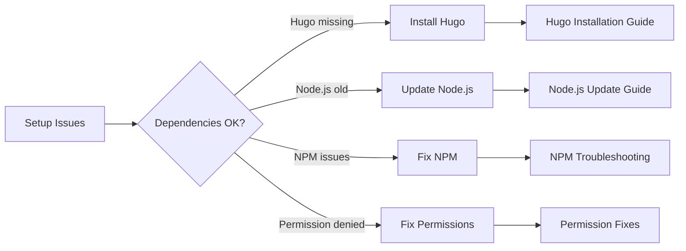
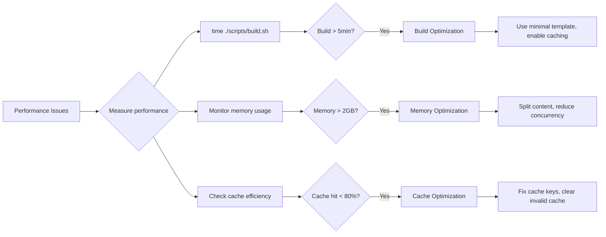
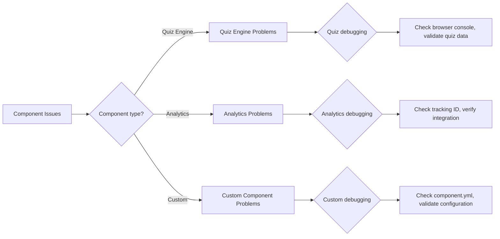
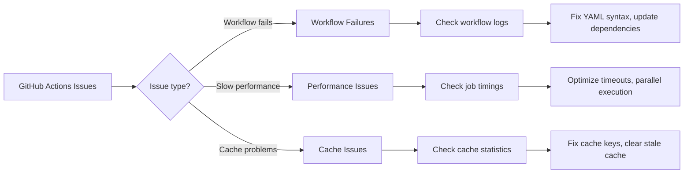

# Interactive Troubleshooting Flowchart

## Overview

This interactive troubleshooting flowchart helps you quickly diagnose and resolve common issues with the Hugo Template Factory. Follow the decision tree to identify the root cause and get directed to specific solutions.

## Prerequisites

- Basic understanding of error messages and symptoms
- Access to terminal/command line
- Ability to run diagnostic commands

## 🔍 Troubleshooting Decision Tree

### Start Here: What Type of Issue Are You Experiencing?

```mermaid
flowchart TD
    Start([🚀 Hugo Template Factory Issue])

    Start --> IssueType{What type of issue?}

    IssueType -->|Build Fails| BuildIssue[🔨 Build Issues]
    IssueType -->|Setup Problems| SetupIssue[⚙️ Setup Issues]
    IssueType -->|Performance Slow| PerfIssue[⚡ Performance Issues]
    IssueType -->|Component Error| CompIssue[🧩 Component Issues]
    IssueType -->|GitHub Actions| GHIssue[🤖 CI/CD Issues]

    BuildIssue --> BuildDiag{Run diagnostic?}
    BuildDiag -->|Yes| BuildDiagRun[./scripts/diagnostic.js --build]
    BuildDiag -->|No| BuildManual[Manual Build Troubleshooting]

    SetupIssue --> SetupDiag{Dependencies installed?}
    SetupDiag -->|Yes| SetupAdv[Advanced Setup Issues]
    SetupDiag -->|No| SetupBasic[Basic Setup Guide]

    PerfIssue --> PerfType{Performance type?}
    PerfType -->|Build Speed| BuildSpeed[Build Optimization]
    PerfType -->|Runtime Slow| RuntimePerf[Runtime Performance]
    PerfType -->|Memory Usage| MemoryIssue[Memory Optimization]

    CompIssue --> CompType{Which component?}
    CompType -->|Quiz Engine| QuizIssue[Quiz Engine Troubleshooting]
    CompType -->|Analytics| AnalyticsIssue[Analytics Troubleshooting]
    CompType -->|Custom| CustomIssue[Custom Component Issues]

    GHIssue --> GHType{GitHub Actions type?}
    GHType -->|Workflow Fails| WorkflowFail[Workflow Failures]
    GHType -->|Slow Performance| WorkflowSlow[Workflow Optimization]
    GHType -->|Cache Issues| CacheIssue[Cache Problems]

    %% Detailed Build Issue Flow
    BuildDiagRun --> BuildResult{Diagnostic result?}
    BuildResult -->|CONFIG Error| ConfigFix[Configuration Issues]
    BuildResult -->|DEPENDENCY Error| DepFix[Dependency Problems]
    BuildResult -->|BUILD Error| HugoFix[Hugo Build Issues]
    BuildResult -->|IO Error| FileFix[File System Issues]

    ConfigFix --> ConfigSolution[📋 Fix Configuration]
    DepFix --> DepSolution[📦 Install Dependencies]
    HugoFix --> HugoSolution[⚙️ Hugo Troubleshooting]
    FileFix --> FileSolution[📁 File System Fixes]

    %% Setup Issues Flow
    SetupBasic --> SetupCheck{Check requirements?}
    SetupCheck -->|Hugo Missing| HugoInstall[Install Hugo Extended]
    SetupCheck -->|Node.js Old| NodeUpdate[Update Node.js ≥18]
    SetupCheck -->|Git Issues| GitSetup[Git Configuration]

    %% Performance Issues Flow
    BuildSpeed --> SpeedCheck{Build time > 5min?}
    SpeedCheck -->|Yes| SpeedOptim[Optimization Strategies]
    SpeedCheck -->|No| SpeedOK[Performance Acceptable]

    %% Solutions
    ConfigSolution --> Solution[✅ Issue Resolved]
    DepSolution --> Solution
    HugoSolution --> Solution
    FileSolution --> Solution
    HugoInstall --> Solution
    NodeUpdate --> Solution
    GitSetup --> Solution
    SpeedOptim --> Solution

    %% Style classes
    classDef startNode fill:#e1f5fe,stroke:#01579b,stroke-width:3px
    classDef issueNode fill:#fff3e0,stroke:#e65100,stroke-width:2px
    classDef diagNode fill:#f3e5f5,stroke:#4a148c,stroke-width:2px
    classDef solutionNode fill:#e8f5e8,stroke:#2e7d32,stroke-width:2px
    classDef endNode fill:#e8f5e8,stroke:#2e7d32,stroke-width:3px

    class Start startNode
    class BuildIssue,SetupIssue,PerfIssue,CompIssue,GHIssue issueNode
    class BuildDiag,SetupDiag,PerfType,CompType,GHType,BuildResult,SetupCheck,SpeedCheck diagNode
    class ConfigSolution,DepSolution,HugoSolution,FileSolution,HugoInstall,NodeUpdate,GitSetup,SpeedOptim solutionNode
    class Solution endNode
```



## 🚨 Quick Diagnostic Commands

Before following the flowchart, run these commands to gather information:

### System Information
```bash
# Check Hugo installation and version
hugo version

# Check Node.js version
node --version
npm --version

# Check Git version and configuration
git --version
git config --list | grep user
```

### Project Diagnostics
```bash
# Run comprehensive system check
./scripts/diagnostic.js --all

# Check specific build system
./scripts/diagnostic.js --component=build-system

# Validate configuration only
./scripts/build.sh --validate-only --debug
```

### Error Analysis
```bash
# Enable verbose logging
./scripts/build.sh --debug --verbose --log-level=debug

# Check recent error logs
ls -la /tmp/hugo-build-error-*.json
```

## 📋 Interactive Issue Categories

### 🔨 Build Issues

**Symptoms**: Build script fails, Hugo errors, compilation problems

**Quick Checks**:
1. ✅ Template exists: `ls templates/your-template/`
2. ✅ Theme available: `ls themes/your-theme/`
3. ✅ Dependencies installed: `npm ci`
4. ✅ Hugo version compatible: `hugo version`

**Decision Flow**:


**Quick Solutions**:
- **Template not found**: `./scripts/list.js --templates` to see available
- **Hugo compilation**: `hugo --verbose --source=./build-dir` for details
- **Configuration**: `./scripts/validate.js --config` to check syntax
- **Components**: `./scripts/validate.js --components` to verify

### ⚙️ Setup Issues

**Symptoms**: Command not found, permission errors, missing dependencies

**Decision Flow**:


**Quick Solutions**:
- **Hugo missing**: [Installation Guide](../user-guides/installation.md#hugo-installation)
- **Node.js old**: Use nvm: `nvm install 18 && nvm use 18`
- **NPM issues**: `npm cache clean --force && npm ci`
- **Permissions**: `chmod +x scripts/*.sh` for executable scripts

### ⚡ Performance Issues

**Symptoms**: Slow builds, high memory usage, long CI/CD times

**Decision Flow**:


**Quick Solutions**:
- **Slow builds**: Use `--template=minimal` for development
- **High memory**: Set `HUGO_MAXMEMORY=2048` environment variable
- **Cache issues**: Clear cache with `rm -rf ~/.cache/hugo_cache/`

### 🧩 Component Issues

**Symptoms**: Components not loading, JavaScript errors, styling problems

**Decision Flow**:


**Quick Solutions**:
- **Quiz Engine**: Check browser console for JavaScript errors
- **Analytics**: Verify tracking ID in components.yml configuration
- **Custom Components**: Validate component.yml syntax and structure

### 🤖 GitHub Actions Issues

**Symptoms**: Workflow failures, slow CI/CD, cache problems

**Decision Flow**:


**Quick Solutions**:
- **Workflow failures**: Check YAML syntax with `yamllint .github/workflows/`
- **Performance**: Review [GitHub Actions Guide](../developer-docs/github-actions.md)
- **Cache issues**: Update cache keys or clear repository cache

## 🎯 Interactive Problem Solver

### Step 1: Identify Your Issue

**What best describes your problem?**

- [ ] 🔨 **Build Script Fails** → [Build Troubleshooting](#build-issues)
- [ ] ⚙️ **Setup/Installation** → [Setup Guide](#setup-issues)
- [ ] ⚡ **Slow Performance** → [Performance Guide](#performance-issues)
- [ ] 🧩 **Component Not Working** → [Component Troubleshooting](#component-issues)
- [ ] 🤖 **GitHub Actions Failing** → [CI/CD Troubleshooting](#github-actions-issues)
- [ ] 📝 **Documentation Unclear** → [Documentation Issues](../user-guides/feedback.md)

### Step 2: Run Initial Diagnostics

```bash
# Copy and run this command block
echo "🔍 Running Hugo Template Factory Diagnostics..."
echo "================================================"

echo "📋 System Information:"
echo "Hugo: $(hugo version 2>/dev/null || echo 'NOT INSTALLED')"
echo "Node.js: $(node --version 2>/dev/null || echo 'NOT INSTALLED')"
echo "NPM: $(npm --version 2>/dev/null || echo 'NOT INSTALLED')"
echo "Git: $(git --version 2>/dev/null || echo 'NOT INSTALLED')"

echo ""
echo "📂 Project Status:"
echo "Current directory: $(pwd)"
echo "Templates available: $(ls templates/ 2>/dev/null | wc -l || echo '0')"
echo "Themes available: $(ls themes/ 2>/dev/null | wc -l || echo '0')"
echo "Node modules: $(test -d node_modules && echo 'INSTALLED' || echo 'MISSING')"

echo ""
echo "🚨 Recent errors:"
ls -la /tmp/hugo-build-error-*.json 2>/dev/null | tail -3 || echo "No recent error logs found"

echo ""
echo "✅ Diagnostic complete. Use results above to follow troubleshooting guide."
```

### Step 3: Follow Specific Guide

Based on your diagnostic results, follow the appropriate detailed guide:

| Issue Type | Diagnostic Result | Next Steps |
|------------|-------------------|------------|
| 🔨 Build | Script fails with error | [Common Issues Guide](./common-issues.md#build-errors) |
| ⚙️ Setup | Missing dependencies | [Installation Guide](../user-guides/installation.md) |
| ⚡ Performance | Slow build times | [Performance Guide](../user-guides/performance.md) |
| 🧩 Components | Component errors | [Component Troubleshooting](./component-issues.md) |
| 🤖 CI/CD | GitHub Actions fail | [GitHub Actions Debug](../developer-docs/github-actions.md#troubleshooting) |

## 🆘 Emergency Procedures

### Quick Reset (Nuclear Option)

If all else fails, perform a complete reset:

```bash
# ⚠️ WARNING: This will reset everything to clean state
echo "🆘 Performing emergency reset..."

# 1. Backup custom content
if [ -d content/ ]; then
    cp -r content/ ../content-backup-$(date +%Y%m%d-%H%M%S)/
    echo "✅ Content backed up"
fi

# 2. Reset repository
git clean -fdx
git reset --hard HEAD
git submodule update --init --recursive

# 3. Reinstall dependencies
npm ci

# 4. Verify basic functionality
./scripts/build.sh --template=minimal --validate-only

echo "🔄 Reset complete. Test with minimal template first."
```

### Get Help

If troubleshooting doesn't resolve your issue:

1. **Create detailed issue report**:
   - System information from diagnostic above
   - Complete error logs with `--debug --verbose`
   - Steps to reproduce the problem

2. **Submit GitHub issue**: [hugo-templates/issues](https://github.com/info-tech-io/hugo-templates/issues)

3. **Include diagnostic output**:
   ```bash
   ./scripts/diagnostic.js --all > diagnostic-report.txt
   ```

4. **Community discussion**: [GitHub Discussions](https://github.com/info-tech-io/hugo-templates/discussions)

## Next Steps

- **Learn prevention**: [Best Practices Guide](../user-guides/best-practices.md)
- **Advanced debugging**: [Developer Debugging Guide](../developer-docs/debugging.md)
- **Contribute fixes**: [Contributing Guide](../developer-docs/contributing.md)

## Related Documentation

- [Common Issues Guide](./common-issues.md)
- [Error Reference](./error-reference.md)
- [Performance Troubleshooting](./performance.md)
- [Build System Guide](../user-guides/build-system.md)